# AZ-900 Exam Questions

## Section 1: Mix Questions (131 Questions)

### 1. You have an on-premises network that contains several servers. You plan to migrate all the servers to Azure. You need to recommend a solution to ensure that some of the servers are available if a single Azure data center goes offline for an extended period. What should you include in the recommendation?

- [x] A. fault tolerance
- [ ] B. elasticity
- [ ] C. scalability
- [ ] D. low latency

> **Explanation:** Fault tolerance is the ability of a system to continue to function in the event of a failure of some of its components. Availability Zones are unique physical locations within an Azure region, each made up of one or more datacenters with independent power, cooling, and networking. The physical separation protects applications and data from datacenter failures, offering an industry-best 99.99% VM uptime SLA.

---

### 2. What are two characteristics of the public cloud? *(Choose two)*

- [ ] A. dedicated hardware
- [ ] B. unsecured connections
- [ ] C. limited storage
- [x] D. metered pricing
- [x] E. self-service management

> **Explanation:** With the public cloud, you get pay-as-you-go pricing — you only pay for what you use (no CapEx). You also have self-service management, where you are responsible for deploying and configuring cloud resources while the underlying hardware is managed by the cloud provider. Hardware is shared (not dedicated), connections are secure, and storage is not limited.

---

### 3. Your company plans to migrate all its data and resources to Azure. The migration plan states that only PaaS solutions must be used. Solution: You create an Azure App Service and Azure SQL databases. Does this meet the goal?

- [x] A. Yes
- [ ] B. No

> **Explanation:** Both Azure App Service and Azure SQL databases are PaaS solutions, so this meets the goal.

---

### 4. Your company plans to migrate all its data and resources to Azure. The migration plan states that only PaaS solutions must be used. Solution: You create an Azure App Service and Azure virtual machines that have Microsoft SQL Server installed. Does this meet the goal?

- [ ] A. Yes
- [x] B. No

> **Explanation:** Azure App Service is PaaS, but Azure Virtual Machines are IaaS. Since the plan requires only PaaS solutions, this does not meet the goal.

---

### 5. Your company plans to migrate all its data and resources to Azure. The migration plan states that only PaaS solutions must be used. Solution: You create an Azure App Service and Azure Storage accounts. Does this meet the goal?

- [ ] A. Yes
- [x] B. No

> **Explanation:** Azure App Service is PaaS, but Azure Storage accounts are IaaS. This does not meet the goal of using only PaaS solutions.

---

### 6. Your company hosts an accounting application (App1) with low usage for the first three weeks of each month and very high usage during the last week. Which benefit of Azure Cloud Services supports cost management for this type of usage pattern?

- [ ] A. high availability
- [ ] B. high latency
- [x] C. elasticity
- [ ] D. load balancing

> **Explanation:** Elasticity is the ability to quickly expand or decrease compute resources to meet changing demands without worrying about capacity planning. Autoscaling is an example. With cloud elasticity, a company avoids paying for unused capacity or idle resources.

---

### 7. You plan to migrate a web application to Azure accessed by external users. You need to minimize the amount of administrative effort to manage the web application. What should you recommend?

- [ ] A. Software as a Service (SaaS)
- [x] B. Platform as a Service (PaaS)
- [ ] C. Infrastructure as a Service (IaaS)
- [ ] D. Database as a Service (DaaS)

> **Explanation:** Azure App Service is a PaaS offering that lets you create web and mobile apps for any platform or device. PaaS minimizes administrative overhead since the underlying platform is managed by Microsoft.

---

### 8. You have an on-premises network with 100 servers. You need to provide additional resources while minimizing capital and operational expenditure costs. What should you recommend?

- [ ] A. a complete migration to the public cloud
- [ ] B. an additional data center
- [ ] C. a private cloud
- [x] D. a hybrid cloud

> **Explanation:** A hybrid cloud combines on-premises (private) and public cloud. You continue using existing on-premises servers while adding new servers in Azure, minimizing capital expenditure. A complete migration would be costly operationally; an additional data center or private cloud would require high capital expenditure.

---

### 9. You plan to migrate several servers from an on-premises network to Azure. What is an advantage of using a public cloud service over an on-premises network?

- [ ] A. The public cloud is owned by the public, not a private corporation
- [ ] B. The public cloud is a crowd-sourcing solution
- [ ] C. All public cloud resources can be freely accessed by every member of the public
- [x] D. The public cloud is a shared entity whereby multiple corporations each use a portion of the resources in the cloud

> **Explanation:** The public cloud is a shared entity where multiple corporations use portions of the cloud resources. The hardware is managed by the cloud provider (e.g., Microsoft). It is not owned by the public, is not crowd-sourced, and resources are not freely accessible — access requires accounts and permissions.

---

### 10. You plan to deploy several Azure virtual machines. You need to ensure services are available if a single data center fails. Solution: You deploy the virtual machines to two or more scale sets. Does this meet the goal?

- [ ] A. Yes
- [x] B. No

> **Explanation:** This solution does not specify that the scale sets are configured across multiple data centers. A scale set alone does not guarantee cross-datacenter availability unless explicitly deployed across availability zones or regions.

---

### 11. You plan to deploy several Azure virtual machines. You need to ensure services are available if a single data center fails. Solution: You deploy the virtual machines to two or more availability zones. Does this meet the goal?

- [x] A. Yes
- [ ] B. No

> **Explanation:** Availability Zones are physically separate zones within an Azure region, each with distinct power, network, and cooling. Deploying VMs across availability zones protects against datacenter failure.

---

### 12. You plan to deploy several Azure virtual machines. You need to ensure services are available if a single data center fails. Solution: You deploy the virtual machines to two or more regions. Does this meet the goal?

- [x] A. Yes
- [ ] B. No

> **Explanation:** Deploying VMs to multiple regions means deploying to multiple datacenters. If one datacenter fails, the services remain available in the other region.

---

### 13. You have 1,000 virtual machines hosted on Hyper-V hosts and plan to migrate them to an Azure pay-as-you-go subscription. Which expenditure model should you identify?

- [x] A. operational
- [ ] B. elastic
- [ ] C. capital
- [ ] D. scalable

> **Explanation:** Moving from on-premises to the public cloud means switching from capital expenditure (buying hardware) to operational expenditure (paying for services as you use them). Pay-as-you-go is an operational expenditure model.

---

### 14. Your company plans to migrate several servers to Azure virtual machines. Which two administrative responsibilities will be eliminated after the migration? *(Choose two)*

- [x] A. Replacing failed server hardware
- [ ] B. Backing up application data
- [x] C. Managing physical server security
- [ ] D. Updating server operating systems
- [ ] E. Managing permissions to shared documents

> **Explanation:** Microsoft owns and manages the physical servers in Azure, so customers don't need to replace failed hardware or manage physical security. However, backing up application data, updating OS, and managing shared document permissions remain the customer's responsibility.

---

### 15. You plan to provision IaaS resources in Azure. Which resource is an example of IaaS?

- [ ] A. an Azure web app
- [x] B. an Azure virtual machine
- [ ] C. an Azure logic app
- [ ] D. an Azure SQL database

> **Explanation:** Azure Virtual Machines are IaaS. Azure web apps, logic apps, and SQL databases are all PaaS examples.

---

### 16. A team plans to deploy and then remove 50 virtual machines each week using ARM templates. Which Azure service minimizes administrative effort?

- [ ] A. Azure Reserved Virtual Machine Instances
- [x] B. Azure DevTest Labs
- [ ] C. Azure virtual machine scale sets
- [ ] D. Microsoft Managed Desktop

> **Explanation:** Azure DevTest Labs creates labs using pre-configured bases or ARM templates. It allows you to quickly provision Windows and Linux environments, integrate with deployment pipelines, and easily remove resources — minimizing administrative overhead.

---

### 17. You plan to deploy several Azure virtual machines. You need to ensure services are available if a single data center fails. Solution: You deploy the virtual machines to two or more resource groups. Does this meet the goal?

- [ ] A. Yes
- [x] B. No

> **Explanation:** A resource group is a logical container — it does not represent a physical location. VMs in the same resource group can still be in the same datacenter. Creating multiple resource groups does not ensure datacenter-level redundancy.

---

### 18. You plan to deploy several Azure virtual machines. You need to ensure services are available if a single data center fails. Solution: You deploy the virtual machines to a scale set. Does this meet the goal?

- [ ] A. Yes
- [x] B. No

> **Explanation:** A single scale set without explicit cross-datacenter configuration does not guarantee availability if a data center fails. The solution must specify deployment across multiple availability zones or regions.

---

### 19. Each business unit requires 20 different Azure resources for daily operation. You need to recommend a solution to automate resource creation. What should you recommend?

- [x] A. Azure Resource Manager templates
- [ ] B. virtual machine scale sets
- [ ] C. the Azure API Management service
- [ ] D. management groups

> **Explanation:** Azure Resource Manager (ARM) templates allow infrastructure-as-code deployments. The template (JSON file) defines the infrastructure and configuration declaratively, automating repeatable resource creation.

---

### 20. Which Azure service should you use to collect events from multiple resources into a centralized repository?

- [ ] A. Azure Event Hubs
- [ ] B. Azure Analysis Services
- [x] C. Azure Monitor
- [ ] D. Azure Stream Analytics

> **Explanation:** Azure Monitor is a comprehensive solution for collecting, analyzing, and acting on telemetry from cloud and on-premises environments. It aggregates events and metrics from multiple Azure resources into a centralized repository.

---

### 21. You need to create a new Azure virtual machine from a tablet running Android. Solution: You use PowerShell in Azure Cloud Shell. Does this meet the goal?

- [x] A. Yes
- [ ] B. No

> **Explanation:** Azure Cloud Shell is a browser-based shell for managing Azure resources. Since it's browser-based, it works on any device including Android tablets, and supports both PowerShell and Bash.

---

### 22. You need to create a new Azure virtual machine from a tablet running Android. Solution: You use the PowerApps portal. Does this meet the goal?

- [ ] A. Yes
- [x] B. No

> **Explanation:** PowerApps is used to build business applications with little or no code — it is not used to create Azure virtual machines.

---

### 23. You need to create a new Azure virtual machine from a tablet running Android. Solution: You use the Azure portal. Does this meet the goal?

- [x] A. Yes
- [ ] B. No

> **Explanation:** The Azure portal is web-based and can be accessed from any browser, including on Android tablets. It provides a full graphical interface for managing Azure resources, including virtual machines.

---

### 24. "An Azure region <u>contains one or more data centers that are connected by using a low-latency network</u>." Is the underlined text correct?

- [x] A. No change is needed
- [ ] B. Is found in each country where Microsoft has a subsidiary office
- [ ] C. Can be found in every country in Europe and the Americas only
- [ ] D. Contains one or more data centers that are connected by using a high-latency network

> **Explanation:** An Azure region is a set of data centers deployed within a latency-defined perimeter and connected through a dedicated regional low-latency network. The statement is correct as written.

---

### 25. "When you need to delegate permissions to several Azure virtual machines simultaneously, you must deploy the Azure virtual machines <u>to the same Azure region</u>." Is the underlined portion correct?

- [ ] A. No change is needed
- [ ] B. by using the same Azure Resource Manager template
- [x] C. to the same resource group
- [ ] D. to the same availability zone

> **Explanation:** A resource group is a logical container for Azure resources. Permissions applied to a resource group apply to all resources within it, enabling simultaneous permission delegation.

---

### 26. A team plans to deploy and remove 50 customized virtual machines each week (30 Windows Server 2016, 20 Ubuntu Linux). Which Azure service minimizes administrative effort?

- [ ] A. Azure Reserved Virtual Machine Instances
- [ ] B. Azure virtual machine scale sets
- [x] C. Azure DevTest Labs
- [ ] D. Microsoft Managed Desktop

> **Explanation:** Azure DevTest Labs supports quickly provisioning both Windows and Linux environments using reusable templates, and easily removing them — ideal for this scenario.

---

### 27. "One of the benefits of Azure SQL Data Warehouse is that <u>high availability</u> is built into the platform." Is the underlined text correct?

- [x] A. No change is needed
- [ ] B. automatic scaling
- [ ] C. data compression
- [ ] D. versioning

> **Explanation:** Azure SQL Data Warehouse (now Azure Synapse Analytics) is a PaaS service with high availability built into the platform, offering a 99.9% availability SLA.

---

### 28. A support engineer will run Azure CLI commands. Which two tools can be used to run the CLI on Windows? *(Choose two)*

- [x] A. Command Prompt
- [ ] B. Azure Resource Explorer
- [x] C. Windows PowerShell
- [ ] D. Windows Defender Firewall
- [ ] E. Network and Sharing Center

> **Explanation:** On Windows, Azure CLI is installed via an MSI and can be run from either Command Prompt (CMD) or Windows PowerShell.

---

### 29. You plan to store 20 TB of data in Azure that is accessed infrequently and visualized using Microsoft Power BI. Which two solutions should you recommend? *(Choose two)*

- [x] A. Azure Data Lake
- [ ] B. Azure Cosmos DB
- [x] C. Azure SQL Data Warehouse
- [ ] D. Azure SQL Database
- [ ] E. Azure Database for PostgreSQL

> **Explanation:** Both Azure Data Lake and Azure SQL Data Warehouse integrate with Power BI for data visualization. Azure Data Lake handles data of any size and shape, while Azure SQL Data Warehouse is optimized for analytics on large datasets.

---

### 30. What type of failure can an Azure availability zone protect against?

- [ ] A. a physical server failure
- [ ] B. an Azure region failure
- [ ] C. a storage failure
- [x] D. an Azure data center failure

> **Explanation:** Availability Zones are physically separate zones within an Azure region, each with distinct power, networking, and cooling. They protect against data center failures. They do not protect against an entire region failure.

---

### 31. You have VM1 running Windows Server 2016 in East US. Which Azure service should you use to view service failure notifications that can affect VM1's availability?

- [ ] A. Azure Service Fabric
- [ ] B. Azure Monitor
- [x] C. Azure virtual machines
- [ ] D. Azure Advisor

> **Explanation:** The Azure Virtual Machines page in the Azure portal has a "Maintenance Status" column that displays service issues that could affect your virtual machine, including platform updates and service failures.

---

### 32. An Azure administrator plans to run a PowerShell script. Solution: Run the script from a computer that runs Linux and has the Azure CLI tools installed. Does this meet the goal?

- [ ] A. Yes
- [x] B. No

> **Explanation:** A PowerShell script requires PowerShell to run. The computer described has Azure CLI tools installed, not PowerShell. Therefore, this solution does not meet the goal.

---

### 33. An Azure administrator plans to run a PowerShell script. Solution: Run the script from a computer that runs Chrome OS and uses Azure Cloud Shell. Does this meet the goal?

- [x] A. Yes
- [ ] B. No

> **Explanation:** Azure Cloud Shell supports PowerShell in a browser-accessible environment. You can run PowerShell cmdlets and scripts from any browser, including Chrome OS, via the Azure Cloud Shell.

---

### 34. An Azure administrator plans to run a PowerShell script. Solution: Run the script from a computer that runs macOS and has PowerShell Core 6.0 installed. Does this meet the goal?

- [x] A. Yes
- [ ] B. No

> **Explanation:** PowerShell Core 6.0 is cross-platform and runs on macOS. With PowerShell installed, you can run PowerShell scripts. You would also need the Azure PowerShell module to create Azure resources.

---

### 35. You have 10 virtual networks and 100 virtual machines. You need to limit inbound traffic to all Azure virtual networks. What should you create?

- [ ] A. one application security group (ASG)
- [ ] B. 10 virtual network gateways
- [ ] C. 10 Azure ExpressRoute circuits
- [x] D. one Azure firewall

> **Explanation:** A single Azure Firewall can restrict traffic to multiple virtual networks. Azure Firewall is a managed, cloud-based network security service with built-in high availability and unrestricted scalability, allowing centralized policy enforcement across subscriptions and virtual networks.

---

### 36. You need to enable on-premises client computers to communicate with Azure virtual machines. Which two Azure resources should you create? *(Choose two)*

- [x] A. a virtual network gateway
- [ ] B. a load balancer
- [ ] C. an application gateway
- [ ] D. a virtual network
- [x] E. a gateway subnet

> **Explanation:** To connect an on-premises network to Azure via VPN, you need a Virtual Network Gateway (the Azure VPN device) and a Gateway Subnet (a dedicated subnet named 'GatewaySubnet' required to host the gateway).

---

### 37. You need to create a new Azure virtual machine from a tablet running Android. Solution: You use Bash in Azure Cloud Shell. Does this meet the goal?

- [x] A. Yes
- [ ] B. No

> **Explanation:** Azure Cloud Shell supports both Bash and PowerShell in a browser-accessible environment. Since it's browser-based, it works on any device including Android tablets.

---

### 38. A server named FinServer must be on a separate network segment per compliance policy. What Azure solution should you recommend?

- [ ] A. a resource group for FinServer and another for all other servers
- [x] B. a virtual network for FinServer and another for all other servers
- [ ] C. a VPN for FinServer and a virtual network gateway for each other server
- [ ] D. one resource group for all servers and a resource lock for FinServer

> **Explanation:** Virtual networks provide network segmentation in Azure. Placing FinServer in a separate virtual network ensures it is on a separate network segment, meeting the compliance requirement.

---

### 39. You plan to map a network drive from Windows 10 computers to Azure Storage. What should you create?

- [ ] A. an Azure SQL database
- [ ] B. a virtual machine data disk
- [x] C. a Files service in a storage account
- [ ] D. a Blobs service in a storage account

> **Explanation:** Azure Files provides cloud file shares that can be mounted as network drives on Windows. Azure file shares support the SMB protocol and can be assigned a drive letter or mount point path on Windows systems.

---

### 40. Your company plans to migrate all its network resources to Azure. What should you create first?

- [x] A. a subscription
- [ ] B. a resource group
- [ ] C. a virtual network
- [ ] D. a management group

> **Explanation:** An Azure subscription is the foundational element — it is your agreement with Microsoft to use Azure services and is required before creating any other resources. All resources exist within a subscription.

---

### 41. You have an on-premises application that sends email notifications based on a rule. You need to recommend a serverless computing solution for the migrated application. What should you recommend?

- [ ] A. a web app
- [ ] B. a server image in Azure Marketplace
- [x] C. a logic app
- [ ] D. an API app

> **Explanation:** Azure Logic Apps is a cloud service for scheduling, automating, and orchestrating tasks and workflows. It is serverless and supports integration scenarios including sending email notifications when events occur in various systems.

---

### 42. You plan to deploy a website accessed worldwide that hosts large video files. Which Azure feature must be used for the best video playback experience?

- [ ] A. an application gateway
- [ ] B. an Azure ExpressRoute circuit
- [x] C. a content delivery network (CDN)
- [ ] D. an Azure Traffic Manager profile

> **Explanation:** A CDN is a distributed network of servers that caches content on edge servers close to end users, minimizing latency. Azure CDN stores content at strategically placed nodes worldwide, ensuring users download video from nearby servers for the best playback experience.

---

### 43. Your company plans to deploy millions of sensors that upload data to Azure. Which two Azure resources should you identify? *(Choose two)*

- [x] A. Azure Data Lake
- [ ] B. Azure Queue storage
- [ ] C. Azure File Storage
- [x] D. Azure IoT Hub
- [ ] E. Azure Notification Hubs

> **Explanation:** Azure IoT Hub is a managed service for bi-directional communication between IoT devices and cloud backends, supporting millions of devices. IoT Hub can route messages to Azure Data Lake Storage Gen2 for storing the sensor data.

---

### 44. You need to manage settings of an Azure web app from an iPhone. Which two management tools can you use? *(Choose two)*

- [ ] A. Azure CLI
- [x] B. the Azure portal
- [x] C. Azure Cloud Shell
- [ ] D. Windows PowerShell
- [ ] E. Azure Storage Explorer

> **Explanation:** The Azure portal and Azure Cloud Shell are both web-based and accessible from any browser, including on an iPhone. Azure CLI and Windows PowerShell cannot be installed on an iPhone. Azure Storage Explorer does not manage web app settings.

---

### 45. Your company plans to deploy an AI solution in Azure. What should you use to build, test, and deploy predictive analytics solutions?

- [ ] A. Azure Logic Apps
- [x] B. Azure Machine Learning Designer
- [ ] C. Azure Batch
- [ ] D. Azure Cosmos DB

> **Explanation:** Azure Machine Learning Designer lets you visually connect datasets and modules on an interactive canvas to create, test, and deploy machine learning models for predictive analytics.

---

### 46. You need to create VM1 in Subscription1 using the Azure CLI command. Solution: From the Azure portal, launch Azure Cloud Shell and select PowerShell. Run the command in Cloud Shell. Does this meet the goal?

- [x] A. Yes
- [ ] B. No

> **Explanation:** Azure Cloud Shell supports running Azure CLI (`az`) commands in both Bash and PowerShell modes. The `az vm create` command works in either shell environment.

---

### 47. You need to create VM1 in Subscription1 using the Azure CLI command. Solution: From a Windows 10 computer, install Azure CLI. From PowerShell, sign in to Azure and run the command. Does this meet the goal?

- [ ] A. Yes
- [x] B. No

> **Explanation:** While Azure CLI can be run from PowerShell on Windows 10, the question implies the goal is to run the command in Azure (using a subscription), not just locally. The command can be run locally — but this answer was marked incorrect in the original exam context, as the preferred approach is via Cloud Shell in Azure.

---

### 48. You need to create VM1 in Subscription1 using the Azure CLI command. Solution: From a Windows 10 computer, install Azure CLI. From a command prompt, sign in to Azure and run the command. Does this meet the goal?

- [ ] A. Yes
- [x] B. No

> **Explanation:** Similar to the previous question, while this is technically possible, the exam marks this as incorrect. The Azure CLI command should be run via Azure Cloud Shell in this context to properly target the Subscription1 environment.

---

### 49. An Azure administrator plans to run a PowerShell script. Solution: Run the script from a computer that runs Windows 10 and has the Azure PowerShell module installed. Does this meet the goal?

- [x] A. Yes
- [ ] B. No

> **Explanation:** Windows 10 includes PowerShell, and with the Azure PowerShell module installed, the administrator can run PowerShell scripts that create Azure resources. This fully meets the goal.

---

### 50. Which service provides serverless computing in Azure?

- [ ] A. Azure Virtual Machines
- [x] B. Azure Functions
- [ ] C. Azure storage account
- [ ] D. Azure Container Instances

> **Explanation:** Azure Functions is a serverless compute service that lets you run event-triggered code without explicitly provisioning or managing infrastructure. It's the primary serverless computing service in Azure.

---

### 51. You need to create VM1 in Subscription1 using the Azure CLI command. Solution: From the Azure portal, launch Azure Cloud Shell and select Bash. Run the command in Cloud Shell. Does this meet the goal?

- [x] A. Yes
- [ ] B. No

> **Explanation:** The `az vm create` command is an Azure CLI command and runs natively in Azure Cloud Shell's Bash environment. This fully meets the goal.

---

### 52. Which Azure service should you use to store certificates?

- [ ] A. Azure Security Center
- [ ] B. an Azure Storage account
- [x] C. Azure Key Vault
- [ ] D. Azure Information Protection

> **Explanation:** Azure Key Vault is a secure store for sensitive information including tokens, passwords, certificates, API keys, and secrets. It uses industry-standard algorithms and FIPS 140-2 Level 2 validated HSMs. Access requires proper authentication and authorization.

---

### 53. You have RG1 and plan to create virtual networks and app services in it. You need to prevent creation of virtual machines only in RG1. What should you use?

- [ ] A. a lock
- [ ] B. an Azure role
- [ ] C. a tag
- [x] D. an Azure policy

> **Explanation:** Azure Policy can enforce rules on resource types during deployment. You can create a policy assigned to RG1 that denies creation of virtual machines specifically. A read-only lock would prevent all resource creation, not just virtual machines.

---

### 54. What can Azure Information Protection encrypt?

- [ ] A. network traffic
- [x] B. documents and email messages
- [ ] C. an Azure Storage account
- [ ] D. an Azure SQL database

> **Explanation:** Azure Information Protection is a cloud-based solution that classifies and protects documents and emails by applying labels. The protection technology uses Azure Rights Management (Azure RMS) with encryption, identity, and authorization policies.

---

### 55. What should you use to evaluate whether your company's Azure environment meets regulatory requirements?

- [ ] A. the Knowledge Center website
- [ ] B. the Advisor blade from the Azure portal
- [x] C. Compliance Manager from the Service Trust Portal
- [ ] D. the Solutions blade from the Azure portal

> **Explanation:** Compliance Manager in the Service Trust Portal is a workflow-based risk assessment tool for tracking, assigning, and verifying your organization's regulatory compliance activities related to Microsoft Cloud services including Azure.

---

### 56. Company policy states administrators must only create Azure resources in the country where their office is located. What Azure resource should you create to meet this requirement?

- [ ] A. a read-only lock
- [x] B. an Azure policy
- [ ] C. a management group
- [ ] D. a reservation

> **Explanation:** Azure Policy can enforce location restrictions using the built-in "Allowed Locations" policy. This ensures administrators can only deploy resources to approved geographic locations, meeting the compliance requirement.

---

### 57. You need to configure an Azure solution that secures websites from attacks and generates reports of attempted attacks. What should you include?

- [ ] A. Azure Firewall
- [ ] B. a network security group (NSG)
- [ ] C. Azure Information Protection
- [x] D. DDoS protection

> **Explanation:** Azure DDoS Protection Standard protects against Distributed Denial of Service attacks targeting publicly reachable endpoints. It provides logging, alerting, and telemetry — including reports with details of attempted attacks. DDoS Basic is built in by default; DDoS Standard adds enhanced reporting.

---

### 58. Your company plans to migrate all on-premises data to Azure. You need to identify whether Azure complies with the company's regional requirements. What should you use?

- [ ] A. the Knowledge Center
- [ ] B. Azure Marketplace
- [ ] C. the Azure portal
- [x] D. the Trust Center

> **Explanation:** The Azure Trust Center lists Azure's 90+ compliance certifications, including region and country-specific ones (US, EU, Germany, Japan, UK, India, China, etc.). You can review these certifications to determine whether Azure meets your regional compliance requirements.

---

### 59. "Azure Key Vault is used to store secrets for <u>Azure Active Directory (Azure AD) user accounts</u>." Is the underlined text correct?

- [ ] A. No change is needed
- [ ] B. Azure Active Directory (Azure AD) administrative accounts
- [ ] C. Personally Identifiable Information (PII)
- [x] D. server applications

> **Explanation:** Azure Key Vault is designed to store secrets for server applications — such as connection strings, API keys, and passwords used by apps to connect to databases or other services. It is not specifically for Azure AD user accounts. Centralizing application secrets in Key Vault eliminates the need to store security information in application code.

---

### 60. Your company plans to automate server deployments to Azure and must encrypt administrative credentials during deployment. What should you recommend?

- [x] A. Azure Key Vault
- [ ] B. Azure Information Protection
- [ ] C. Azure Security Center
- [ ] D. Azure Multi-Factor Authentication (MFA)

> **Explanation:** Azure Key Vault securely stores and encrypts sensitive information including tokens, passwords, certificates, and API keys. By storing administrative credentials in Key Vault, deployment scripts no longer need plain-text credentials. All information in Key Vault is encrypted and protected by FIPS 140-2 Level 2 validated HSMs.

---

### 61. You plan to deploy several Azure virtual machines and need to control which ports Internet devices can use to access them. What should you use?

- [x] A. a network security group (NSG)
- [ ] B. an Azure Active Directory (Azure AD) role
- [ ] C. an Azure Active Directory group
- [ ] D. an Azure key vault

> **Explanation:** A Network Security Group (NSG) works like a firewall and contains security rules that allow or deny inbound/outbound network traffic. You can attach an NSG to a virtual network, subnet, or individual network interface to control port access from the Internet.

---

### 62. "Azure Germany can be used by <u>legal residents of Germany only</u>." Is the underlined text correct?

- [ ] A. No change is needed
- [ ] B. only enterprises that are registered in Germany
- [ ] C. only enterprises that purchase their Azure licenses from a partner based in Germany
- [x] D. any user or enterprise that requires its data to reside in Germany

> **Explanation:** Azure Germany is available to eligible customers and partners globally who intend to do business in the EU/EFTA, including the UK. The key requirement is that data must reside in Germany — not that users must be German residents or registered in Germany.

---

### 63. You need to ensure VM1 is accessible from the Internet over HTTP. Solution: You modify a network security group (NSG). Does this meet the goal?

- [x] A. Yes
- [ ] B. No

> **Explanation:** You can add a rule to the NSG to allow inbound traffic on port 80 (HTTP), making VM1 accessible from the Internet over HTTP. NSGs control inbound and outbound traffic for Azure resources.

---

### 64. You need to ensure VM1 is accessible from the Internet over HTTP. Solution: You modify a DDoS protection plan. Does this meet the goal?

- [ ] A. Yes
- [x] B. No

> **Explanation:** DDoS protection plans protect against Distributed Denial of Service attacks — they do not provide or configure connectivity to virtual machines. To allow HTTP access, you need to modify an NSG or Azure Firewall.

---

### 65. You need to ensure VM1 is accessible from the Internet over HTTP. Solution: You modify an Azure firewall. Does this meet the goal?

- [x] A. Yes
- [ ] B. No

> **Explanation:** Azure Firewall is a managed, cloud-based network security service. You can add a rule to Azure Firewall to allow inbound traffic on port 80 (HTTP) to VM1, making it accessible from the Internet.

---

### 66. You need to ensure VM1 is accessible from the Internet over HTTP. Solution: You modify an Azure Traffic Manager profile. Does this meet the goal?

- [ ] A. Yes
- [x] B. No

> **Explanation:** Azure Traffic Manager is a DNS-based load balancing solution — it routes traffic between endpoints but does not control port-level access. To allow HTTP access to VM1, you need to modify an NSG or Azure Firewall.

---

### 67. Which two types of customers are eligible to use Azure Government? *(Choose two)*

- [ ] A. a Canadian government contractor
- [ ] B. a European government contractor
- [x] C. a United States government entity
- [x] D. a United States government contractor
- [ ] E. a European government entity

> **Explanation:** Azure Government is a sovereign cloud built exclusively for US government agencies (at federal, state, and local levels) and their solution providers/contractors. It is not available to non-US government entities or contractors.

---

### 68. You need to ensure that Azure AD users connecting from anonymous IP addresses are automatically prompted to change their password. Which Azure service should you use?

- [ ] A. Azure AD Connect Health
- [ ] B. Azure AD Privileged Identity Management
- [ ] C. Azure Advanced Threat Protection (ATP)
- [x] D. Azure AD Identity Protection

> **Explanation:** Azure AD Identity Protection includes sign-in risk policies that detect risky sign-ins, including those from anonymous IP addresses (e.g., Tor browser or anonymous VPN). You can configure the sign-in risk policy to automatically require a password change when this risk is detected.

---

### 69. You plan to deploy web servers and database servers to Azure and need to limit the types of connections from web servers to database servers. What should you recommend?

- [x] A. network security groups (NSGs)
- [ ] B. Azure Service Bus
- [ ] C. a local network gateway
- [ ] D. a route filter

> **Explanation:** NSGs contain security rules that allow or deny traffic between Azure resources. You can attach NSGs to subnets or network interfaces to restrict what types of connections the web servers can make to the database servers.

---

### 70. To what should an application connect to retrieve security tokens?

- [ ] A. an Azure Storage account
- [x] B. Azure Active Directory (Azure AD)
- [ ] C. a certificate store
- [ ] D. an Azure key vault

> **Explanation:** Azure AD is a centralized identity provider that authenticates users and issues access tokens (security tokens). Applications connect to Azure AD to obtain tokens, which are then used to access Web APIs and other protected resources. This enables scenarios like Single Sign On (SSO) and Conditional Access.

---

### 71. "<u>Resource groups</u> provide organizations with the ability to manage the compliance of Azure resources across multiple subscriptions." Is the underlined text correct?

- [ ] A. No change is needed
- [ ] B. Management groups
- [x] C. Azure policies
- [ ] D. Azure App Service plans

> **Explanation:** Azure Policies manage compliance of Azure resources across multiple subscriptions by enforcing rules and effects. Resource groups are logical containers but do not manage compliance across subscriptions. Azure Policy evaluates resources for non-compliance and all policy data is encrypted at rest.

---

### 72. Your network has an Active Directory forest with 5,000 user accounts. You plan to migrate to Azure and decommission the on-premises data center. What should you recommend to minimize impact on users?

- [ ] A. Implement Azure Multi-Factor Authentication (MFA)
- [x] B. Sync all the Active Directory user accounts to Azure Active Directory (Azure AD)
- [ ] C. Instruct all users to change their password
- [ ] D. Create a guest user account in Azure Active Directory (Azure AD) for each user

> **Explanation:** Using Azure AD Connect to sync on-premises Active Directory accounts (including password hashes) to Azure AD minimizes user impact — users keep their existing credentials. Creating guest accounts or requiring password changes would be disruptive.

---

### 73. Which service provides network traffic filtering across multiple Azure subscriptions and virtual networks?

- [x] A. Azure Firewall
- [ ] B. an application security group
- [ ] C. Azure DDoS protection
- [ ] D. a network security group (NSG)

> **Explanation:** Azure Firewall can centrally create, enforce, and log network connectivity policies across multiple subscriptions and virtual networks. It is a fully stateful firewall-as-a-service with built-in high availability and unrestricted cloud scalability.

---

### 74. What is guaranteed in an Azure Service Level Agreement (SLA) for virtual machines?

- [x] A. uptime
- [ ] B. feature availability
- [ ] C. bandwidth
- [ ] D. performance

> **Explanation:** Azure VM SLAs guarantee uptime. For example: 99.99% uptime for VMs across two or more Availability Zones, 99.95% for VMs in the same Availability Set, and 99.9% for a single VM using Premium SSD or Ultra Disk. The SLA does not guarantee bandwidth or performance.

---

### 75. Your company's support policy requires access to support engineers by phone or email. Solution: Recommend a Basic support plan. Does this meet the goal?

- [ ] A. Yes
- [x] B. No

> **Explanation:** The Basic support plan does not include any technical support from engineers. Phone and email access to support engineers is only available in the Standard, Professional Direct, and Premier plans.

---

### 76. Your company's support policy requires access to support engineers by phone or email. Solution: Recommend a Standard support plan. Does this meet the goal?

- [x] A. Yes
- [ ] B. No

> **Explanation:** The Standard, Professional Direct, and Premier support plans all include technical support via email and phone. Standard is the lowest-cost plan that meets this requirement.

---

### 77. Your company's support policy requires access to support engineers by phone or email. Solution: Recommend a Premier support plan. Does this meet the goal?

- [x] A. Yes
- [ ] B. No

> **Explanation:** The Premier support plan includes technical support via email and phone, along with additional benefits such as architectural reviews and proactive services from Microsoft technical specialists.

---

### 78. Your company needs an architectural review of its Azure environment from Microsoft. The solution must minimize costs. Which support plan should you recommend?

- [x] A. Premier
- [ ] B. Developer
- [ ] C. Professional Direct
- [ ] D. Standard

> **Explanation:** The Premier support plan provides customer-specific architectural support such as design reviews, performance tuning, configuration and implementation assistance delivered by Microsoft Azure technical specialists. No lower-tier plan offers this service.

---

### 79. What is required to use Azure Cost Management?

- [ ] A. a Dev/Test subscription
- [ ] B. Software Assurance
- [x] C. an Enterprise Agreement (EA)
- [ ] D. a pay-as-you-go subscription

> **Explanation:** Azure Cost Management is available to customers with an Azure Enterprise Agreement (EA), Microsoft Customer Agreement (MCA), or Microsoft Partner Agreement (MPA). It helps organizations plan, analyze, and optimize cloud spending.

---

### 80. Your company's support policy requires access to support engineers by phone or email. Solution: Recommend a Professional Direct support plan. Does this meet the goal?

- [x] A. Yes
- [ ] B. No

> **Explanation:** Professional Direct includes technical support via email and phone. Support plan tiers with phone/email access are: Standard, Professional Direct, and Premier. Basic has no technical support; Developer has email only.

---

### 81. Your company has 10 departments and each must use a different payment option for Azure services. What should you create for each department?

- [ ] A. a reservation
- [x] B. a subscription
- [ ] C. a resource group
- [ ] D. a container instance

> **Explanation:** Azure costs are billed per subscription. To enable different payment options per department, create a separate subscription for each. Multiple subscriptions can exist within a single Azure Active Directory tenant. Resource groups and reservations do not support separate payment options.

---

### 82. You receive a message that you must increase your Azure subscription limits to create more SQL Managed Instances. What should you do?

- [ ] A. Create a service health alert
- [ ] B. Upgrade your support plan
- [ ] C. Modify an Azure policy
- [x] D. Create a new support request

> **Explanation:** Azure resource quota limits can be increased by opening a support request. In the request, select "Service and subscription limits (quotas)" as the issue type, then select your subscription and the SQL Database Managed Instance quota type.

---

### 83. Your company has 10 offices and you need to generate billing reports showing Azure resource utilization per office. Which Azure Resource Manager feature should you use?

- [x] A. tags
- [ ] B. templates
- [ ] C. locks
- [ ] D. policies

> **Explanation:** Resource tags are metadata key/value pairs attached to Azure resources. You can tag each resource with an office identifier (e.g., Location = Office1), then generate reports filtered by tag value to show each office's resource utilization.

---

### 84. "You deploy an Azure resource. The resource becomes unavailable due to a service outage. <u>Microsoft will automatically refund your bank account</u>." Is the underlined text correct?

- [ ] A. No change is needed
- [ ] B. migrate the resource to another subscription
- [x] C. credit your account
- [ ] D. send you a coupon code that you can redeem for Azure credits

> **Explanation:** When an Azure SLA is not met, Microsoft credits your account — they do not issue bank refunds or coupons. Service Credits apply only to fees paid for the specific service affected and cannot exceed the monthly service fees for that service.

---

### 85. Your company plans to migrate to Azure with multiple departments, each managed by a department administrator. What are two techniques to segment Azure for the departments? *(Choose two)*

- [x] A. multiple subscriptions
- [ ] B. multiple Azure Active Directory (Azure AD) directories
- [ ] C. multiple regions
- [x] D. multiple resource groups

> **Explanation:** Multiple subscriptions provide billing separation and administrative boundaries per department. Multiple resource groups allow grouping and managing resources for each department separately. A department administrator can be assigned as owner of their subscription or resource group.

---

### 86. "If Microsoft plans to end support for an Azure service that does NOT have a successor service, Microsoft will provide notification at least <u>12 months before</u>." Is the underlined text correct?

- [x] A. No change is needed
- [ ] B. 6 months
- [ ] C. 90 days
- [ ] D. 30 days

> **Explanation:** Under the Modern Lifecycle Policy, Microsoft provides a minimum of 12 months' notification before ending support for a service with no successor — excluding free services and preview releases.

---

### 87. Your subscription has unused resources including 20 Azure AD user accounts, 5 Azure AD groups, 10 public IP addresses, and 10 network interfaces. Solution: You remove the unused network interfaces. Does this reduce costs?

- [ ] A. Yes
- [x] B. No

> **Explanation:** Azure does not charge for unused network interfaces. Removing them will not reduce your Azure costs.

---

### 88. Your subscription has unused resources. Solution: You remove the unused public IP addresses. Does this reduce costs?

- [x] A. Yes
- [ ] B. No

> **Explanation:** Azure charges for public IP addresses even when they are not associated with a running resource. Removing unused public IP addresses will reduce your Azure costs.

---

### 89. Your subscription has unused resources. Solution: You remove the unused user accounts. Does this reduce costs?

- [ ] A. Yes
- [x] B. No

> **Explanation:** Azure Active Directory user accounts are not billed individually (unless using premium Azure AD features). Removing unused user accounts will not reduce Azure costs.

---

### 90. "A support plan solution that gives you best practice information, health status and notifications, and 24/7 access to billing information at the lowest possible cost is a <u>Standard support plan</u>." Is the underlined text correct?

- [ ] A. No change is needed
- [ ] B. Developer
- [x] C. Basic
- [ ] D. Premier

> **Explanation:** The Basic support plan (free) provides 24x7 access to billing and subscription support, online self-help, Azure Advisor recommendations (best practices), and personalized Service Health Dashboard. It is the lowest-cost option for these features.

---

### 91. In which Azure support plans can you open a new support request?

- [ ] A. Premier and Professional Direct only
- [ ] B. Premier, Professional Direct, and Standard only
- [x] C. Premier, Professional Direct, Standard, and Developer only
- [ ] D. Premier, Professional Direct, Standard, Developer, and Basic

> **Explanation:** You can open technical support cases in Developer, Standard, Professional Direct, and Premier plans. The Basic plan does not allow opening support cases.

---

### 92. "You can create an Azure support request from <u>support.microsoft.com</u>." Is the underlined text correct?

- [ ] A. No change is needed
- [x] B. the Azure portal
- [ ] C. the Knowledge Center
- [ ] D. the Security & Compliance admin center

> **Explanation:** Azure support requests are created from the Help and Support blade in the Azure portal, or from the Support + Troubleshooting section of an Azure resource. The correct URL is portal.azure.com, not support.microsoft.com.

---

### 93. Your subscription has unused resources. Solution: You remove the unused groups. Does this reduce costs?

- [ ] A. Yes
- [x] B. No

> **Explanation:** Azure Active Directory groups are not charged. Removing unused groups will not reduce Azure costs.

---

### 94. "The Azure <u>Standard</u> support plan is the lowest cost option to receive 24x7 access to support engineers by phone." Is the underlined text correct?

- [x] A. No change is needed
- [ ] B. Developer
- [ ] C. Basic
- [ ] D. Professional Direct

> **Explanation:** Support plans in order from cheapest to most expensive are: Basic, Developer, Standard, Professional Direct, Premier. Of these, Standard is the cheapest plan that offers 24x7 access to support engineers by both phone and email (Developer offers email only).

---

### 95. Migration plan requires only PaaS solutions. Solution: You create Azure virtual machines, Azure SQL databases, and Azure Storage accounts. Does this meet the goal?

- [ ] A. Yes
- [x] B. No

> **Explanation:** Azure Virtual Machines are IaaS, not PaaS. Since the migration plan requires only PaaS solutions, including virtual machines violates the requirement. Azure SQL databases are PaaS, but the presence of VMs makes this solution non-compliant.

---

### 96. Your company plans to deploy custom invoicing applications to Azure, each with several prerequisite applications and services installed. What cloud deployment model should you recommend?

- [ ] A. Software as a Service (SaaS)
- [ ] B. Platform as a Service (PaaS)
- [x] C. Infrastructure as a Service (IaaS)

> **Explanation:** IaaS provides the infrastructure (VMs, networking, storage) where you can install, configure, and manage your own software and prerequisites. SaaS uses pre-built apps; PaaS provides a development platform. Since the applications have custom prerequisites requiring full control, IaaS is appropriate.

---

### 97. "<u>Azure Databricks</u> is an Apache Spark-based analytics service." Is the underlined text correct?

- [x] A. No change is needed
- [ ] B. Azure Data Factory
- [ ] C. Azure DevOps
- [ ] D. Azure HDInsight

> **Explanation:** Azure Databricks is indeed an Apache Spark-based analytics platform. It includes components such as MLlib (a Machine Learning library) for classification, regression, clustering, and other ML algorithms. The statement is correct.

---

### 98. Which Azure service provides a set of version control tools to manage code?

- [x] A. Azure Repos
- [ ] B. Azure DevTest Labs
- [ ] C. Azure Storage
- [ ] D. Azure Cosmos DB

> **Explanation:** Azure Repos is a set of version control tools within Azure DevOps for managing source code. DevTest Labs is for provisioning lab environments; Azure Storage is for data storage; Cosmos DB is a globally distributed database service.

---

### 99. "From Azure <u>Cloud Shell</u>, you can track your company's regulatory standards and regulations, such as ISO 27001." Is the underlined text correct?

- [ ] A. No change is needed
- [ ] B. the Microsoft Cloud Partner Portal
- [x] C. Compliance Manager
- [ ] D. the Trust Center

> **Explanation:** Microsoft Compliance Manager is the correct tool for tracking regulatory compliance activities (such as ISO 27001) related to Microsoft cloud services. Azure Cloud Shell is a browser-accessible shell for managing Azure resources — it is not a compliance tracking tool.

---

### 100. Which statement accurately describes the Modern Lifecycle Policy for Azure services?

- [ ] A. Microsoft provides mainstream support for a service for five years
- [x] B. Microsoft provides a minimum of 12 months' notice before ending support for a service
- [ ] C. After a service is made generally available, Microsoft provides support for a minimum of four years
- [ ] D. When a service is retired, you can purchase extended support for up to five years

> **Explanation:** Under the Modern Lifecycle Policy, Microsoft provides a minimum of 12 months' notification before ending support for a service when no successor product is offered — excluding free services and preview releases.

---

### 101. "You can use <u>Advisor recommendations</u> in Azure to send email alerts when the cost of the current billing period exceeds a specified limit." Is the underlined text correct?

- [ ] A. No change is needed
- [ ] B. Access control (IAM)
- [x] C. Budget alerts
- [ ] D. Compliance

> **Explanation:** Budget alerts (in Azure Cost Management) notify you when spending reaches or exceeds the amount defined in the alert condition. Azure Advisor provides best-practice recommendations but does not send cost threshold alerts.

---

### 102. "An Availability Zone in Azure has physically separate locations <u>across two continents</u>." Is the underlined text correct?

- [ ] A. No change is needed
- [x] B. within a single Azure region
- [ ] C. within multiple Azure regions
- [ ] D. within a single Azure datacenter

> **Explanation:** Availability Zones are physically separate locations within a single Azure region — not across continents or multiple regions. Each zone has independent power, cooling, and networking to protect against datacenter failures.

---

### 103. "You have several virtual machines in an Azure subscription. You create a new subscription. <u>The virtual machines cannot be moved to the new subscription</u>." Is the underlined text correct?

- [ ] A. No change is needed
- [x] B. The virtual machines can be moved to the new subscription
- [ ] C. The virtual machines can be moved only if they are all in the same resource group
- [ ] D. The virtual machines can be moved only if they run Windows Server 2016

> **Explanation:** Azure supports moving resources, including virtual machines, between subscriptions. There is no restriction based on resource group membership or operating system when moving VMs to a new subscription.

---

### 104. "When planning to migrate a public website to Azure, <u>you must plan to pay monthly usage costs</u>." Is the underlined text correct?

- [x] A. No change is needed
- [ ] B. Deploy a VPN
- [ ] C. Pay to transfer all the website data to Azure
- [ ] D. Reduce the number of connections to the website

> **Explanation:** Azure uses an operational expenditure model — you pay monthly for the resources you use. When migrating a public website to Azure, planning for monthly usage costs is correct.

---

### 105. "You plan to deploy 20 virtual machines. To ensure VM1 cannot connect to the other virtual machines, VM1 must be deployed <u>to a separate virtual network</u>." Is the underlined text correct?

- [x] A. No change is needed
- [ ] B. run a different operating system than the other virtual machines
- [ ] C. be deployed to a separate resource group
- [ ] D. have two network interfaces

> **Explanation:** Deploying VM1 to a separate virtual network ensures network-level isolation from all other VMs. Resource groups are logical containers and do not provide network isolation. The statement is correct.

---

### 106. "When you need to delegate permissions to several Azure virtual machines simultaneously, you must deploy the Azure virtual machines <u>to the same Azure region</u>." Is the underlined text correct?

- [ ] A. No change is needed
- [ ] B. by using the same Azure Resource Manager template
- [x] C. to the same resource group
- [ ] D. to the same availability zone

> **Explanation:** Permissions applied to a resource group apply to all resources within it. By deploying VMs to the same resource group, you can delegate permissions to all of them simultaneously. The region is irrelevant to permission delegation.

---

### 107. "If a resource group named RG1 has a delete lock, <u>only a member of the global administrators group can delete RG1</u>." Is the underlined text correct?

- [ ] A. No change is needed
- [x] B. the delete lock must be removed before an administrator can delete RG1
- [ ] C. an Azure policy must be modified before an administrator can delete RG1
- [ ] D. an Azure tag must be added before an administrator can delete RG1

> **Explanation:** A delete lock prevents any user — including global administrators — from deleting the resource group. To delete RG1, the lock must first be removed by someone with appropriate permissions to manage locks.

---

### 108. "Your company implements <u>Azure policies</u> to automatically add a watermark to Microsoft Word documents that contain credit card information." Is the underlined text correct?

- [ ] A. No change is needed
- [ ] B. DDoS protection
- [x] C. Azure Information Protection
- [ ] D. Azure Active Directory (Azure AD) Identity Protection

> **Explanation:** Azure Information Protection classifies and protects documents and emails by applying labels. It can automatically add watermarks to Word documents that contain sensitive data like credit card information. Azure policies manage resource compliance, not document content.

---

### 109. "<u>Authorizatio</u> is the process of verifying a user's credentials." Is the underlined text correct?

- [ ] A. No change is needed
- [x] B. Authentication
- [ ] C. Federation
- [ ] D. Ticketing

> **Explanation:** Authentication is the process of verifying a user's credentials (proving who you are). Authorization determines what an authenticated user is allowed to do (what permissions they have). The statement incorrectly uses "Authorization" where "Authentication" is correct.

---

### 110. "You deploy an Azure resource. The resource becomes unavailable due to a service outage. <u>Microsoft will automatically refund your bank account</u>." Is the underlined text correct?

- [ ] A. No change is needed
- [ ] B. automatically migrate the resource to another subscription
- [x] C. automatically credit your account
- [ ] D. send you a coupon code that you can redeem for Azure credits

> **Explanation:** When an Azure SLA is breached due to a service outage, Microsoft automatically credits your account — not your bank account. The credit applies only to the affected service and cannot exceed that service's monthly fees.

---

### 111. A company needs an automated process to upload logs to Azure SQL every week and generate reports. Which service should you use?

- [ ] A. The AzCopy tool
- [x] B. Azure Data Factory
- [ ] C. Azure HDInsight
- [ ] D. Data Migration Assistant

> **Explanation:** Azure Data Factory is a cloud-based data integration service that allows you to create automated pipelines for copying and transforming data. You can use it to schedule weekly uploads of logs to Azure SQL Database and trigger report generation.

---

### 112. An application hosted on Azure Web Apps needs a service to help the business analyze how many users return to the application. Which service best fulfills this requirement?

- [x] A. Application Insights
- [ ] B. Azure Service Health
- [ ] C. Azure Advisor
- [ ] D. Azure Policies

> **Explanation:** Application Insights is an application performance management (APM) service within Azure Monitor. It includes user retention analytics that shows how many users return to your application — directly addressing the business requirement described.

---

### 113. A company has Premium P2 licenses. Based on the department requirements shown in the table below, which service would you suggest for the Logistics department?

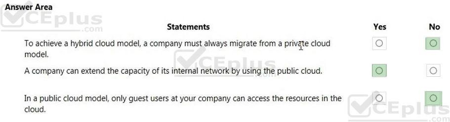

- [x] A. Managed Service Identity
- [ ] B. Identity Protection
- [ ] C. Privileged Identity Management
- [ ] D. Azure AD Connect

> **Explanation:** The Logistics department needs applications hosted on VMs to safely access Azure Key Vault. Managed Service Identity (MSI) provides an automatically managed identity in Azure AD for applications running on VMs, allowing them to authenticate to services like Azure Key Vault without storing credentials in code. Privileged Identity Management would suit Procurement (just-in-time access + notifications); Identity Protection suits sign-in risk scenarios; Azure AD Connect is for syncing on-premises AD to Azure AD.

---

### 114. A company deployed a web service on a VM in a virtual network. An API Management service provides access to this API. Consultant companies must connect to the API over the Internet. Based on the configuration shown below, would the API be available to the consultants over the Internet?

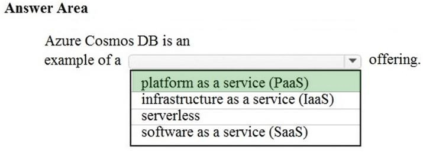

> The API Management gateway is configured with **Virtual Network = External**, connected to the `whizlab-network` VNet in Central US.

- [x] A. Yes
- [ ] B. No

> **Explanation:** With the Virtual Network setting set to **External**, the API Management gateway is accessible from the public Internet while also having access to resources within the VNet. This means consultant companies can connect to the API over the Internet. If it were set to **Internal**, only resources within the VNet could access it.

---

### 115. A company wants to deploy an application that requires full .Net framework, OS-level admin access, and redundancy if an Azure region fails. Solution: Deploy 2 Azure VMs in 2 separate regions and create a Traffic Manager Profile. Does this meet the requirement?

- [x] A. Yes
- [ ] B. No

> **Explanation:** Azure Virtual Machines provide full OS access and the ability to install the full .Net framework. Deploying VMs in two separate regions ensures redundancy if one region fails. Azure Traffic Manager with a failover routing policy routes traffic to the healthy region automatically. All three requirements are met.

---

### 116. A team needs to generate an alert from Azure Log Analytics when a CosmosDB request charge exceeds 40 units more than 10 times during a 10-minute window. Which two actions should you recommend? *(Choose two)*

- [x] A. Create a search query to identify when the requestCharge_s exceeds 40
- [ ] B. Create a search query to identify when the requestCharge_s exceeds 10
- [ ] C. Create a search query to identify when the duration_s exceeds 10
- [x] D. Configure a period of 10 and a frequency of 10

> **Explanation:** The query must filter for `requestCharge_s > 40` to identify requests exceeding 40 units. Setting the alert period and frequency both to 10 minutes defines the 10-minute evaluation window. The threshold of "more than 10 times" is configured in the alert rule itself.

---

### 117. A VM will host SQL Server with 2 data disks — one for log files and one for data files. Which caching policy should you recommend for the disk containing the log files?

- [x] A. None
- [ ] B. ReadOnly
- [ ] C. WriteOnly
- [ ] D. ReadWrite

> **Explanation:** SQL Server transaction log disks should use **no caching (None)**. Log files are write-heavy and sequential — caching provides no benefit and could cause data consistency issues. Data disks benefit from ReadOnly caching; log disks do not.

---

### 118. A development team needs to start and stop VMs on specific occasions only. You must use the principle of least privilege and minimize costs. Which security feature should you use?

- [ ] A. Conditional Access policy
- [ ] B. Azure Policies
- [ ] C. Just in time VM access
- [x] D. Privileged Identity Management

> **Explanation:** Azure AD Privileged Identity Management (PIM) enables just-in-time privileged access to Azure resources. Users are assigned eligible roles and can activate them only when needed, for a limited time — following the principle of least privilege. This minimizes standing access while controlling costs.

---

### 119. Applications are deployed across Windows and Linux VMs using Log Analytics. Which table should you query for events from Windows Event Logs?

- [ ] A. Azure Activity
- [ ] B. Azure Diagnostics
- [x] C. Event
- [ ] D. Syslog

> **Explanation:** The **Event** table in Log Analytics stores events collected from Windows Event Logs. The **Syslog** table is used for Linux syslog events. Azure Activity logs Azure subscription-level operations; Azure Diagnostics captures resource-level diagnostic data.

---

### 120. Data in a Microsoft SQL Server 2008 table needs to be migrated to an Azure CosmosDB account using the SQL API. Which tool should you use?

- [ ] A. AzCopy
- [x] B. Azure CosmosDB Data Migration tool
- [ ] C. Data Management Gateway
- [ ] D. Data Migration Assistant

> **Explanation:** The Azure CosmosDB Data Migration tool is designed specifically to import data from various sources — including SQL Server databases — into Azure Cosmos DB. AzCopy is for Azure Storage; Data Migration Assistant is for SQL Server to Azure SQL Database migrations.

---

### 121. A company plans to deploy an Azure Web App to 2 regions and ensure it stays available if one region fails, while minimizing deployment costs. Which service should you include?

- [ ] A. Azure Functions
- [x] B. Azure Traffic Manager
- [ ] C. Azure Application Gateway
- [ ] D. Azure Load Balancer

> **Explanation:** Azure Traffic Manager is a DNS-based traffic routing service that can route users to the healthy region if one region fails (using the failover routing method). It works at the DNS level across regions, unlike Application Gateway and Load Balancer which operate within a single region.

---

### 122. A company plans to deploy a stateless microservices application using Azure Service Fabric. Which two factors should you consider when designing the infrastructure? *(Choose two)*

- [x] A. The number of node types in the cluster
- [x] B. The properties for each node type
- [ ] C. The network connectivity
- [ ] D. The service tier

> **Explanation:** When planning an Azure Service Fabric cluster, you must determine the number of node types (primary and secondary) and the properties for each node type (VM size, number of nodes, durability tier, etc.). These define the cluster's capacity and capabilities.

---

### 123. Which Azure service should you use to correlate events from multiple resources into a centralized repository?

- [ ] A. Azure Event Hubs
- [ ] B. Azure Analysis Services
- [x] C. Azure Monitor
- [ ] D. Azure Log Analytics

> **Explanation:** Azure Monitor collects and correlates telemetry data from multiple Azure resources into a centralized platform. It provides a unified solution for monitoring, analysis, and alerting across your Azure environment.

---

### 124. "Data that is stored in the Archive access tier of an Azure Storage account <u>can be accessed at any time by using azcopy.exe</u>." Is the underlined text correct?

- [ ] A. No change is needed
- [ ] B. can only be read by using Azure Backup
- [ ] C. must be restored before the data can be accessed
- [x] D. must be rehydrated before the data can be accessed

> **Explanation:** Data in the Archive tier is offline and cannot be accessed directly. Before you can read it, the blob must be **rehydrated** — moved to the Hot or Cool tier — which can take several hours. "Rehydrated" is the correct Azure terminology (not just "restored").

---

### 125. "Azure Cosmos DB is an example of a <u>platform as a service (PaaS)</u> offering." Is the underlined text correct?

- [x] A. No change is needed
- [ ] B. infrastructure as a service (IaaS)
- [ ] C. serverless
- [ ] D. software as a service (SaaS)

> **Explanation:** Azure Cosmos DB is a PaaS cloud database service. Microsoft manages the underlying infrastructure, patching, and availability — customers manage the data and configuration. The statement is correct.

---

### 126. An Azure administrator needs to run a PowerShell script that creates Azure resources. Which three computers can run the script? *(Choose three)*

- [x] A. a computer that runs macOS and has PowerShell Core 6.0 installed
- [x] B. a computer that runs Windows 10 and has the Azure PowerShell module installed
- [x] C. a computer that runs Chrome OS and uses Azure Cloud Shell
- [ ] D. a computer that runs Linux and has the Azure CLI tools installed

> **Explanation:** PowerShell scripts require PowerShell (not Azure CLI). macOS with PowerShell Core 6.0, Windows 10 with Azure PowerShell module, and Chrome OS using Azure Cloud Shell (which runs PowerShell in the browser) all support running PowerShell scripts. A Linux machine with only Azure CLI installed cannot run PowerShell scripts.

---

### 127. You need to ensure VM1 is accessible from the Internet over HTTP. What are two possible solutions? *(Choose two)*

- [ ] A. Modify a DDoS protection plan
- [x] B. Modify an Azure firewall
- [ ] C. Modify an Azure Traffic Manager profile
- [x] D. Modify a network security group (NSG)

> **Explanation:** Both Azure Firewall and NSGs can control inbound port access. Adding a rule to allow port 80 (HTTP) in either an NSG or Azure Firewall will make VM1 accessible over HTTP. DDoS protection does not manage connectivity; Traffic Manager is a DNS routing service and does not control port access.

---

### 128. Which task can you perform by using Azure Advisor?

- [ ] A. Integrate Active Directory and Azure Active Directory (Azure AD)
- [x] B. Estimate the costs of an Azure solution
- [ ] C. Confirm that Azure subscription security follows best practices
- [ ] D. Evaluate which on-premises resources can be migrated to Azure

> **Explanation:** Azure Advisor analyzes your Azure usage and provides personalized recommendations across cost, security, reliability, performance, and operational excellence. It can estimate costs and recommend ways to reduce them. Security Center handles security posture; Azure Migrate handles on-premises assessments.

---

### 129. In which type of cloud model are all hardware resources owned by a third-party and shared between multiple tenants?

- [ ] A. private
- [ ] B. hybrid
- [x] C. public

> **Explanation:** In the public cloud (e.g., Microsoft Azure, AWS, Google Cloud), all hardware is owned and managed by the cloud provider (a third party) and is shared among multiple customers (tenants). Private cloud hardware is owned by the organization itself.

---

### 130. To which cloud models can you deploy physical servers?

- [x] A. private cloud and hybrid cloud only
- [ ] B. private cloud only
- [ ] C. private cloud, hybrid cloud, and public cloud
- [ ] D. hybrid cloud only

> **Explanation:** Physical servers can only be deployed in environments where you have access to on-premises infrastructure — which is the private cloud and the on-premises portion of a hybrid cloud. In the public cloud, Microsoft owns and manages all physical hardware; customers cannot deploy their own physical servers.

---

### 131. You have 50 virtual machines hosted on-premises and 50 virtual machines hosted in Azure, all connected to each other. Which type of cloud model is this?

- [x] A. hybrid
- [ ] B. private
- [ ] C. public

> **Explanation:** A hybrid cloud combines on-premises (private) infrastructure with public cloud resources. Having VMs both on-premises and in Azure that connect to each other is a classic example of a hybrid cloud model.

---

## Section 2: Hotspot (97 Questions)

### 132. For each of the following statements, select Yes if the statement is true. Otherwise, select No.  
<u>NOTE: Each correct selection is worth one point.</u>

**Hot Area:**

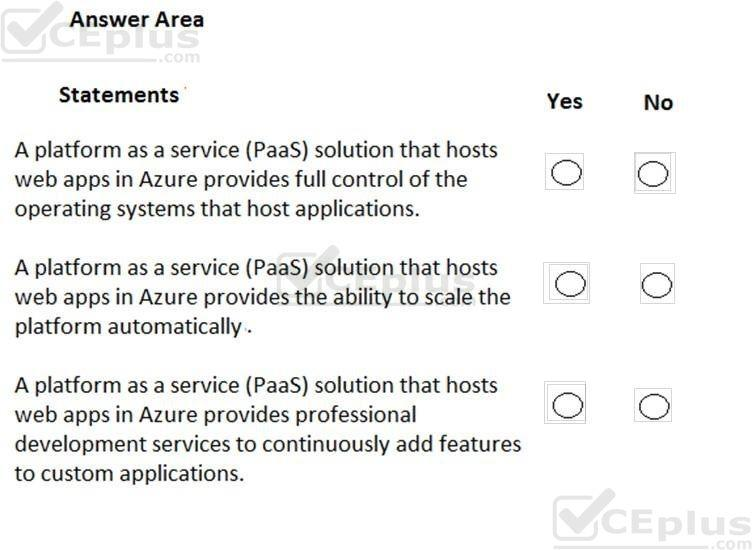

**Correct Answer:**

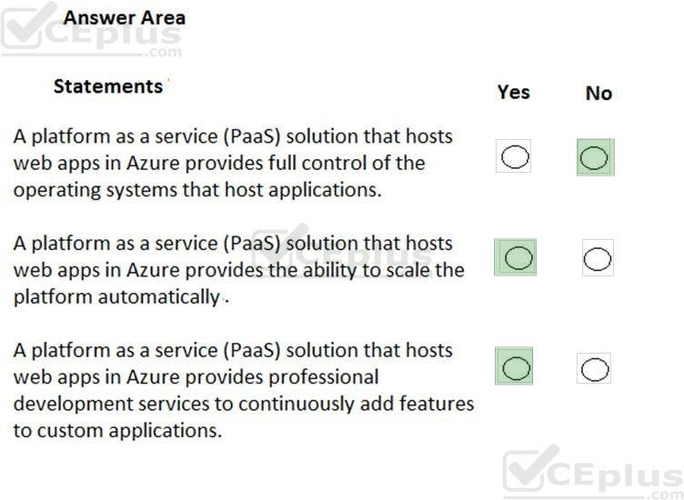

> **Explanation:**
>
> **Box 1: No** — A PaaS solution does not provide access to the operating system. The Azure Web Apps service provides an environment for you to host your web applications. Behind the scenes, the web apps are hosted on virtual machines running IIS. However, you have no direct access to the virtual machine, the operating system or IIS.
>
> **Box 2: Yes** — A PaaS solution that hosts web apps in Azure does provide the ability to scale the platform automatically. This is known as autoscaling. Behind the scenes, the web apps are hosted on virtual machines running IIS. Autoscaling means adding more load balanced virtual machines to host the web apps.
>
> **Box 3: Yes** — PaaS provides a framework that developers can build upon to develop or customize cloud-based applications. PaaS development tools can cut the time it takes to code new apps with pre-coded application components built into the platform, such as workflow, directory services, security features, search and so on.

---

### 133. For each of the following statements, select Yes if the statement is true. Otherwise, select No.  
<u>NOTE: Each correct selection is worth one point.</u>

**Hot Area:**

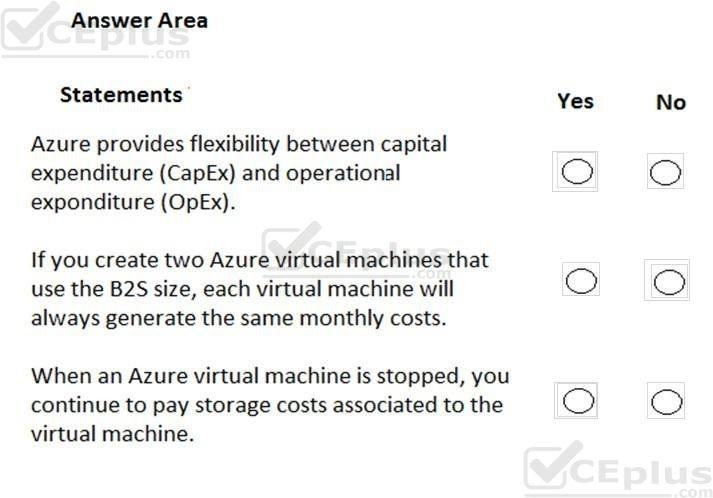

**Correct Answer:**

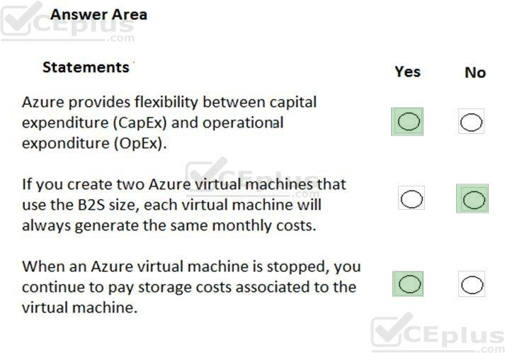

> **Explanation:**
>
> **Box 1: Yes** — Traditionally, IT expenses have been considered a Capital Expenditure (CapEx). Today, with the move to the cloud and the pay-as-you-go model, organizations have the ability to stretch their budgets and are shifting their IT CapEx costs to Operating Expenditures (OpEx) instead. This flexibility, in accounting terms, is now an option due to the “as a Service” model of purchasing software, cloud storage and other IT related resources.
>
> **Box 2: No** — Two virtual machines using the same size could have different disk configurations. Therefore, the monthly costs could be different.
>
> **Box 3: Yes** — When an Azure virtual machine is stopped, you don’t pay for the virtual machine. However, you do still pay for the storage costs associated to the virtual machine. The most common storage costs are for the disks attached to the virtual machines. There are also other storage costs associated with a virtual machine such as storage for diagnostic data and virtual machine backups.

---

### 134. Which cloud deployment solution is used for Azure virtual machines and Azure SQL databases? To answer, select the appropriate options in the answer area.  
<u>NOTE: Each correct selection is worth one point.</u>

**Hot Area:**

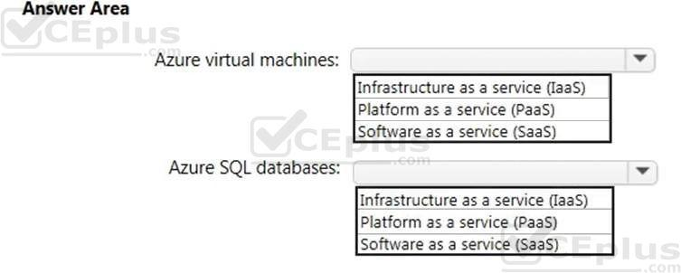

**Correct Answer:**

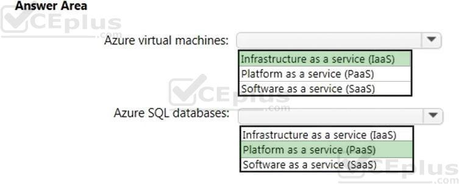

> **Explanation:**
>
> **Box 1:** Azure virtual machines are Infrastructure as a Service (IaaS). Infrastructure as a Service is the most flexible category of cloud services. It aims to give you complete control over the hardware that runs your application (IT infrastructure servers and virtual machines (VMs), storage, networks, and operating systems). Instead of buying hardware, with IaaS, you rent it.
>
> **Box 2:** Azure SQL databases are Platform as a Service (Paas). Azure SQL Database is a fully managed Platform as a Service (PaaS) Database Engine that handles most of the database management functions such as upgrading, patching, backups, and monitoring without user involvement. Azure SQL Database is always running on the latest stable version of SQL Server Database Engine and patched OS with 99.99% availability. PaaS capabilities that are built-in into Azure SQL database enable you to focus on the domain specific database administration and optimization activities that are critical for your business.

---

### 135. For each of the following statements, select Yes if the statement is true. Otherwise, select No.  
<u>NOTE: Each correct selection is worth one point.</u>

**Hot Area:**

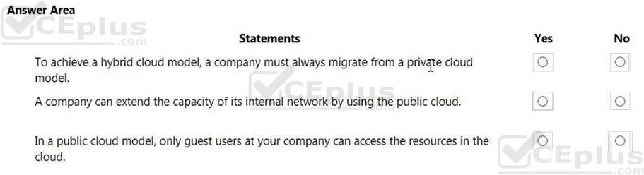

**Correct Answer:**

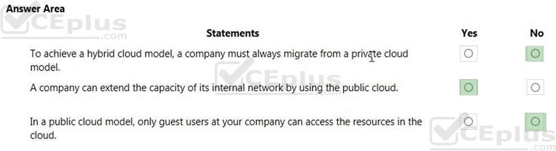

> **Explanation:**
>
> **Box 1: No** — It is not true that a company must always migrate from a private cloud model to implement a hybrid cloud. You could start with a public cloud and then combine that with an on-premise infrastructure to implement a hybrid cloud.
>
> **Box 2: Yes** — A company can extend the capacity of its internal network by using the public cloud. This is very common. When you need more capacity, rather than pay out for new on-premises infrastructure, you can configure a cloud environment and connect your on-premises network to the cloud environment by using a VPN.
>
> **Box 3: No** — It is not true that only guest users can access cloud resources. You can give anyone with an account in Azure Active Directory access to the cloud resources. There are many authentication scenarios but a common one is to replicate your on-premises Active Directory accounts to Azure Active Directory and provide access to the Azure Active Directory accounts. Another commonly used authentication method is ‘Federation’ where authentication for access to cloud resources is passed to another authentication provider such as an on-premises Active Directory.

---

### 136. You need to view a list of planned maintenance events that can affect the availability of an Azure subscription.  
Which blade should you use from the Azure portal? To answer, select the appropriate blade in the answer area.

**Hot Area:**

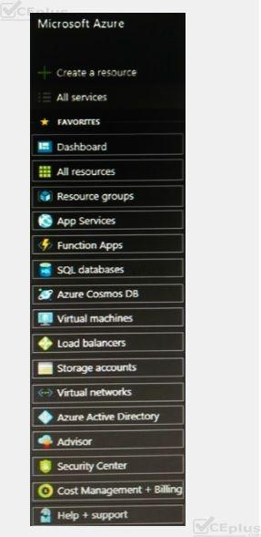

**Correct Answer:**

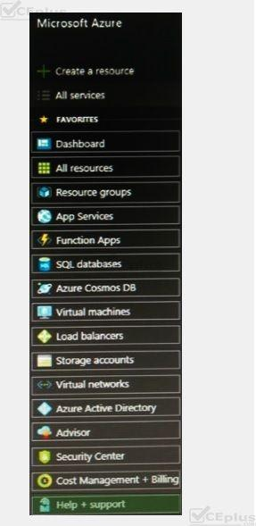

> **Explanation:** Answer: Help + support On the Help and Support blade, there is a Service Health option. If you click Service Health, a new blade opens. The Service Health blade contains the Planned Maintenance link which opens a blade where you can view a list of planned maintenance events that can affect the availability of an Azure subscription.

---

### 137. You plan to implement an Azure database solution.  
You need to implement a database solution that meets the following requirements:  
Can add data concurrently from multiple regions  
Can store JSON documents  
Which database service should you deploy? To answer, select the appropriate service in the answer area.

**Hot Area:**

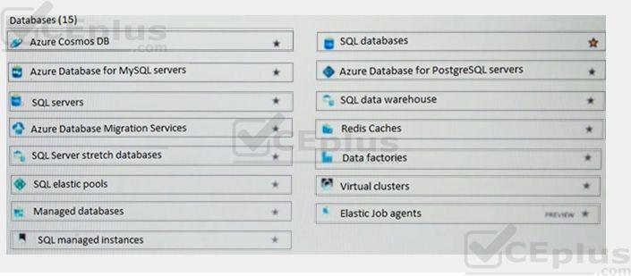

**Correct Answer:**

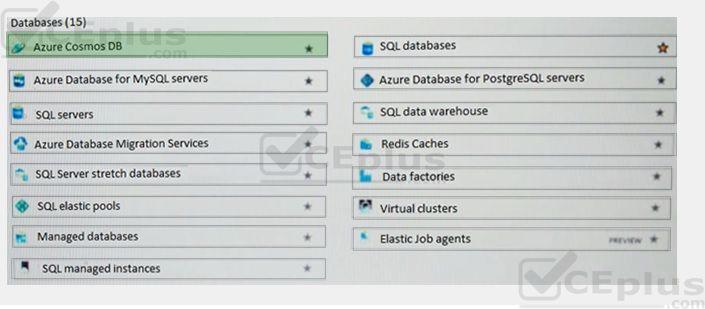

> **Explanation:** Azure Cosmos DB is the correct answer. It is a globally distributed, multi-model database that supports multi-region concurrent writes and natively stores JSON documents.

---

### 138. For each of the following statements, select Yes if the statement is true. Otherwise, select No.  
<u>NOTE: Each correct selection is worth one point.</u>

**Hot Area:**

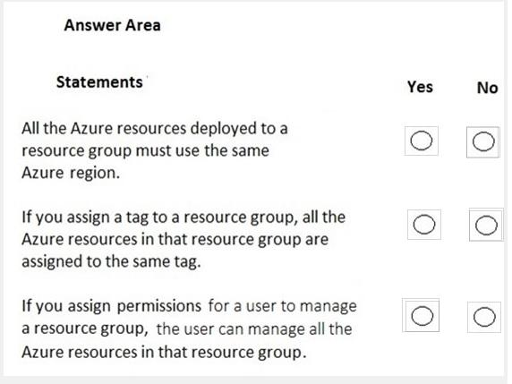

**Correct Answer:**

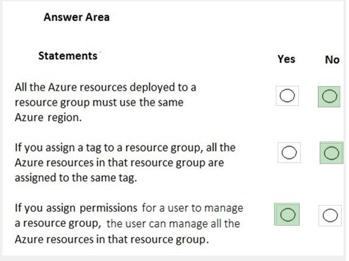

> **Explanation:**
>
> **Box 1: No** — Azure resources deployed to a single resource group can be located in different regions. The resource group only contains metadata about the resources it contains. When creating a resource group, you need to provide a location for that resource group. You may be wondering, "Why does a resource group need a location? And, if the resources can have different locations than the resource group, why does the resource group location matter at all?" The resource group stores metadata about the resources. When you specify a location for the resource group, you're specifying where that metadata is stored. For compliance reasons, you may need to ensure that your data is stored in a particular region.
>
> **Box 2: No** — Tags for Resources are not inherited by default from their Resource Group
>
> **Box 3: Yes** — A resource group can be used to scope access control for administrative actions. By default, permissions set at the resource level are inherited by the resources in the resource group.

---

### 139. For each of the following statements, select Yes if the statement is true. Otherwise, select No.  
<u>NOTE: Each correct selection is worth one point.</u>

**Hot Area:**

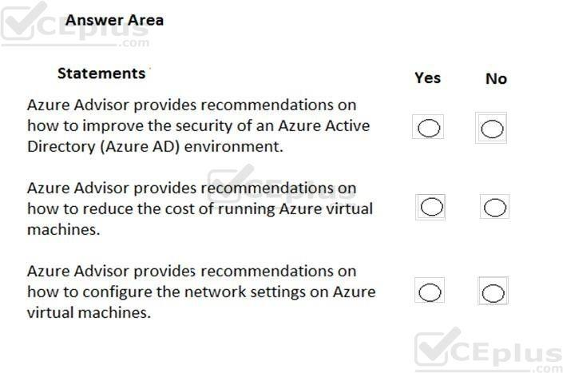

**Correct Answer:**

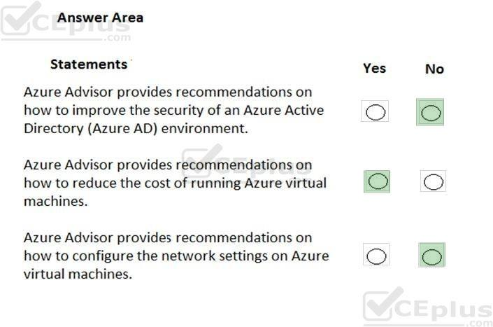

> **Explanation:**
>
> **Box 1: No** — Azure Advisor does not provide recommendations specific to Azure Active Directory environments.
>
> **Box 2: Yes** — Azure Advisor does recommend ways to reduce costs, including identifying underutilized virtual machines.
>
> **Box 3: No** — Azure Advisor does not configure network settings on virtual machines.

---

### 140. Several support engineers plan to manage Azure by using the computers shown in the following table:  
You need to identify which Azure management tools can be used from each computer.  
What should you identify for each computer? To answer, select the appropriate options in the answer area.  
<u>NOTE: Each correct selection is worth one point.</u>

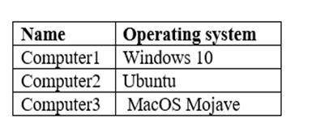

**Hot Area:**

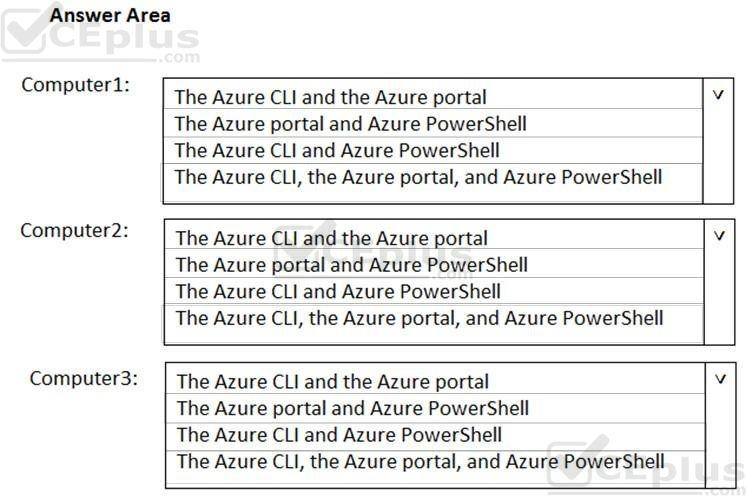

**Correct Answer:**

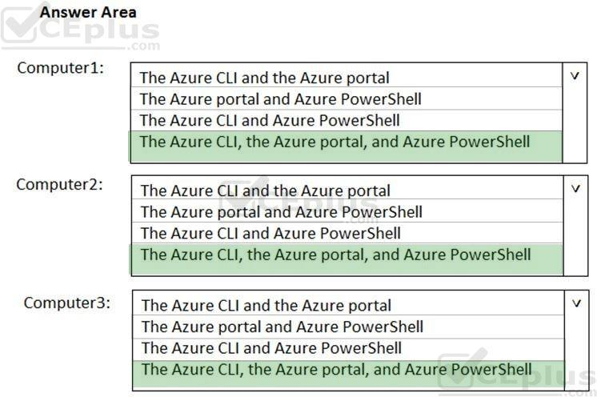

> **Explanation:** Previously, the Azure CLI (or x-plat CLI) was the only option for managing Azure subscriptions and resources from the command-line on Linux and macOS. Now with the open source and cross-platform release of PowerShell, you’ll be able to manage all your Azure resources from Windows, Linux and macOS using your tool of choice, either the Azure CLI or Azure PowerShell cmdlets. The Azure portal runs in a web browser so can be used in either operating system.

---

### 141. You plan to deploy a critical line-of-business application to Azure.  
The application will run on an Azure virtual machine.  
You need to recommend a deployment solution for the application. The solution must provide a guaranteed availability of 99.99 percent.  
What is the minimum number of virtual machines and the minimum number of availability zones you should recommend for the deployment? To answer, select the appropriate options in the answer area.  
<u>NOTE: Each correct selection is worth one point.</u>

**Hot Area:**

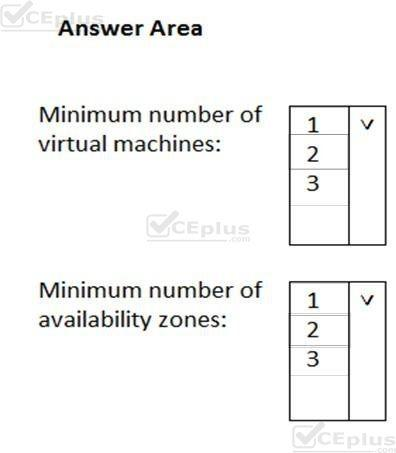

**Correct Answer:**

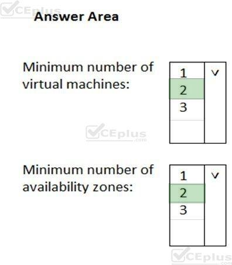

> **Explanation:** You need a minimum of two virtual machines with each one located in a different availability zone. Availability Zones is a high-availability offering that protects your applications and data from datacenter failures. Availability Zones are unique physical locations within an Azure region. Each zone is made up of one or more datacenters equipped with independent power, cooling, and networking. To ensure resiliency, there’s a minimum of three separate zones in all enabled regions. The physical separation of Availability Zones within a region protects applications and data from datacenter failures. Zone-redundant services replicate your applications and data across Availability Zones to protect from single-points-of-failure. With Availability Zones, Azure offers industry best 99.99% VM uptime SLA.

---

### 142. For each of the following statements, select Yes if the statement is true. Otherwise, select No.  
<u>NOTE: Each correct selection is worth one point.</u>

**Hot Area:**

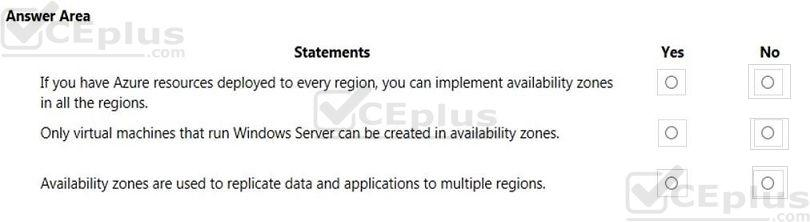

**Correct Answer:**

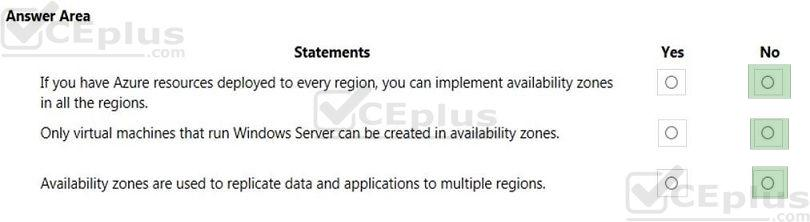

> **Explanation:**
>
> **Box 1: No** — Not all Azure regions support availability zones.
>
> **Box 2: No** — Regions that support availability zones support Linux virtual machines.
>
> **Box 3: Yes** — Availability Zones is a high-availability offering that protects your applications and data from datacenter failures. Availability Zones are unique physical locations within an Azure region. Each zone is made up of one or more datacenters equipped with independent power, cooling, and networking. To ensure resiliency, there’s a minimum of three separate zones in all enabled regions. The physical separation of Availability Zones within a region protects applications and data from datacenter failures. Zone-redundant services replicate your applications and data across Availability Zones to protect from single-points-of-failure. With Availability Zones, Azure offers industry best 99.99% VM uptime SLA.

---

### 143. You need to manage Azure by using Azure Cloud Shell.  
Which Azure portal icon should you select? To answer, select the appropriate icon in the answer area.

**Hot Area:**

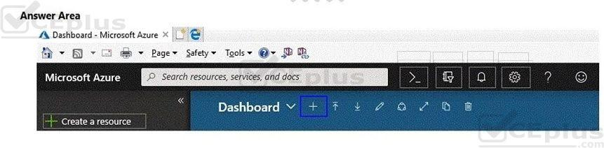

**Correct Answer:**

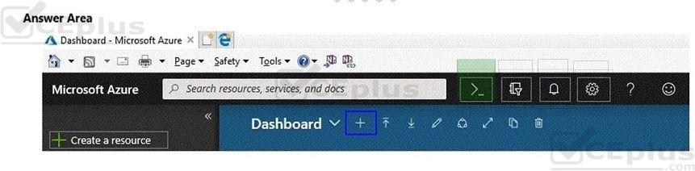

> **Explanation:** Answer: >_ You can access Azure Cloud Shell in the Azure portal by clicking the icon. Azure Cloud Shell is an interactive, authenticated, browser-accessible shell for managing Azure resources. It provides the flexibility of choosing the shell experience that best suits the way you work, either Bash or PowerShell. Cloud Shell enables access to a browser-based command-line experience built with Azure management tasks in mind.

---

### 144. You have an Azure environment that contains 10 web apps. To which URL should you connect to manage all the Azure resources? To answer, select the appropriate options in the answer area.  
<u>NOTE: Each correct selection is worth one point.</u>

**Hot Area:**

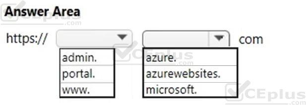

**Correct Answer:**

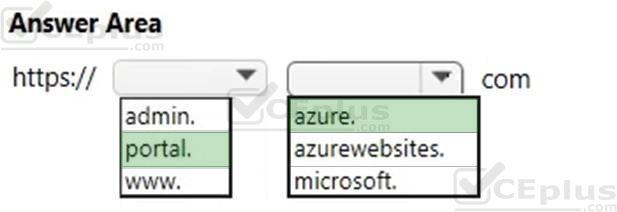

> **Explanation:** Answer: portal.azure.com — Connect to https://portal.azure.com to manage all Azure resources via the web-based Azure portal.

---

### 145. You plan to extend your company’s network to Azure. The network contains a VPN appliance that uses an IP address of 131.107.200.1.  
You need to create an Azure resource that defines the VPN appliance in Azure.  
Which Azure resource should you create? To answer, select the appropriate resource in the answer area.

**Hot Area:**

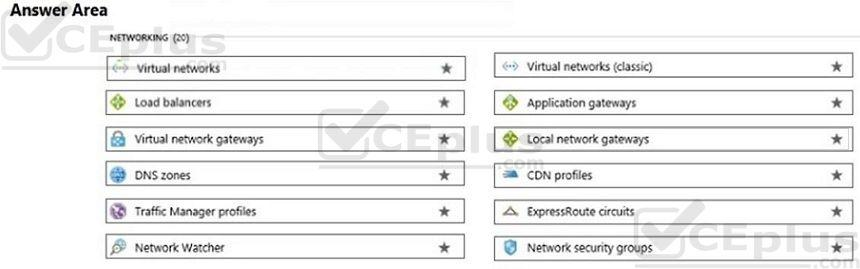

**Correct Answer:**

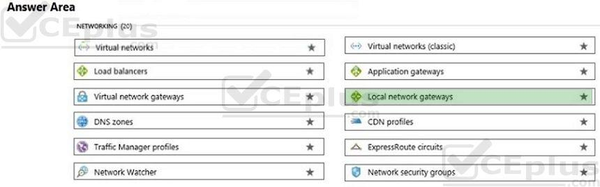

> **Explanation:** A Local Network Gateway is an object in Azure that represents your on-premise VPN device. A Virtual Network Gateway is the VPN object at the Azure end of the VPN. A ‘connection’ is what connects the Local Network Gateway an the Virtual Network Gateway to bring up the VPN. The local network gateway typically refers to your on-premises location. You give the site a name by which Azure can refer to it, then specify the IP address of the on-premises VPN device to which you will create a connection. You also specify the IP address prefixes that will be routed through the VPN gateway to the VPN device. The address prefixes you specify are the prefixes located on your on-premises network. If your on-premises network changes or you need to change the public IP address for the VPN device, you can easily update the values later.

---

### 146. For each of the following statements, select Yes if the statement is true. Otherwise, select No.  
<u>NOTE: Each correct selection is worth one point.</u>

**Hot Area:**

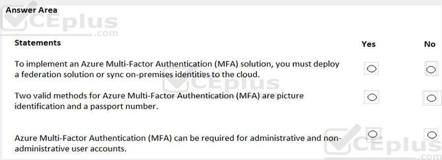

**Correct Answer:**

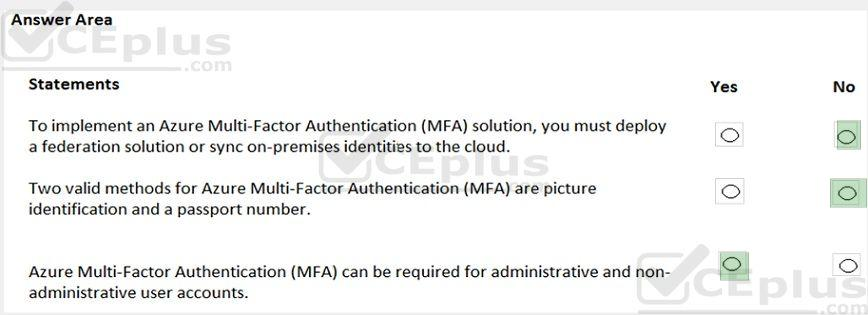

> **Explanation:**
>
> **Box 1: No** — It is not true that you must deploy a federation solution or sync on-premises identities to the cloud. You can have a cloud-only environment and use MFA.
>
> **Box 2: No** — Picture identification and passport numbers are not valid MFA authentication methods. Valid methods include: Password, Microsoft Authenticator App, SMS and Voice call.
>
> **Box 3:** You can configure MFA to be required for administrator accounts only or you can configure MFA for any user account.

---

### 147. You create a resource group named RG1 in Azure Resource Manager.  
You need to prevent the accidental deletion of the resources in RG1.  
Which setting should you use? To answer, select the appropriate setting in the answer area.

**Hot Area:**

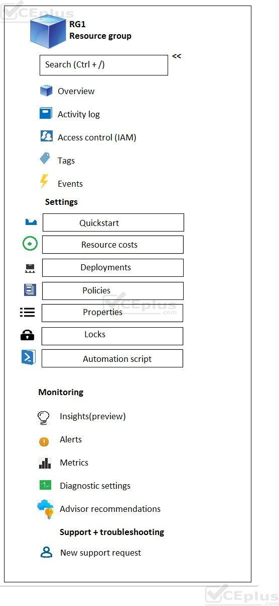

**Correct Answer:**

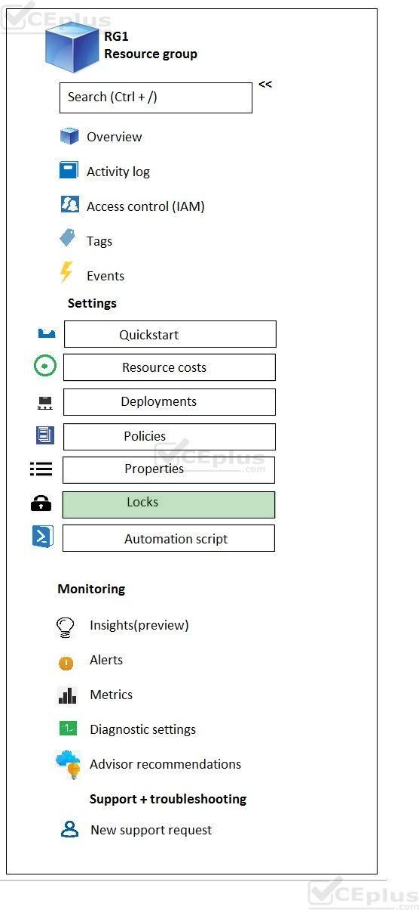

> **Explanation:** You can configure a lock on a resource group to prevent the accidental deletion. As an administrator, you may need to lock a subscription, resource group, or resource to prevent other users in your organization from accidentally deleting or modifying critical resources. You can set the lock level toCanNotDelete orReadOnly. In the portal, the locks are calledDelete andRead-only respectively. CanNotDelete means authorized users can still read and modify a resource, but they can't delete the resource. ReadOnly means authorized users can read a resource, but they can't delete or update the resource. Applying this lock is similar to restricting all authorized users to the permissions granted by the Reader role.

---

### 148. You plan to create an Azure virtual machine.  
You need to identify which storage service must be used to store the data disks of the virtual machine.  
What should you identify? To answer, select the appropriate service in the answer area.

**Hot Area:**

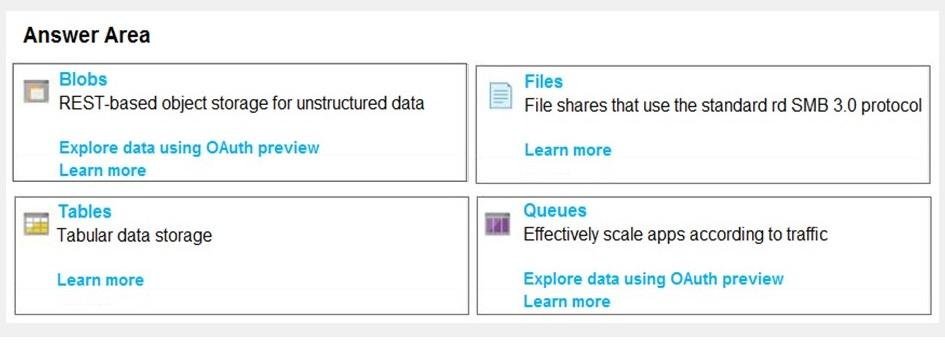

**Correct Answer:**

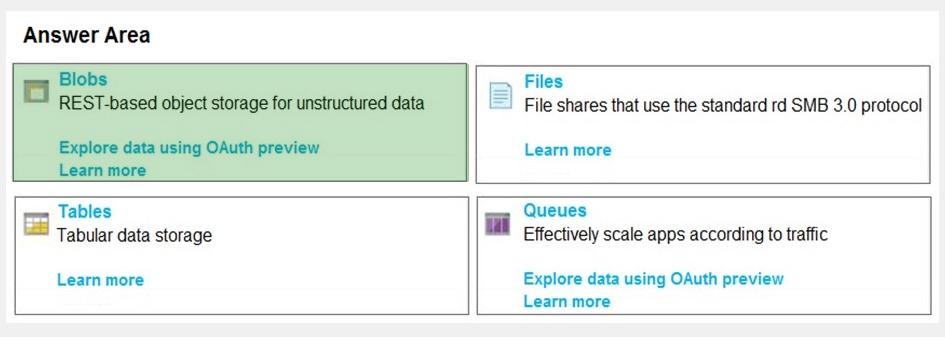

> **Explanation:** Answer: Azure Managed Disks — Azure Managed Disks are block-level storage volumes managed by Azure and used with Azure Virtual Machines.

---

### 149. You plan to implement several security services for an Azure environment. You need to identify which Azure services must be used to meet the following security requirements:  
Monitor threats by using sensors  
Enforce azure Multi-Factor Authentication (MFA) based on a condition  
Which Azure service should you identify for each requirement? To answer, select the appropriate option in the answer area.  
<u>NOTE: Each correct selection is worth one point.</u>

**Hot Area:**

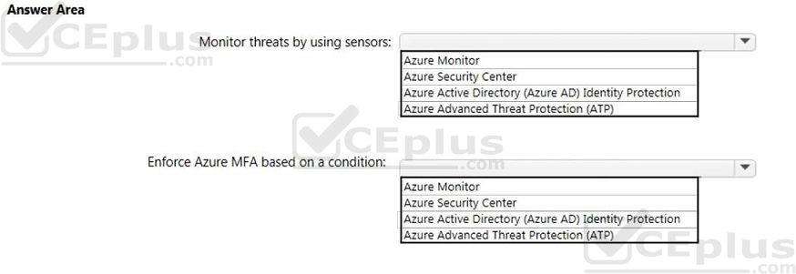

**Correct Answer:**

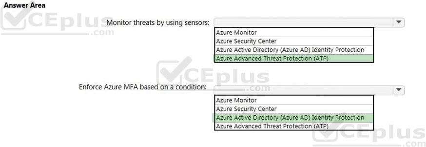

> **Explanation:**
>
> **Box 1: Azure Advanced Threat Protection (ATP)** — Monitors threats using sensors deployed across your network.
>
> **Box 2: Azure Active Directory (AD) Conditional Access** — Enforces MFA based on conditions such as user location or device state.

---

### 150. For each of the following statements, select Yes if the statement is true. Otherwise, select No.  
<u>NOTE: Each correct selection is worth one point.</u>

**Hot Area:**

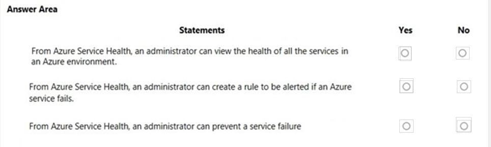

**Correct Answer:**

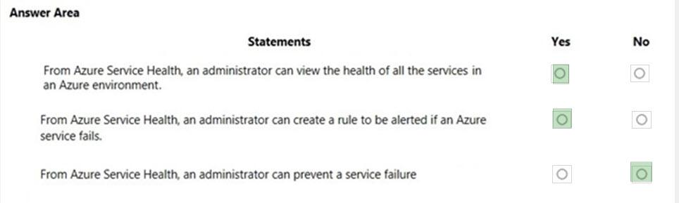

> **Explanation:**
>
> **Box 1: Yes** — Azure Service Health allows administrators to view the health of all services in an Azure environment.
>
> **Box 2: Yes** — Administrators can create alert rules in Azure Service Health to be notified when a service fails.
>
> **Box 3: No** — Azure Service Health cannot prevent service failures; it only provides visibility and alerts.

---

### 151. For each of the following statements, select Yes if the statement is true. Otherwise, select No.  
<u>NOTE: Each correct selection is worth one point.</u>

**Hot Area:**

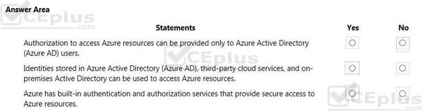

**Correct Answer:**

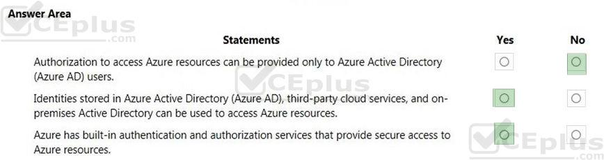

> **Explanation:**
>
> **Box 1: No** — Authorization can be provided to other identity providers too, not only Azure AD users.
>
> **Box 2: Yes** — Identities from Azure AD, third-party cloud services, and on-premises Active Directory can access Azure resources.
>
> **Box 3: Yes** — Azure has built-in authentication and authorization services that provide secure access.

---

### 152. For each of the following statements, select Yes if the statement is true. Otherwise, select No.  
<u>NOTE: Each correct selection is worth one point.</u>

**Hot Area:**

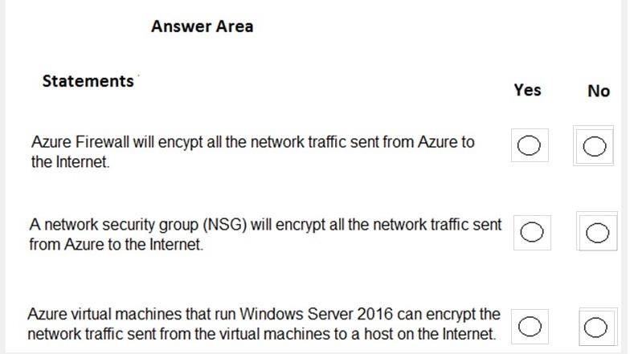

**Correct Answer:**

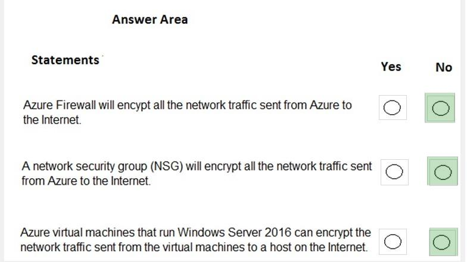

> **Explanation:**
>
> **Box 1: No** — Azure Firewall does not encrypt traffic; it is a stateful firewall for filtering.
>
> **Box 2: No** — NSGs filter traffic based on rules but do not encrypt it.
>
> **Box 3: No** — Windows Server 2016 VMs do not automatically encrypt network traffic sent to Internet hosts.

---

### 153. For each of the following statements, select Yes if the statement is true. Otherwise, select No.  
<u>NOTE: Each correct selection is worth one point.</u>

**Hot Area:**

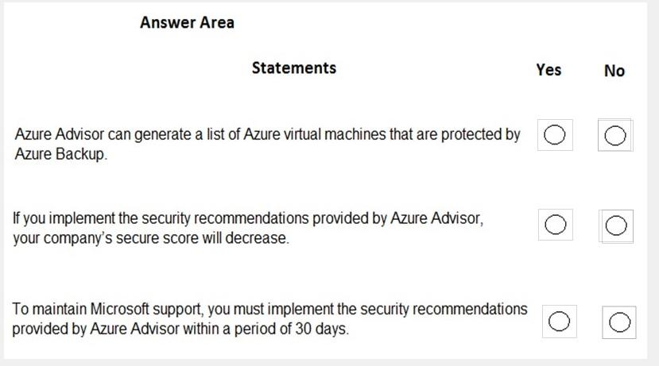

**Correct Answer:**

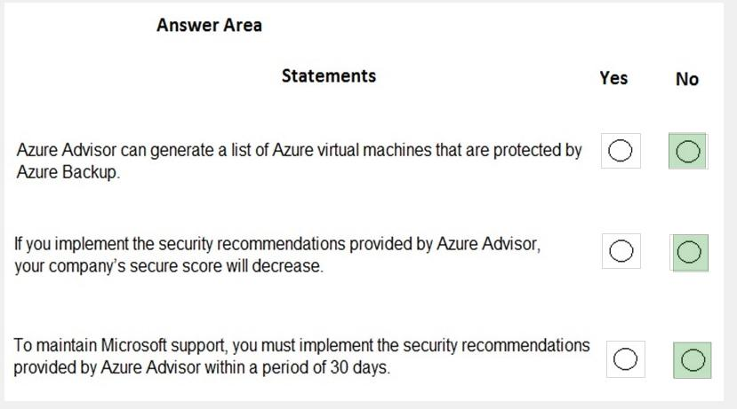

> **Explanation:**
>
> **Box 1: No** — Azure Advisor cannot generate a list of VMs protected by Azure Backup.
>
> **Box 2: No** — Implementing Azure Advisor security recommendations increases (improves) your secure score, not decreases it.
>
> **Box 3: No** — Microsoft does not require you to implement security recommendations within 30 days to maintain support.

---

### 154. For each of the following statements, select Yes if the statement is true. Otherwise, select No.  
<u>NOTE: Each correct selection is worth one point.</u>

**Hot Area:**

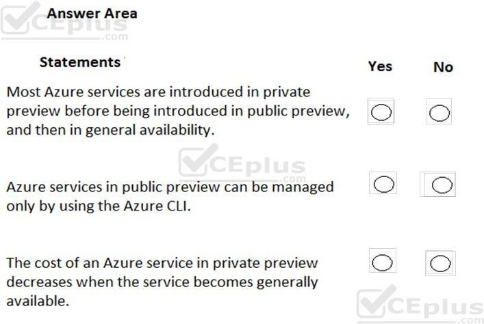

**Correct Answer:**

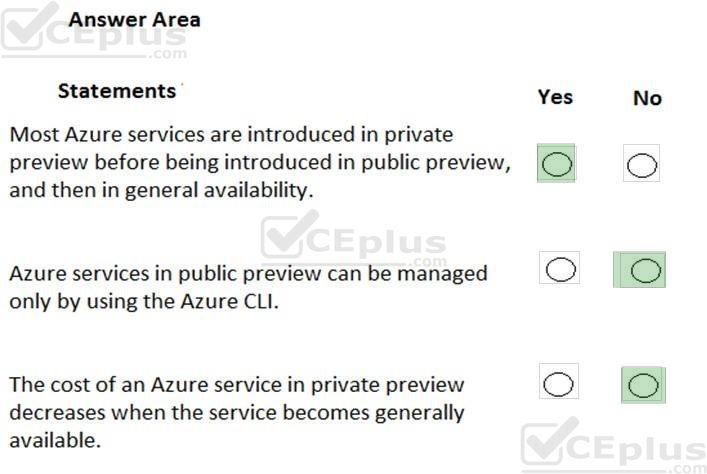

> **Explanation:**
>
> **Box 1: Yes** — Most services go to private preview then public preview before being released to general availability. The private preview is only available to certain Azure customers for evaluation purposes. The public preview is available to all Azure customers.
>
> **Box 2: No** — Azure services in public preview can be managed using the regular management tools: Azure Portal, Azure CLI and PowerShell.
>
> **Box 3: No** — Services in private or public preview are usually offered at reduced costs. However, the costs increase, not decrease when the services are released to general availability.

---

### 155. For each of the following statements, select Yes if the statement is true. Otherwise, select No.  
<u>NOTE: Each correct selection is worth one point.</u>

**Hot Area:**

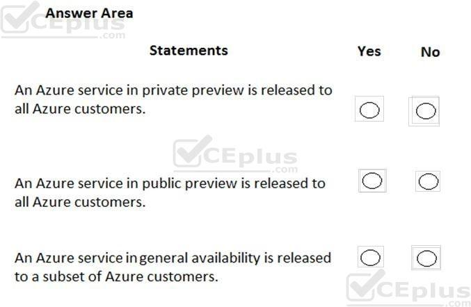

**Correct Answer:**

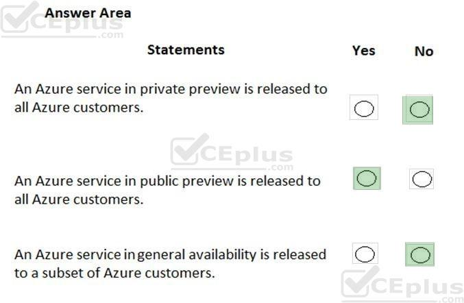

> **Explanation:**
>
> **Box 1: No** — Most services go to private preview then public preview before being released to general availability. The private preview is only available to certain Azure customers for evaluation purposes.
>
> **Box 2: Yes** — Public Preview means that the service is in public beta and can be tried out by anyone with an Azure subscription. Services in public preview are often offered at a discount price. Public previews are excluded from SLAs and in some cases, no support is offered.
>
> **Box 3: No** — An Azure service in general availability is available to all Azure customers, not just a subset of the customers.

---

### 156. For each of the following statements, select Yes if the statement is true. Otherwise, select No.  
<u>NOTE: Each correct selection is worth one point.</u>

**Hot Area:**

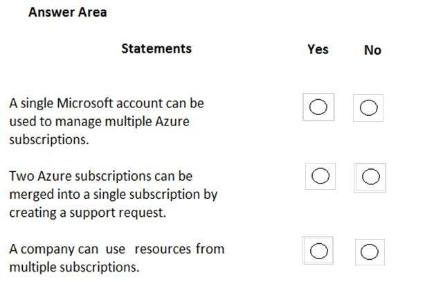

**Correct Answer:**

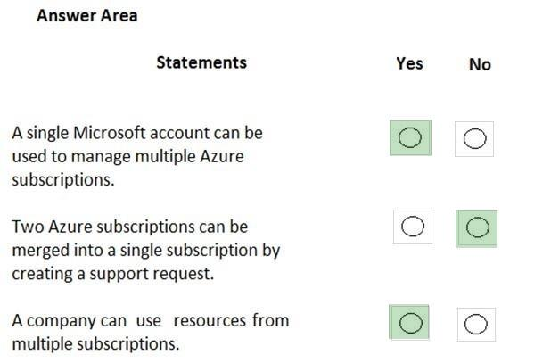

> **Explanation:**
>
> **Box 1: Yes** — A single Microsoft account can manage multiple Azure subscriptions.
>
> **Box 2: No** — Two Azure subscriptions cannot be merged into one; subscriptions cannot be merged.
>
> **Box 3: Yes** — A company can use resources from multiple subscriptions.

---

### 157. For each of the following statements, select Yes if the statement is true. Otherwise, select No.  
<u>NOTE: Each correct selection is worth one point.</u>

**Hot Area:**

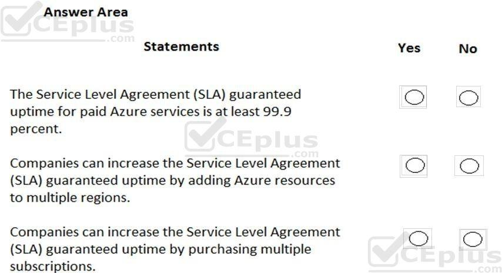

**Correct Answer:**

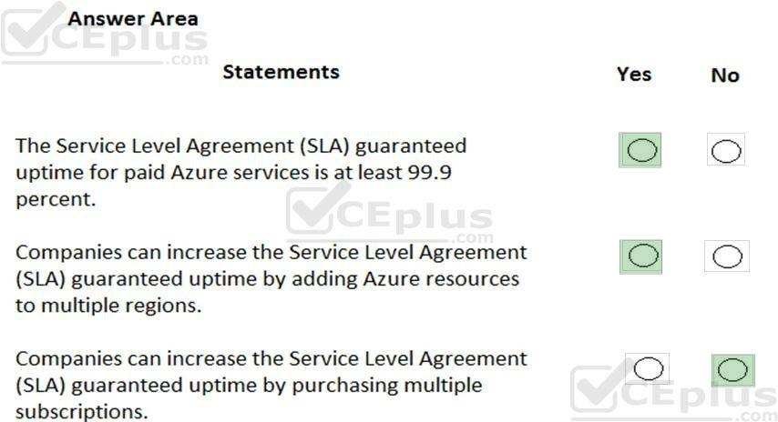

> **Explanation:**
>
> **Box 1: Yes** — The SLA guaranteed uptime for paid Azure services is at least 99.9 percent.
>
> **Box 2: Yes** — Companies can increase SLA uptime by deploying Azure resources to multiple regions.
>
> **Box 3: No** — Purchasing multiple subscriptions does not increase the SLA guaranteed uptime.

---

### 158. For each of the following statements, select Yes if the statement is true. Otherwise, select No.  
<u>NOTE: Each correct selection is worth one point.</u>

**Hot Area:**

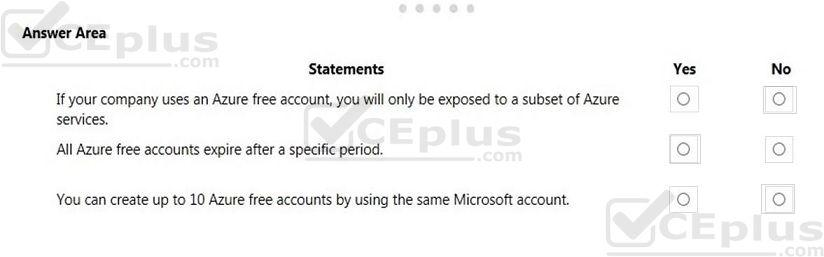

**Correct Answer:**

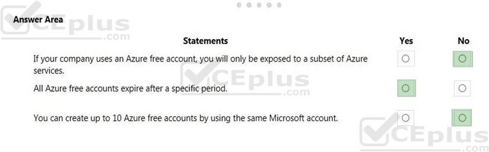

> **Explanation:**
>
> **Box 1: No** — Azure Free Account gives you 12 months access to the most popular free services. It also gives you a credit (150 GBP or 200 USD) to use on any Azure service for up to 30 days.
>
> **Box 2: Yes** — All free accounts expire after 12 months.
>
> **Box 3: No** — You can only create one free Azure account per Microsoft account.

---

### 159. For each of the following statements, select Yes if the statement is true. Otherwise, select No.  
<u>NOTE: Each correct selection is worth one point.</u>

**Hot Area:**

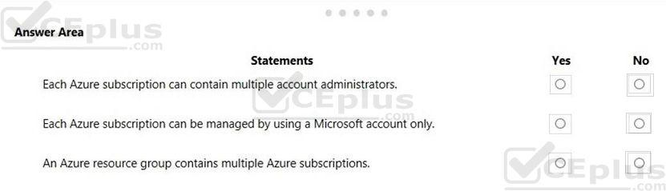

**Correct Answer:**

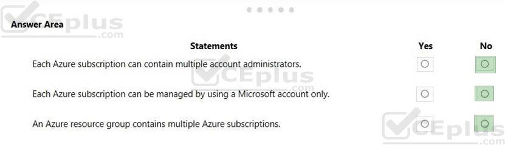

> **Explanation:**
>
> **Box 1: No** — The Account Administrator is the subscription owner. Conceptually, this is the billing owner of the subscription. Every Azure subscription has one Account Administrator, which defaults to the person who created the subscription.
>
> **Box 2: No** — You need an Azure Active Directory account to manage a subscription, not a Microsoft account. An account is created in the Azure Active Directory when you create the subscription. Further accounts can be created in the Azure Active Directory to manage the subscription.
>
> **Box 3: No** — Resource groups are logical containers for Azure resources. However, resource groups do not contain subscriptions. Subscriptions contain resource groups.

---

### 160. For each of the following statements, select Yes if the statement is true. Otherwise, select No.  
<u>NOTE: Each correct selection is worth one point.</u>

**Hot Area:**

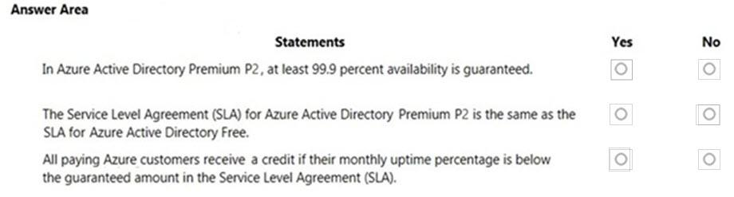

**Correct Answer:**

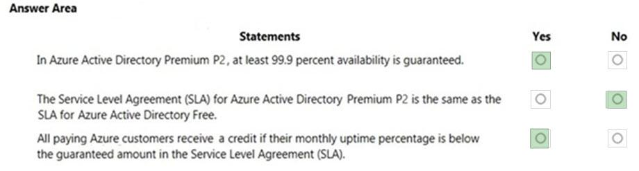

> **Explanation:**
>
> **Box 1: Yes** — Microsoft guarantee at least 99.9% availability of the Azure Active Directory Premium edition services. The services are considered available in the following scenarios: Users are able to login to the service, login to the Access Panel, access applications on the Access Panel and reset passwords. IT administrators are able to create, read, write and delete entries in the directory or provision or de-provision users to applications in the directory.
>
> **Box 2: No** — No SLA is provided for the Free tier of Azure Active Directory.
>
> **Box 3: Yes** — You can claim credit if the availability falls below the SLA. The amount of credit depends on the availability. For example: You can claim 25% credit if the availability is less than 99.9%, 50% credit for less than 99% and 100% for less than 95% availability.

---

### 161. For each of the following statements, select Yes if the statement is true. Otherwise, select No.  
<u>NOTE: Each correct selection is worth one point.</u>

**Hot Area:**

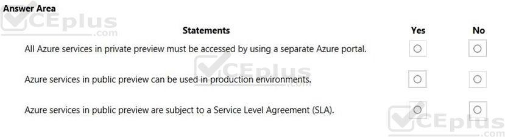

**Correct Answer:**

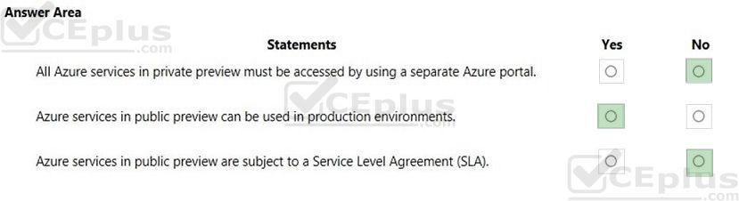

> **Explanation:** Public Preview means that the service is in public beta and can be tried out by anyone with an Azure subscription. Services in public preview are often offered at a discount price.
>
> **Box 1: No** — Services in private preview can be viewed in the regular Azure portal. However, you need to be signed up for the feature in private preview before you can view it. Access to private preview features is usually by invitation only.
>
> **Box 2: Yes** — You can use services in public preview in production environments. However, you should be aware that the service may have faults, is not subject to an SLA and may be withdrawn without notice.
>
> **Box 3: No** — Public previews are excluded from SLAs and in some cases, no support is offered.

---

### 162. For each of the following statements, select Yes if the statement is true. Otherwise, select No.  
<u>NOTE: Each correct selection is worth one point.</u>

**Hot Area:**

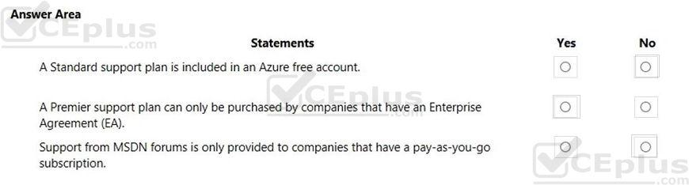

**Correct Answer:**

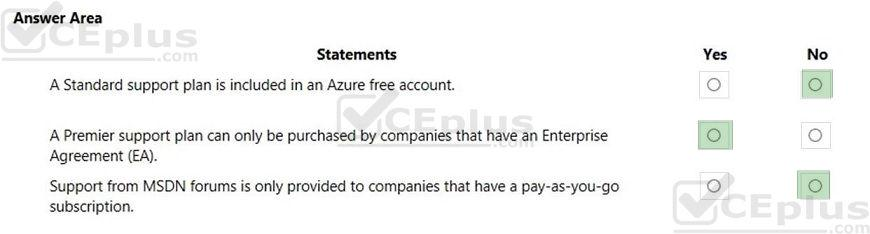

> **Explanation:**
>
> **Box 1: No** — An Azure free account comes with a ‘basic’ support plan, not a ‘standard’ support plan.
>
> **Box 2: Yes** — You can purchase the Professional Direct, Standard, and Developer support plans with the Microsoft Customer Agreement. You can also purchase the Professional and Standard support plans with the Enterprise Agreement.
>
> **Box 3: No** — Users with any type of Azure subscription (pay-as-you-go, Enterprise Agreement, Microsoft Customer Agreement etc.) can get support from the MSDN forums.

---

### 163. How should you calculate the monthly uptime percentage? To answer, select the appropriate options in the answer area.  
<u>NOTE: Each correct selection is worth one point.</u>

**Hot Area:**

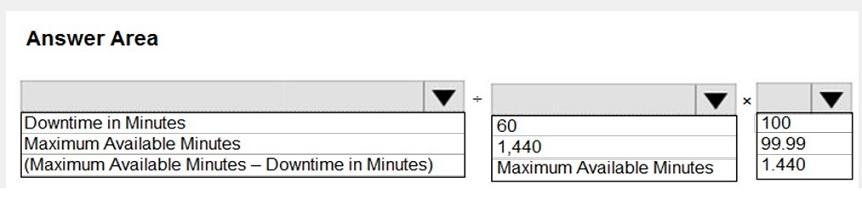

**Correct Answer:**

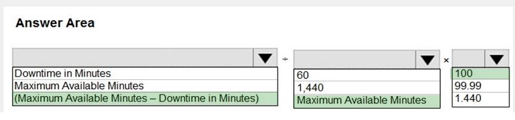

> **Explanation:** The monthly uptime percentage formula and correct values are shown in the Correct Answer image above.

---

### 164. For each of the following statements, select Yes if the statement is true. Otherwise, select No.  
<u>NOTE: Each correct selection is worth one point.</u>

**Hot Area:**

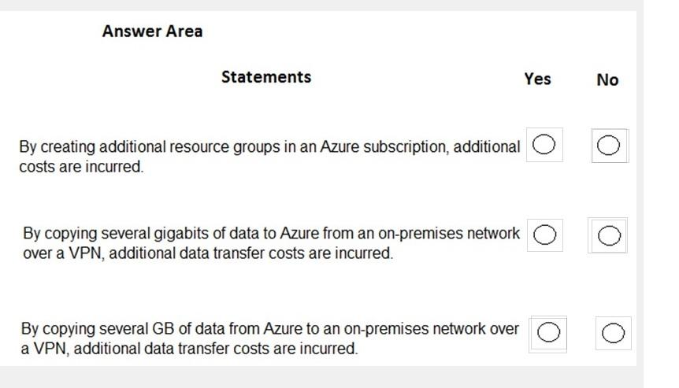

**Correct Answer:**

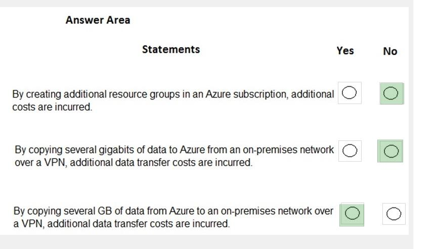

> **Explanation:**
>
> **Box 1: No** — Creating additional resource groups does not incur additional costs; resource groups are free.
>
> **Box 2: No** — Copying data to Azure over a VPN does not incur costs; inbound data transfer is free.
>
> **Box 3: Yes** — Copying data from Azure to an on-premises network over a VPN incurs outbound data transfer costs.

---

### 165. For each of the following statements, select Yes if the statement is true. Otherwise, select No.  
<u>NOTE: Each correct selection is worth one point.</u>

**Hot Area:**

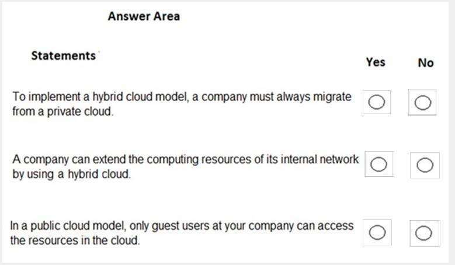

**Correct Answer:**

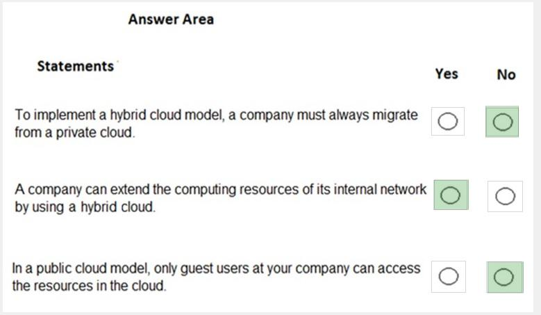

> **Explanation:**
>
> **Box 1: No** — It is not true that a company must always migrate from a private cloud model to implement a hybrid cloud. You could start with a public cloud and then combine that with an on-premise infrastructure to implement a hybrid cloud.
>
> **Box 2: Yes** — A company can extend the computing resources of its internal network by using the public cloud. This is very common. When you need more resources, rather than pay out for new on-premises infrastructure, you can configure a cloud environment and connect your on-premises network to the cloud environment by using a VPN.
>
> **Box 3: No** — It is not true that only guest users can access cloud resources. You can give anyone with an account in Azure Active Directory access to the cloud resources. There are many authentication scenarios but a common one is to replicate your on-premises Active Directory accounts to Azure Active Directory and provide access to the Azure Active Directory accounts. Another commonly used authentication method is ‘Federation’ where authentication for access to cloud resources is passed to another authentication provider such as an on-premises Active Directory.

---

### 166. You need to identify which blades in the Azure portal must be used to perform the following tasks:  
View security recommendations.  
Monitor the health of Azure services.  
Browse available virtual machine images.  
Which blade should you identify for each task? To answer, select the appropriate options in the answer area.  
<u>NOTE: Each correct selection is worth one point.</u>

**Hot Area:**

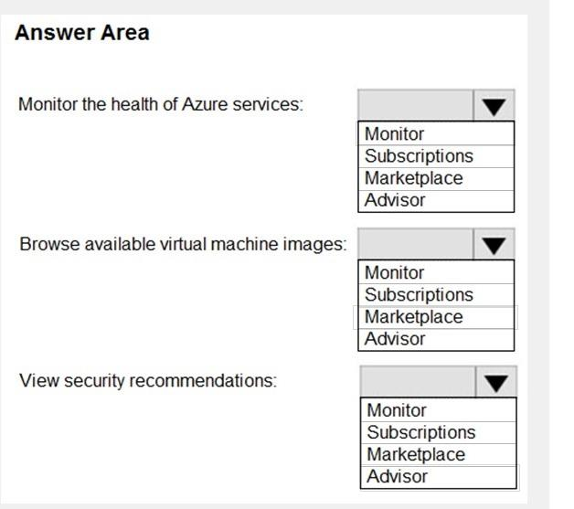

**Correct Answer:**

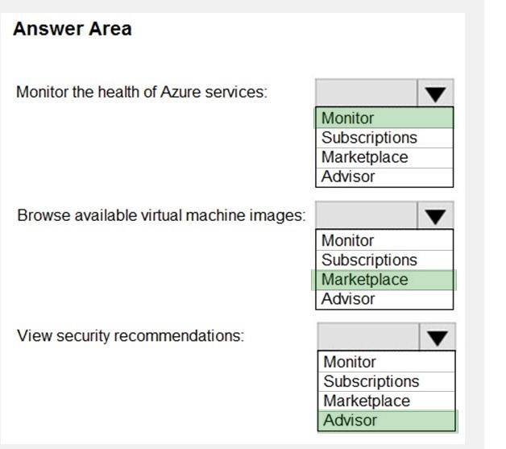

> **Explanation:**
>
> **Box 1:** Azure Monitor is used to monitor the health of Azure services. Azure Monitor maximizes the availability and performance of your applications and services by delivering a comprehensive solution for collecting, analyzing, and acting on telemetry from your cloud and on-premises environments. It helps you understand how your applications are performing and proactively identifies issues affecting them and the resources they depend on.
>
> **Box 2:** You can browse available virtual machine images in the Azure Marketplace. Azure Marketplace provides access and information on solutions and services available from Microsoft and their partners. Customers can discover, try, or buy cloud software solutions built on or for Azure. The catalog of 8,000+ listings provides Azure building blocks, such as Virtual Machines (VMs), APIs, Azure apps, Solution Templates and managed applications, SaaS apps, containers, and consulting services.
>
> **Box 3:** . Azure Advisor displays security recommendations. Azure Advisor provides you with a consistent, consolidated view of recommendations for all your Azure resources. It integrates with Azure Security Center to bring you security recommendations. You can get security recommendations from the Security tab on the Advisor dashboard. Security Center helps you prevent, detect, and respond to threats with increased visibility into and control over the security of your Azure resources. It periodically analyzes the security state of your Azure resources. When Security Center identifies potential security vulnerabilities, it creates recommendations. The recommendations guide you through the process of configuring the controls you need.

---

### 167. For each of the following statements, select Yes if the statement is true. Otherwise, select No.  
<u>NOTE: Each correct selection is worth one point.</u>

**Hot Area:**

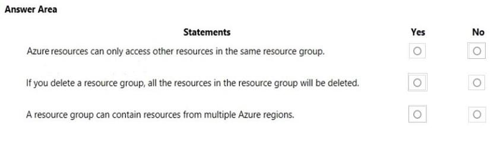

**Correct Answer:**

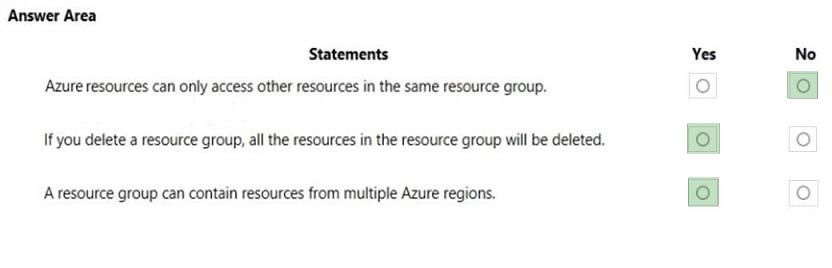

---

### 168. For each of the following statements, select Yes if the statement is true. Otherwise, select No.  
<u>NOTE: Each correct selection is worth one point.</u>

**Hot Area:**

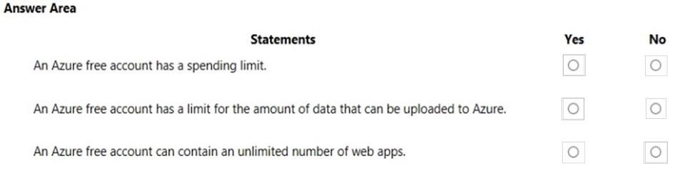

**Correct Answer:**

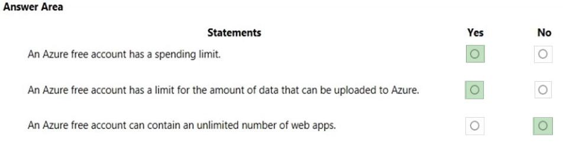

> **Explanation:**
>
> **Box 1: Yes** — 
>
> **Box 2: Yes** — Azure free account has a 5 GB blob storage limit and a 5 GB file storage limit.
>
> **Box 3: No** — Azure free account has a limit of 10 web, mobile or API apps

---

### 169. For each of the following statements, select Yes if the statement is true. Otherwise, select No.  
<u>NOTE: Each correct selection is worth one point.</u>

**Hot Area:**

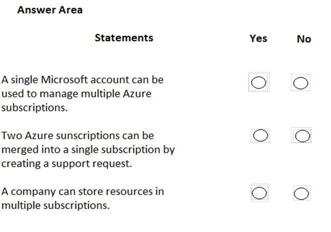

**Correct Answer:**

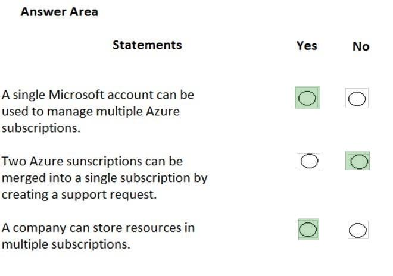

> **Explanation:**
>
> **Box 1: Yes** — You can use the same account to manage multiple subscriptions. You can create an additional subscription for your account in the Azure portal. You may want an additional subscription to avoid hitting subscription limits, to create separate environments for security, or to isolate data for compliance reasons.
>
> **Box 2: No** — You cannot merge two subscriptions into a single subscription. However, you can move some Azure resources from one subscription to another. You can also transfer ownership of a subscription and change the billing type for a subscription.
>
> **Box 3: Yes** — A company can have multiple subscriptions and store resources in the different subscriptions. However, a resource instance can exist in only one subscription.

---

### 170. For each of the following statements, select Yes if the statement is true. Otherwise, select No.  
<u>NOTE: Each correct selection is worth one point.</u>

**Hot Area:**

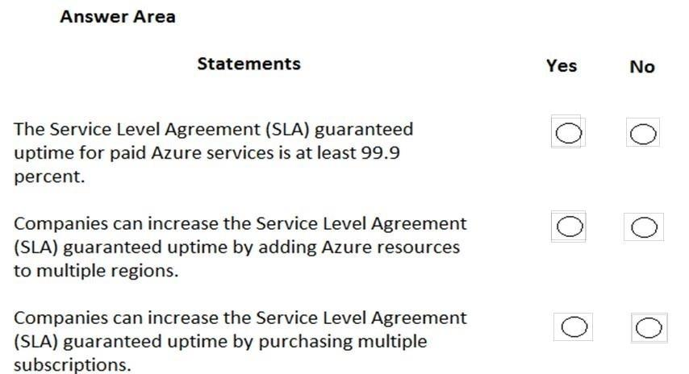

**Correct Answer:**

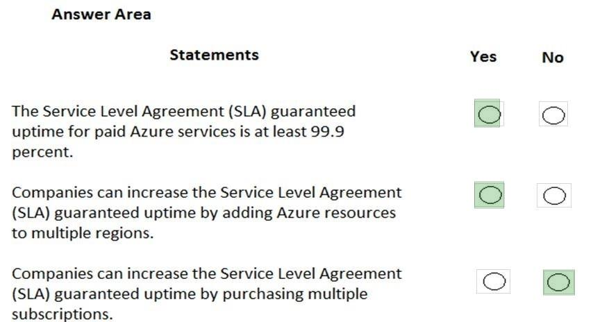

> **Explanation:**
>
> **Box 1: Yes** — SLA’s vary based on the resource type and the location distribution of the resource. However, the minimum uptime for all Azure services is 99.9 percent.
>
> **Box 2: Yes** — The SLA guaranteed uptime is increased (usually to 99.95 percent) when resources are deployed across multiple regions.
>
> **Box 3: No** — The number of subscriptions is unrelated to uptime SLA’s. You can deploy resources to multiple regions under a single subscription or you can have multiple subscriptions with resources deployed to the same region.

---

### 171. For each of the following statements, select Yes if the statement is true. Otherwise, select No.  
<u>NOTE: Each correct selection is worth one point.</u>

**Hot Area:**

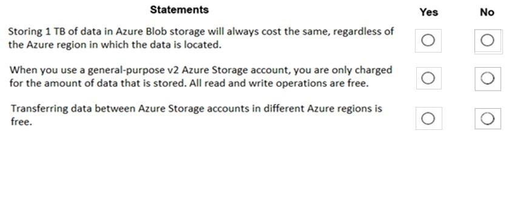

**Correct Answer:**

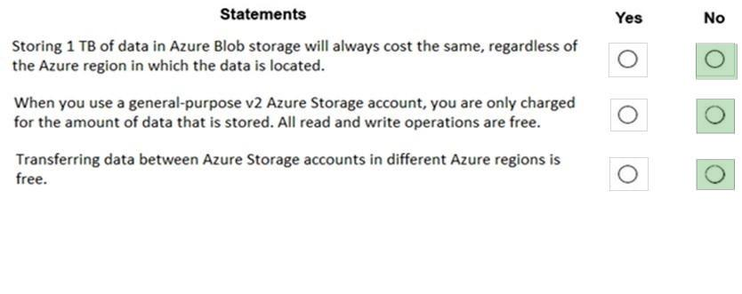

> **Explanation:**
>
> **Box 1: No** — The price of Azure storage varies by region. If you use the Azure storage pricing page, you can select different regions and see how the price changes per region.
>
> **Box 2: No** — You are charged for read and write operations in general-purpose v2 storage accounts.
>
> **Box 3: No** — You would be charge for the read operations of the source storage account and write operations in the destination storage account.

---

### 172. For each of the following statements, select Yes if the statement is true. Otherwise, select No.<u>NOTE: Each correct selection is worth one point.</u>

**Hot Area:**

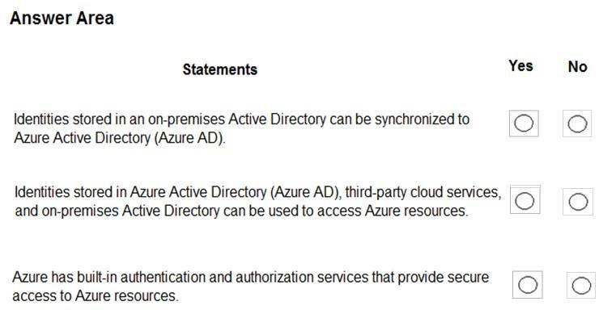

**Correct Answer:**

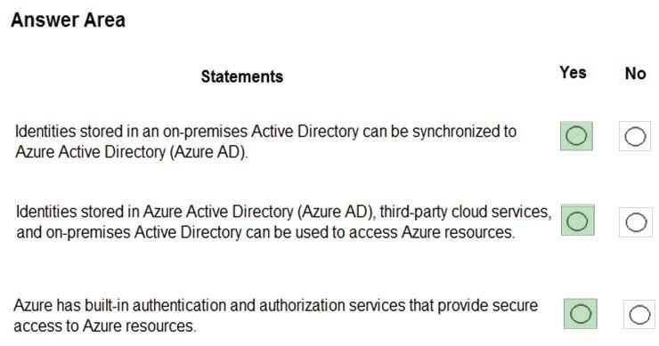

> **Explanation:**
>
> **Box 1: Yes** — On-premises Active Directory identities can be synchronized to Azure AD using Azure AD Connect.
>
> **Box 2: Yes** — Identities from Azure AD, third-party cloud services, and on-premises AD can access Azure resources.
>
> **Box 3: Yes** — Azure has built-in authentication and authorization services that provide secure access.

---

### 173. For each of the following statements, select Yes if the statement is true. Otherwise, select No.  
<u>NOTE: Each correct selection is worth one point</u>

**Hot Area:**

**Correct Answer:**

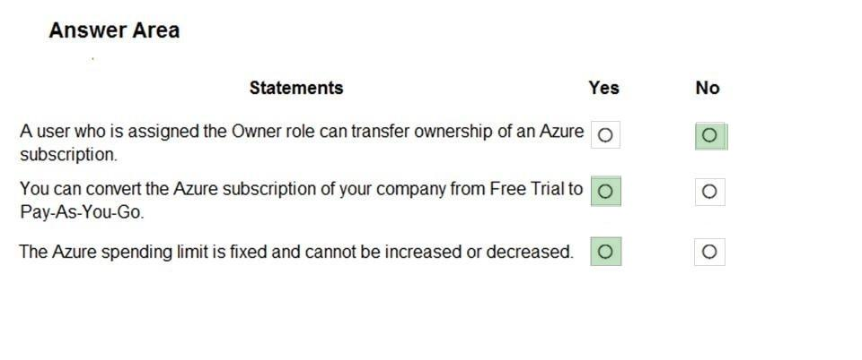

> **Explanation:**
>
> **Box 1: No** — You need to be an administrator of the billing account that has the subscription to be able to transfer the subscription. This could be a Billing Administrator or Global Administrator. A subscription owner can manage all resources and permissions within the subscription but cannot transfer ownership of the subscription.
>
> **Box 2: Yes** — You can convert a free trial subscription to Pay-As-You-Go. This is common practice for people who wish to continue using the Azure services when the free trial period expires.
>
> **Box 3: Yes** — You can remove the spending limit, but you can’t increase or decrease it. The spending limit in Azure prevents spending over your credit amount. All new customers who sign up for an Azure free account or subscription types that include credits over multiple months have the spending limit turned on by default. The spending limit is equal to the amount of credit and it can’t be changed. For example, if you signed up for Azure free account, your spending limit is $200 and you can't change it to $500. However, you can remove the spending limit. So, you either have no limit, or you have a limit equal to the amount of credit.

---

### 174. For each of the following statements, select Yes if the statement is true. Otherwise, select No.  
<u>NOTE: Each correct selection is worth one point.</u>

**Hot Area:**

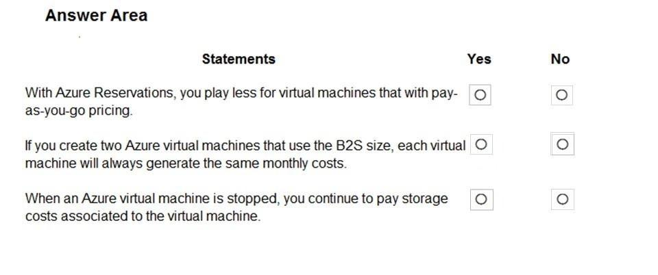

**Correct Answer:**

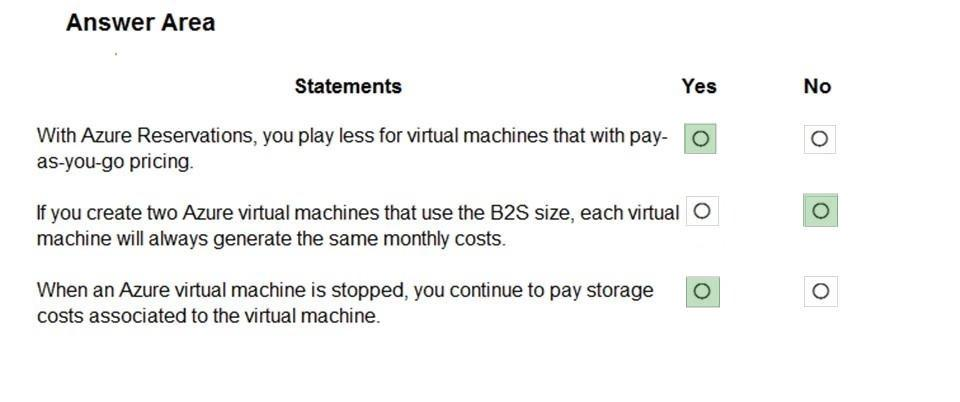

> **Explanation:**
>
> **Box 1: Yes** — A reservation is where you commit to pay for a resource (for example a virtual machine) for one or three years. This gives you a discounted price on the resource for the reservation period.
>
> **Box 2: No** — There are other factors that influence the cost of a virtual machine such as the virtual hard disks attached to the virtual machine. You could have multiple virtual machines with the same ‘size’ (B2S in this case) but with different virtual hard disk configurations.
>
> **Box 3: Yes** — When a virtual machine is stopped (deallocated), the virtual machine is unloaded/dismounted from the physical server in Azure. In this state, you are not charged for the virtual machine itself. However, you are still charged for the storage costs of the virtual hard disks attached to the virtual machine. If the virtual machine is stopped but not deallocated (this happens if you shut down the virtual machine from the operating system of the virtual machine), the virtual machine is still mounted on the physical server in Azure and you are charged for the virtual machine itself as well as the storage costs. To ensure that a virtual machine is ‘stopped (deallocated)’, you need to stop the virtual machine in the Azure portal.

---

### 175. For each of the following statements, select Yes if the statement is true. Otherwise, select No.  
<u>NOTE: Each correct selection is worth one point.</u>

**Hot Area:**

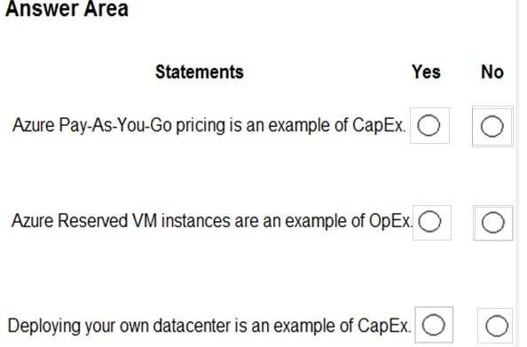

**Correct Answer:**

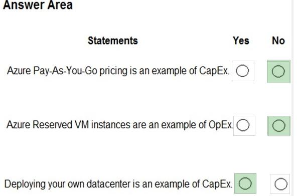

> **Explanation:** One of the major changes that you will face when you move from on-premises cloud to the public cloud is the switch from capital expenditure (buying hardware) to operating expenditure (paying for service as you use it).
>
> **Box 1: No** — With the pay-as-go model, you pay for services as you use them. This is Opex (Operational Expenditure), not CapEx (Captial Expenditure). CapEx is where you pay for something upfront. For example, buying a new physical server.
>
> **Box 2: No** — A reserved instance is where you pay upfront for the use of a virtual machine for a period of time (1 or 3 years). This can save you money as you receive a discount on the cost of a VM if you pay upfront for a reserved instance. However, as this is an upfront payment, it will be classed as CapEx, not OpEx.
>
> **Box 3: Yes** — Deploying your own datacenter is an example of CapEx. This is because you need to purchase all the infrastructure upfront before you can use it.

---

### 176. For each of the following statements, select Yes if the statement is true. Otherwise, select No.  
<u>NOTE: Each correct selection is worth one point.</u>

**Hot Area:**

**Correct Answer:**

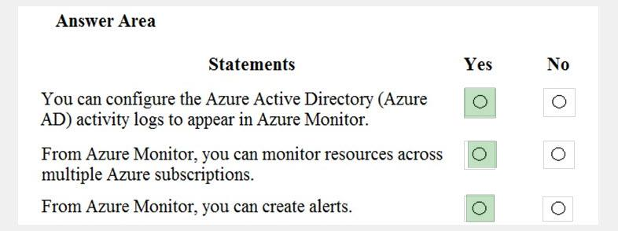

> **Explanation:**
>
> **Box 1: Yes** — You can send Azure AD activity logs to Azure Monitor logs to enable rich visualizations, monitoring and alerting on the connected data. All data collected by Azure Monitor fits into one of two fundamental types, metrics and logs (including Azure AD activity logs). Activity logs record when resources are created or modified. Metrics tell you how the resource is performing and the resources that it's consuming.
>
> **Box 2: Yes** — Azure Monitor can consolidate log entries from multiple Azure resources, subscriptions, and tenants into one location for analysis together.
>
> **Box 3: Yes** — You can create alerts in Azure Monitor. Alerts in Azure Monitor proactively notify you of critical conditions and potentially attempt to take corrective action. Alert rules based on metrics provide near real time alerting based on numeric values, while rules based on logs allow for complex logic across data from multiple sources.

---

### 177. For each of the following statements, select Yes if the statement is true. Otherwise, select No.  
<u>NOTE: Each correct selection is worth one point.</u>

**Hot Area:**

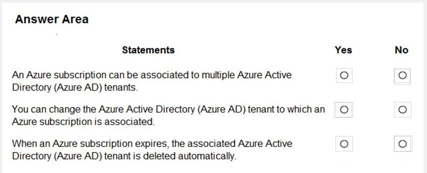

**Correct Answer:**

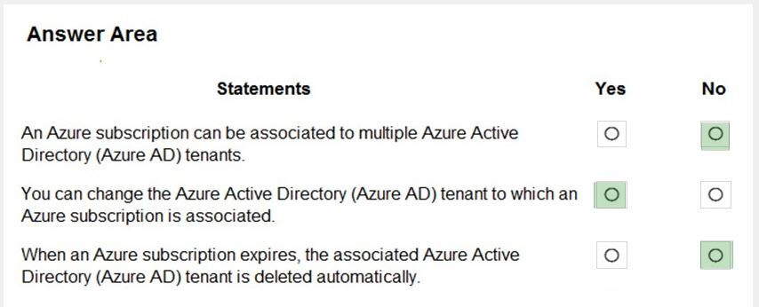

> **Explanation:**
>
> **Box 1: No** — An Azure AD tenant can have multiple subscriptions but an Azure subscription can only be associated with one Azure AD tenant.
>
> **Box 2: Yes** — 
>
> **Box 3: No** — If your subscription expires, you lose access to all the other resources associated with the subscription. However, the Azure AD directory remains in Azure. You can associate and manage the directory using a different Azure subscription.

---

### 178. For each of the following statements, select Yes if the statement is true. Otherwise, select No.  
<u>NOTE: Each correct selection is worth one point.</u>

**Hot Area:**

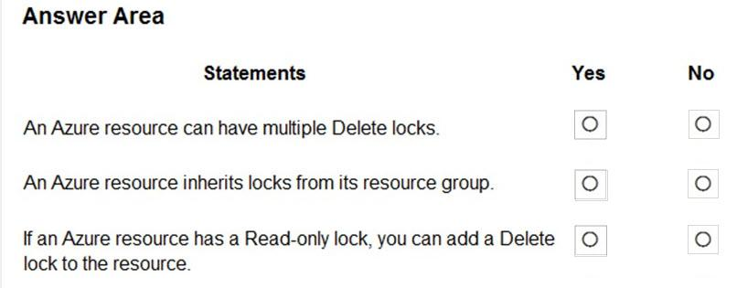

**Correct Answer:**

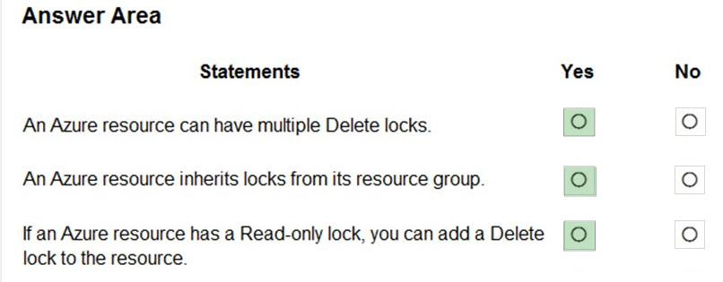

> **Explanation:**
>
> **Box 1: Yes** — An Azure resource can have multiple Delete locks.
>
> **Box 2: Yes** — An Azure resource inherits locks from its resource group.
>
> **Box 3: Yes** — If a resource has a Read-only lock, you can still add a Delete lock.

---

### 179. For each of the following statements, select Yes if the statement is true. Otherwise, select No.  
<u>NOTE: Each correct selection is worth one point.</u>

**Hot Area:**

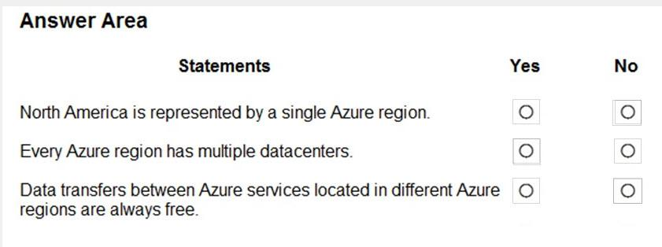

**Correct Answer:**

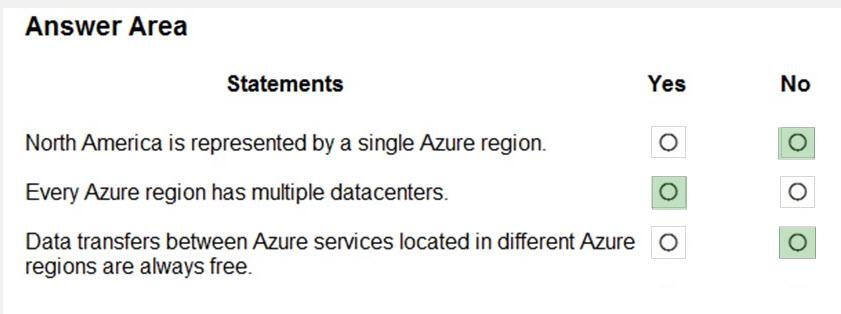

> **Explanation:**
>
> **Box 1: No** — North America has several Azure regions, including West US, Central US, South Central US, East Us, and Canada East.
>
> **Box 2: Yes** — A region is a set of datacenters deployed within a latency-defined perimeter and connected through a dedicated regional low-latency network.
>
> **Box 3: No** — Outbound data transfer is charged at the normal rate and inbound data transfer is free.

---

### 180. For each of the following statements, select Yes if the statement is true. Otherwise, select No.  
<u>NOTE: Each correct selection is worth one point.</u>

**Hot Area:**

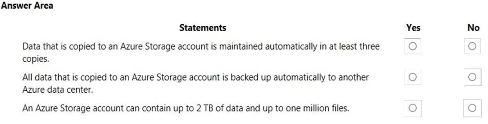

**Correct Answer:**

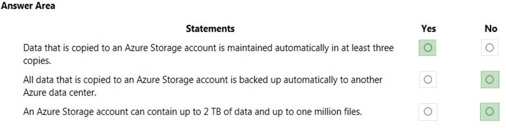

> **Explanation:**
>
> **Box 1: Yes** — There are different replication options available with a storage account. The ‘minimum’ replication option is Locally Redundant Storage (LRS). With LRS, data is replicated synchronously three times within the primary region.
>
> **Box 2: No** — Data is not backed up automatically to another Azure Data Center although it can be depending on the replication option configured for the account. Locally Redundant Storage (LRS) is the default which maintains three copies of the data in the data center. Geo-redundant storage (GRS) has cross-regional replication to protect against regional outages. Data is replicated synchronously three times in the primary region, then replicated asynchronously to the secondary region.
>
> **Box 3: No** — The limits are much higher than that. The current storage limit is 2 PB for US and Europe, and 500 TB for all other regions (including the UK) with no limit on the number of files.

---

### 181. For each of the following statements, select Yes if the statement is true. Otherwise, select No.  
<u>NOTE: Each correct selection is worth one point.</u>

**Hot Area:**

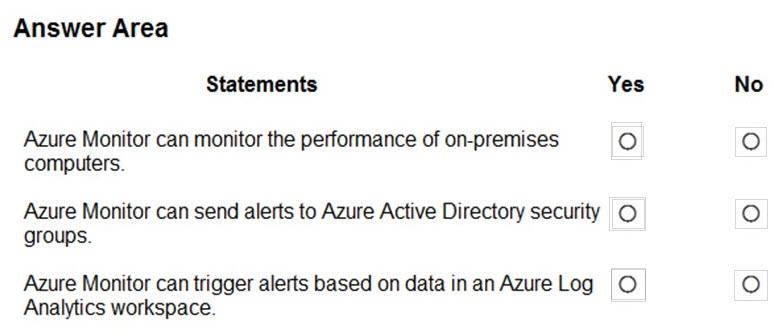

**Correct Answer:**

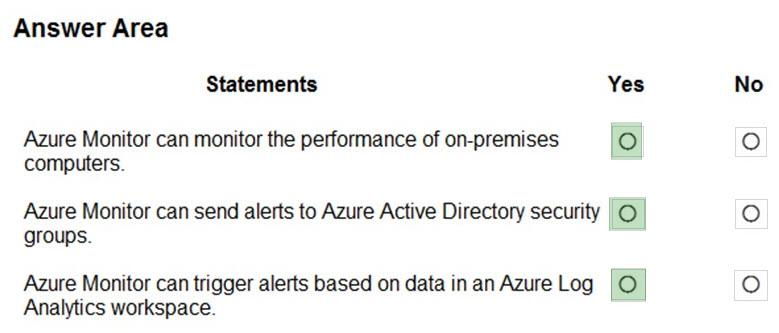

> **Explanation:**
>
> **Box 1: Yes** — Azure Monitor maximizes the availability and performance of your applications and services by delivering a comprehensive solution for collecting, analyzing, and acting on telemetry from your cloud and on-premises environments.
>
> **Box 2: Yes** — Alerts in Azure Monitor proactively notify you of critical conditions and potentially attempt to take corrective action.
>
> **Box 3: Yes** — Azure Monitor uses Target Resource, which is the scope and signals available for alerting. A target can be any Azure resource. Example targets: a virtual machine, a storage account, a virtual machine scale set, a Log Analytics workspace, or an Application Insights resource.

---

### 182. For each of the following statements, select Yes if the statement is true. Otherwise, select No.  
<u>NOTE: Each correct selection is worth one point.</u>

**Hot Area:**

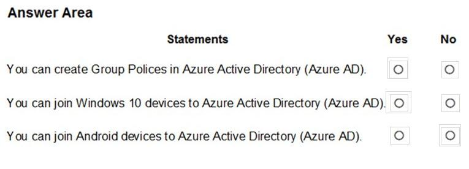

**Correct Answer:**

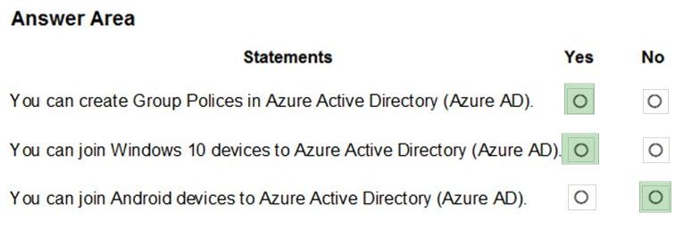

> **Explanation:** Azure AD join only applies to Windows 10 devices.

---

### 183. For each of the following statements, select Yes if the statement is true. Otherwise, select No.  
<u>NOTE: Each correct selection is worth one point.</u>

**Hot Area:**

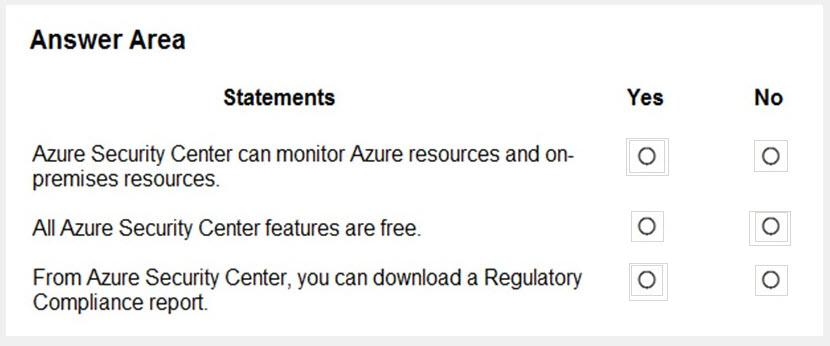

**Correct Answer:**

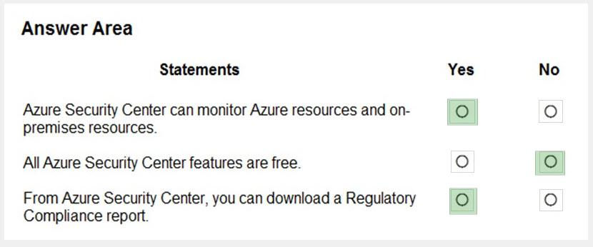

> **Explanation:**
>
> **Box 1: Yes** — Azure Security Center is a unified infrastructure security management system that strengthens the security posture of your data centers, and provides advanced threat protection across your hybrid workloads in the cloud - whether they're in Azure or not - as well as on premises.
>
> **Box 2: No** — Only two features: Continuous assessment and security recommendations, and Azure secure score, are free.
>
> **Box 3: Yes** — The advanced monitoring capabilities in Security Center also let you track and manage compliance and governance over time. The overall compliance provides you with a measure of how much your subscriptions are compliant with policies associated with your workload.

---

### 184. You need to request that Microsoft increase a subscription quota limit for your company.  
Which blade should you use from the Azure portal? To answer, select the appropriate blade in the answer area.

**Hot Area:**

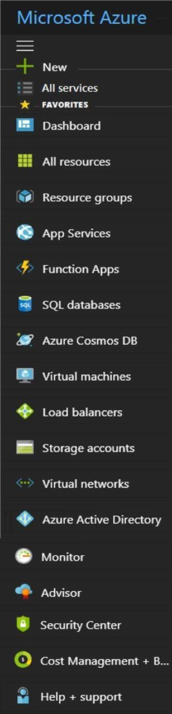

**Correct Answer:**

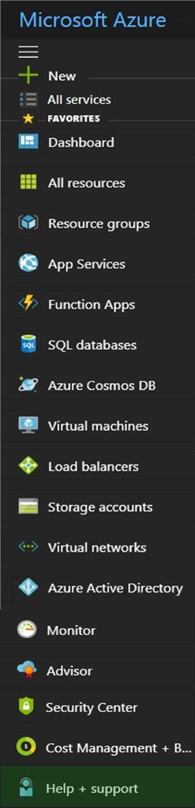

> **Explanation:** Request a standard quota increase from Help + support

---

### 185. For each of the following statements, select Yes if the statement is true. Otherwise, select No.  
<u>NOTE: Each correct selection is worth one point.</u>

**Hot Area:**

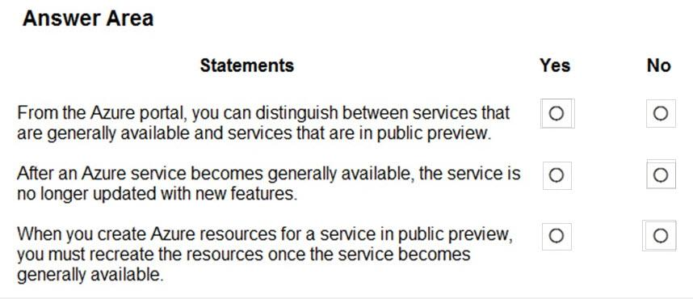

**Correct Answer:**

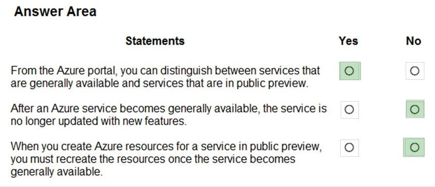

> **Explanation:**
>
> **Box 1: Yes** — From the Azure portal you can distinguish between generally available services and those in public preview (marked with 'Preview').
>
> **Box 2: No** — After a service becomes generally available, it continues to be updated with new features.
>
> **Box 3: No** — You do not need to recreate resources once a preview service becomes generally available.

---

### 186. For each of the following statements, select Yes if the statement is true. Otherwise, select No.  
<u>NOTE: Each correct selection is worth one point.</u>

**Hot Area:**

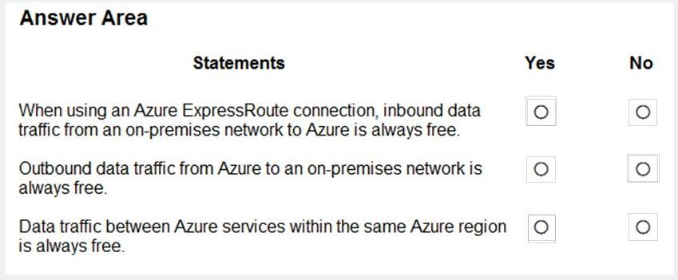

**Correct Answer:**

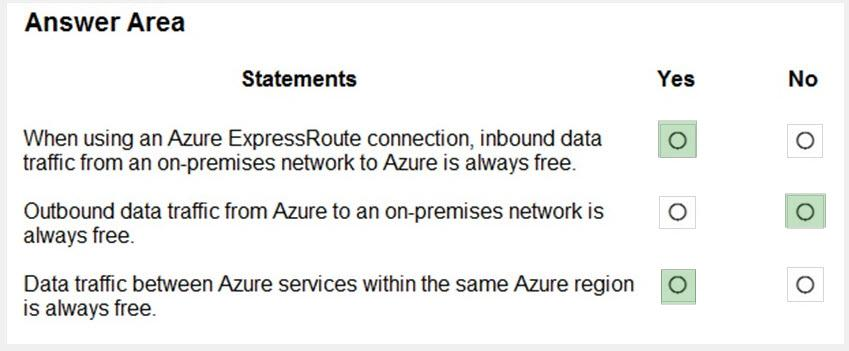

> **Explanation:**
>
> **Box 1: Yes** — With Azure ExpressRoute, all inbound data transfer is free of charge.
>
> **Box 2: No** — Inbound data traffic is free but outbound data traffic is not.
>
> **Box 3: Yes** — 

---

### 187. For each of the following statements, select Yes if the statement is true. Otherwise, select No.  
<u>NOTE: Each correct selection is worth one point.</u>

**Hot Area:**

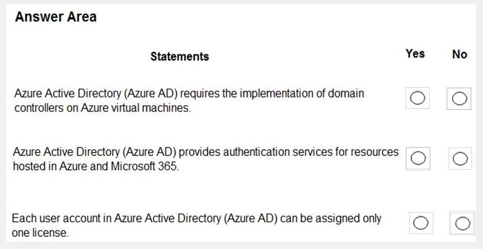

**Correct Answer:**

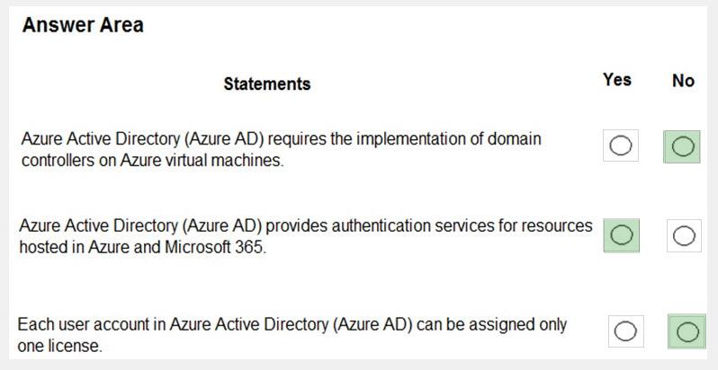

> **Explanation:**
>
> **Box 1: No** — Azure Active Directory (Azure AD) is a cloud-based service. It does not require domain controllers on virtual machines.
>
> **Box 2: Yes** — Azure Active Directory (Azure AD) is a centralized identity provider in the cloud. This is the primary built-in authentication and authorization service to provide secure access to Azure resources and Microsoft 365.
>
> **Box 3: No** — User accounts in Azure Active Directory can be assigned multiple licenses for different Azure or Microsoft 365 services.

---

### 188. For each of the following statements, select Yes if the statement is true. Otherwise, select No.  
<u>NOTE: Each correct selection is worth one point.</u>

**Hot Area:**

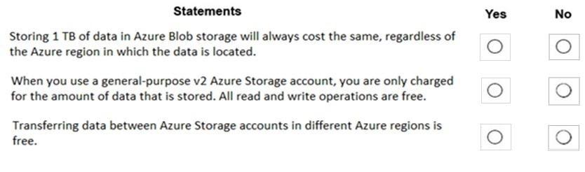

**Correct Answer:**

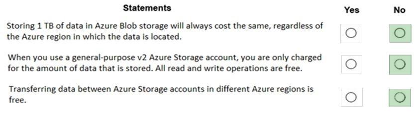

---

### 189. To complete the sentence, select the appropriate option in the answer area.

**Hot Area:**

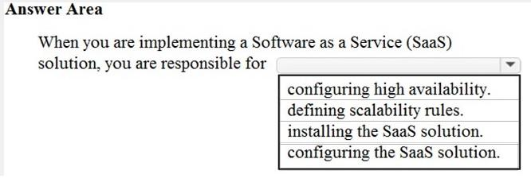

**Correct Answer:**

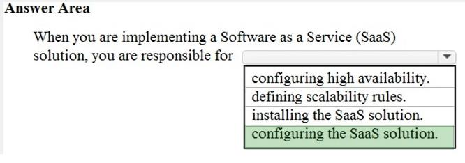

> **Explanation:** When you are implementing a Software as a Service (SaaS) solution, you are responsible for configuring the SaaS solution. Everything else is managed by the cloud provider. SaaS requires the least amount of management. The cloud provider is responsible for managing everything, and the end user just uses the software. Software as a service (SaaS) allows users to connect to and use cloud-based apps over the Internet. Common examples are email, calendaring and office tools (such as Microsoft Office 365). SaaS provides a complete software solution which you purchase on a pay-as-you-go basis from a cloud service provider. You rent the use of an app for your organization and your users connect to it over the Internet, usually with a web browser. All of the underlying infrastructure, middleware, app software and app data are located in the service provider’s data center. The service provider manages the hardware and software and with the appropriate service agreement, will ensure the availability and the security of the app and your data as well.

---

### 190. To complete the sentence, select the appropriate option in the answer area.

**Hot Area:**

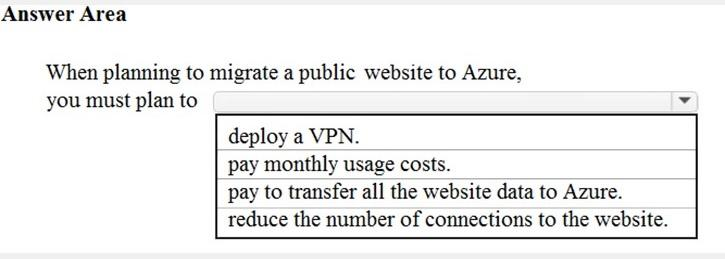

**Correct Answer:**

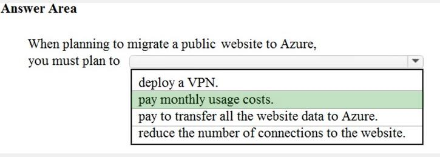

> **Explanation:** When planning to migrate a public website to Azure, you must plan to pay monthly usage costs. This is because Azure uses the pay-as-you-go model.

---

### 191. To complete the sentence, select the appropriate option in the answer area.

**Hot Area:**

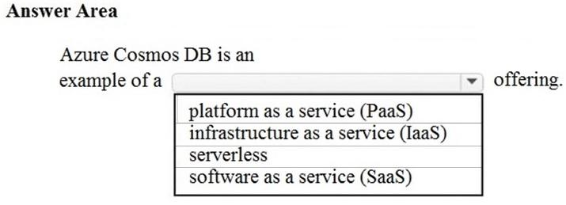

**Correct Answer:**

> **Explanation:** Azure Cosmos DB is an example of a platform as a service (PaaS) cloud database provider.

---

### 192. To complete the sentence, select the appropriate option in the answer area.

**Hot Area:**

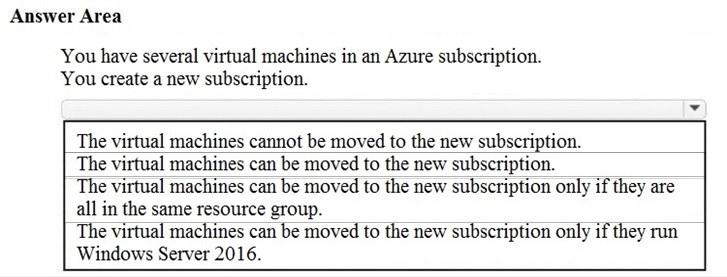

**Correct Answer:**

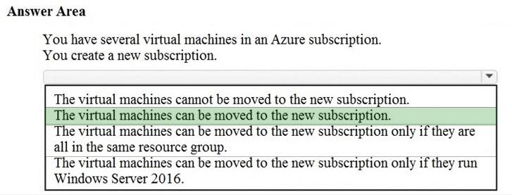

> **Explanation:** You can move a VM and its associated resources to a different subscription by using the Azure portal. Moving between subscriptions can be handy if you originally created a VM in a personal subscription and now want to move it to your company's subscription to continue your work. You do not need to start the VM in order to move it and it should continue to run during the move.

---

### 193. For each of the following statements, select Yes if the statement is true. Otherwise, select No.  
<u>NOTE: Each correct selection is worth one point.</u>

**Hot Area:**

**Correct Answer:**

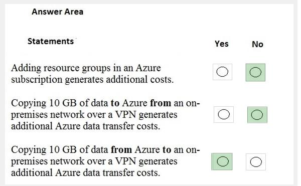

> **Explanation:**
>
> **Box 1: No** — Resource groups are logical containers for Azure resources. You do not pay for resource groups.
>
> **Box 2: No** — Data ingress over a VPN is data ‘coming in’ to Azure over the VPN. You are not charged data transfer costs for data ingress.
>
> **Box 3: Yes** — Data egress over a VPN is data ‘going out’ of Azure over the VPN. You are charged for data egress.

---

### 194. For each of the following statements, select Yes if the statement is true. Otherwise, select No.  
<u>NOTE: Each correct selection is worth one point.</u>

**Hot Area:**

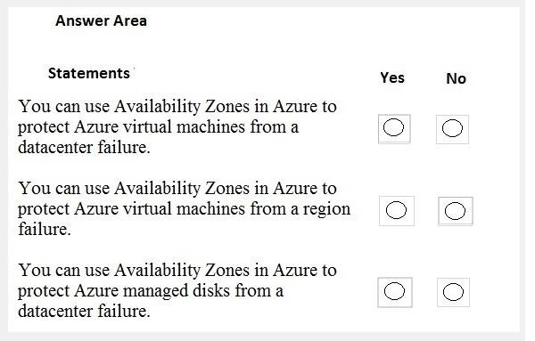

**Correct Answer:**

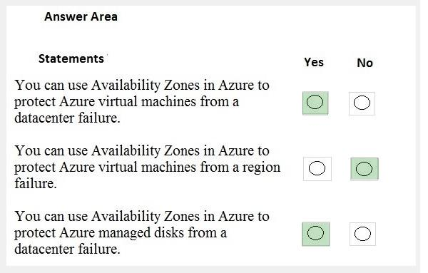

> **Explanation:** Availability zones expand the level of control you have to maintain the availability of the applications and data on your VMs. Availability Zones are unique physical locations within an Azure region. Each zone is made up of one or more datacenters equipped with independent power, cooling, and networking. To ensure resiliency, there are a minimum of three separate zones in all enabled regions. The physical separation of Availability Zones within a region protects applications and data from datacenter failures. With Availability Zones, Azure offers industry best 99.99% VM uptime SLA. By architecting your solutions to use replicated VMs in zones, you can protect your applications and data from the loss of a datacenter. If one zone is compromised, then replicated apps and data are instantly available in another zone.

---

### 195. To complete the sentence, select the appropriate option in the answer area.

**Hot Area:**

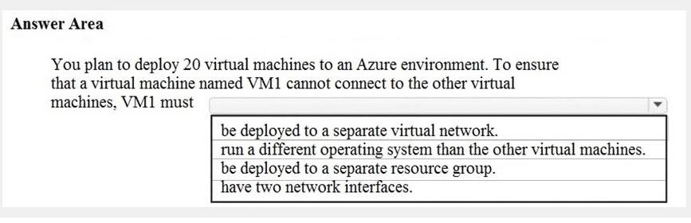

**Correct Answer:**

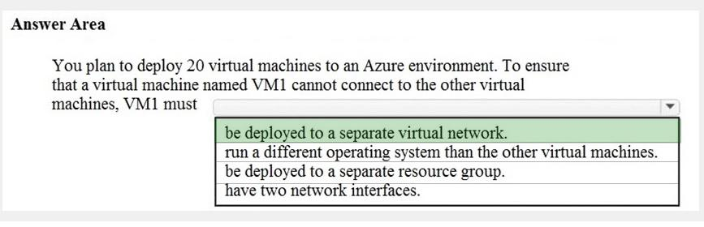

> **Explanation:** Answer: be deployed to a separate virtual network — Azure automatically routes traffic between VMs in the same virtual network. To prevent VM1 from connecting to other VMs, it must be deployed to a separate virtual network.

---

### 196. To complete the sentence, select the appropriate option in the answer area.

**Hot Area:**

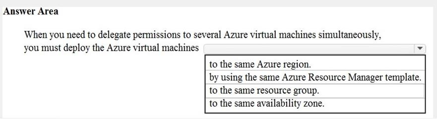

**Correct Answer:**

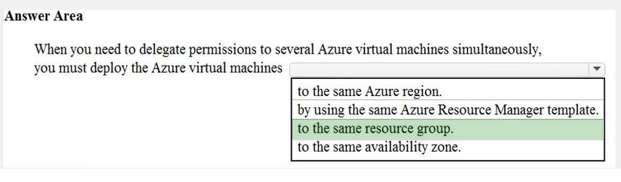

> **Explanation:** Answer: to the same resource group — To delegate permissions to multiple Azure VMs simultaneously, the VMs must be in the same resource group so that RBAC permissions can be applied at the resource group level.

---

### 197. To complete the sentence, select the appropriate option in the answer area.

**Hot Area:**

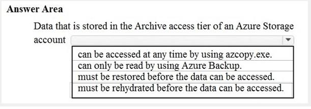

**Correct Answer:**

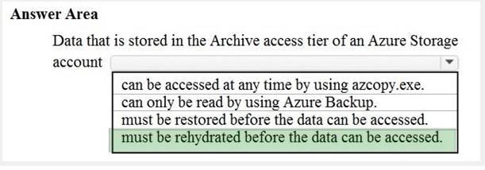

> **Explanation:** Answer: must be rehydrated before the data can be accessed — Data stored in the Archive access tier cannot be accessed directly. It must be rehydrated (moved to Hot or Cool tier) before it can be read.

---

### 198. To complete the sentence, select the appropriate option in the answer area.

**Hot Area:**

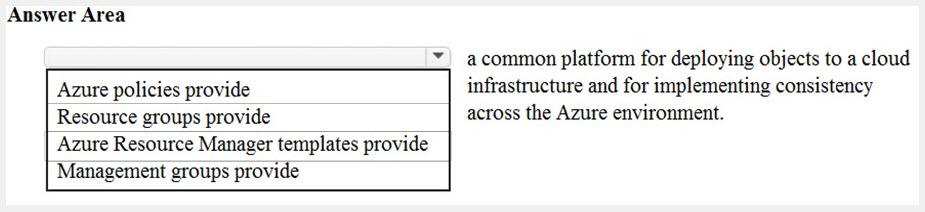

**Correct Answer:**

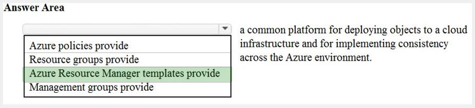

> **Explanation:** Answer: Azure Resource Manager templates provide — ARM templates provide a common platform for deploying objects to a cloud infrastructure and implementing consistency across the Azure environment.

---

### 199. To complete the sentence, select the appropriate option in the answer area.

**Hot Area:**

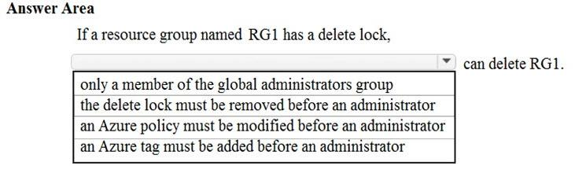

**Correct Answer:**

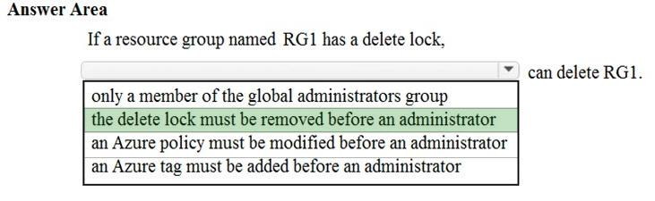

> **Explanation:** Answer: the delete lock must be removed before an administrator — If a resource group has a delete lock, the lock must be removed before any administrator can delete the resource group.

---

### 200. To complete the sentence, select the appropriate option in the answer area.

**Hot Area:**

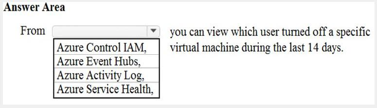

**Correct Answer:**

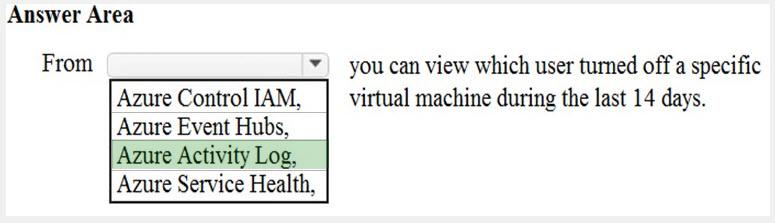

> **Explanation:** Answer: Azure Activity Log — The Azure Activity Log records all operations performed on Azure resources, including who turned off a specific virtual machine and when.

---

### 201. To complete the sentence, select the appropriate option in the answer area.

**Hot Area:**

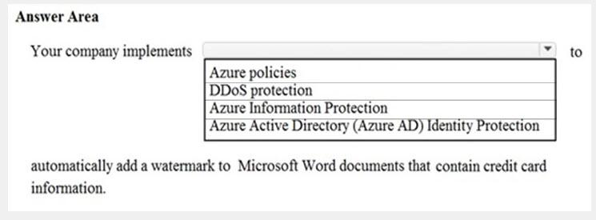

**Correct Answer:**

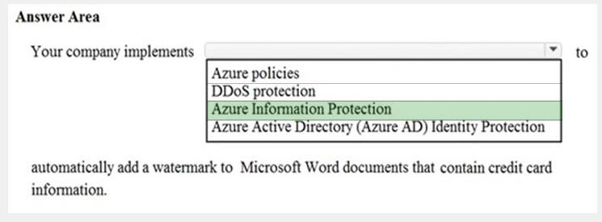

> **Explanation:** Answer: Azure Information Protection — Azure Information Protection is used to automatically classify and protect documents. It can add watermarks to Word documents that contain sensitive data such as credit card information.

---

### 202. To complete the sentence, select the appropriate option in the answer area.

**Hot Area:**

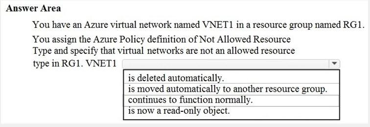

**Correct Answer:**

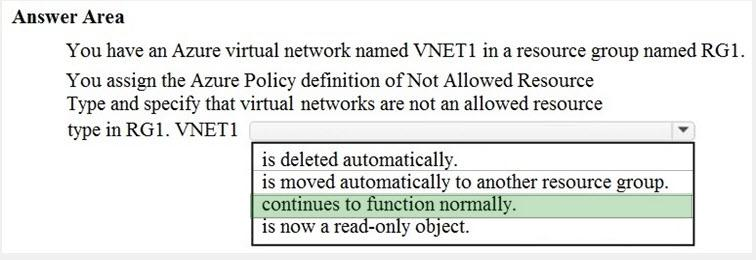

> **Explanation:** Answer: continues to function normally — When an Azure Policy of type 'Not Allowed Resource Type' is assigned to a resource group, existing non-compliant resources (like VNET1) are marked as non-compliant but continue to function. They are not deleted or moved.

---

### 203. To complete the sentence, select the appropriate option in the answer area.

**Hot Area:**

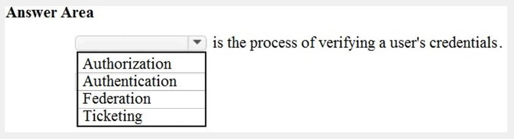

**Correct Answer:**

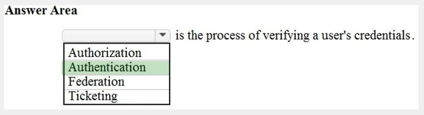

> **Explanation:** Answer: Authentication — Authentication is the process of verifying a user's identity and credentials. Authorization is the process of determining what an authenticated user is allowed to do.

---

### 204. To complete the sentence, select the appropriate option in the answer area.

**Hot Area:**

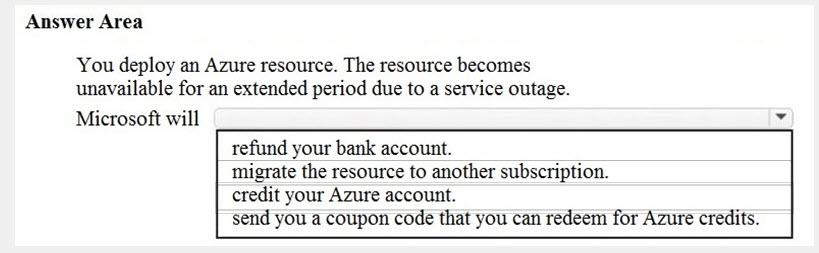

**Correct Answer:**

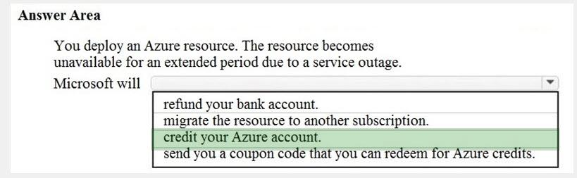

> **Explanation:** Answer: credit your Azure account — When an Azure SLA is not met due to a service outage, Microsoft credits your Azure account. The credit amount depends on the severity and duration of the downtime.

---

### 205. For each of the following statements, select Yes if the statement is true. Otherwise, select No.  
<u>NOTE: Each correct selection is worth one point.</u>

**Hot Area:**

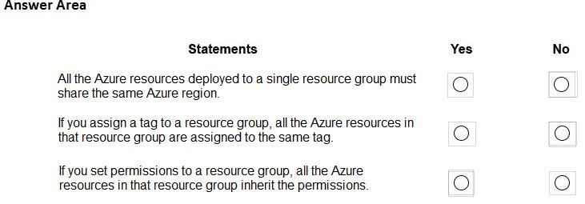

**Correct Answer:**

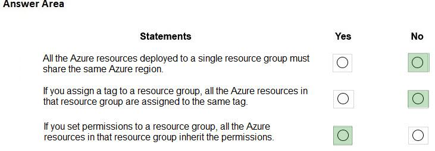

---

### 206. For each of the following statements, select Yes if the statement is true. Otherwise, select No.  
<u>NOTE: Each correct selection is worth one point.</u>

**Hot Area:**

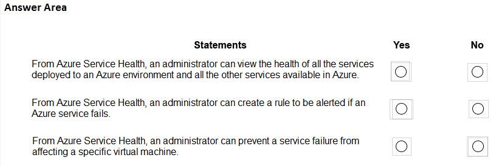

**Correct Answer:**

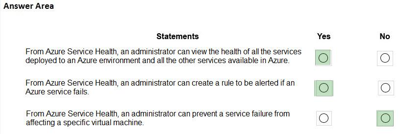

---

### 207. Several support engineers plan to manage Azure by using the computers shown in the following table:  
You need to identify which Azure management tools can be used from each computer. What should you identify for each computer? To answer, select the appropriate options in the answer area.  
<u>NOTE: Each correct selection is worth one point</u>

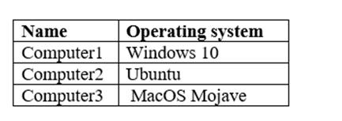

**Hot Area:**

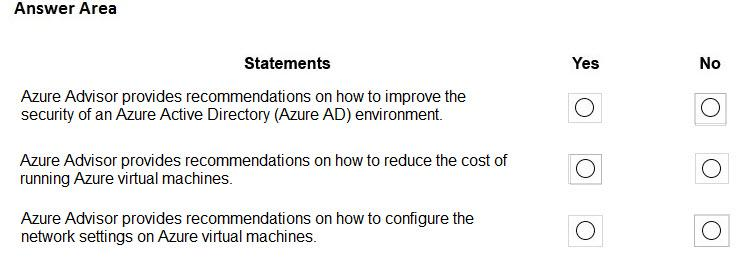

**Correct Answer:**

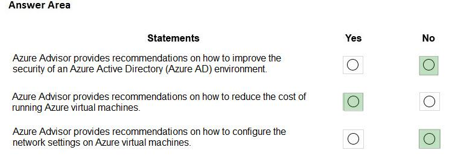

> **Explanation:** The Correct Answer image shows the management tool availability per computer type. Azure CLI and PowerShell are cross-platform (Windows, Linux, macOS). The Azure portal works via any browser. Cloud Shell works from any browser through the portal.

---

### 208. To complete the sentence, select the appropriate option in the answer area.

**Hot Area:**

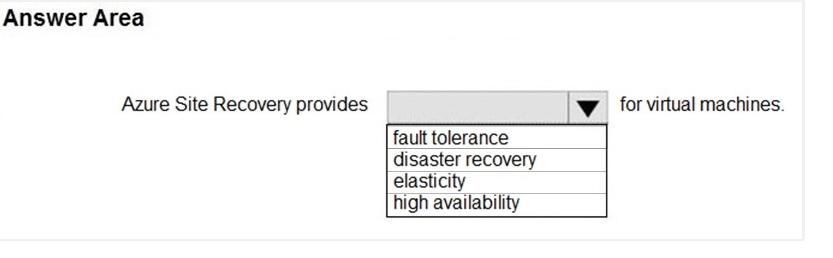

**Correct Answer:**

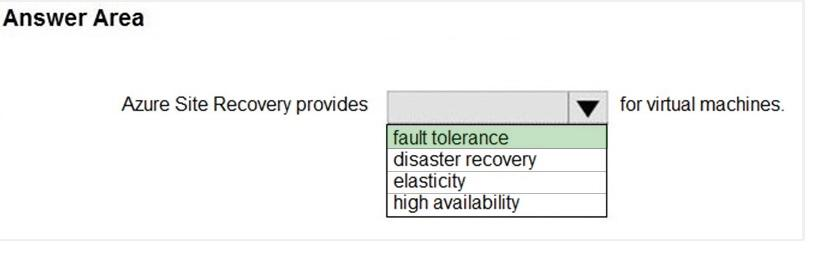

> **Explanation:** Azure Site Recovery helps ensure business continuity by keeping business apps and workloads running during outages. Site Recovery replicates workloads running on physical and virtual machines (VMs) from a primary site to a secondary location.

---

### 209. To complete the sentence, select the appropriate option in the answer area.

**Hot Area:**

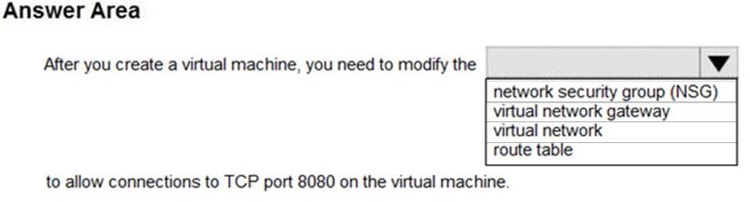

**Correct Answer:**

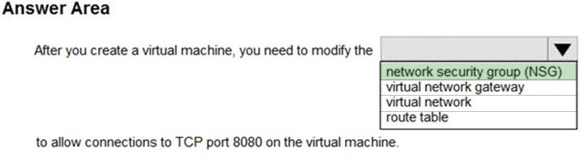

> **Explanation:** Answer: network security group (NSG) — After creating a virtual machine, you need to modify the Network Security Group (NSG) to allow connections to TCP port 8080 on the virtual machine.

---

### 210. To complete the sentence, select the appropriate option in the answer area.

**Hot Area:**

**Correct Answer:**

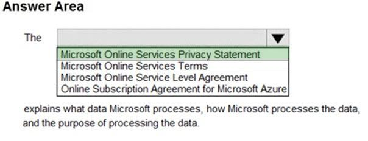

> **Explanation:** Answer: Microsoft Online Services Privacy Statement — The Microsoft Online Services Privacy Statement explains what personal data Microsoft processes, how it processes the data, and the purpose of processing.

---

### 211. To complete the sentence, select the appropriate option in the answer area.

**Hot Area:**

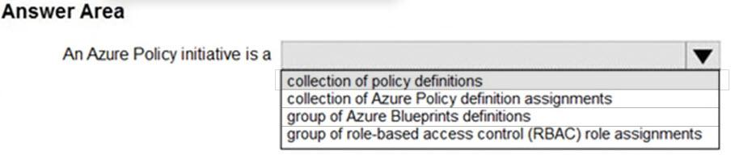

**Correct Answer:**

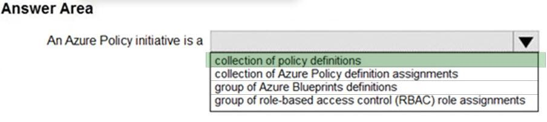

> **Explanation:** Answer: collection of policy definitions — An Azure Policy initiative is a collection of policy definitions grouped together to achieve a single goal or objective.

---

### 212. To complete the sentence, select the appropriate option in the answer area.

**Hot Area:**

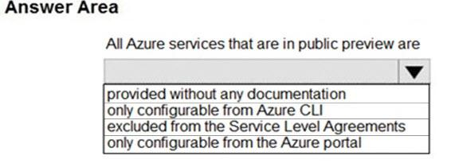

**Correct Answer:**

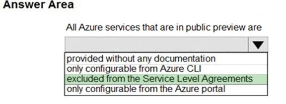

> **Explanation:** Answer: excluded from the Service Level Agreements — All Azure services in public preview are excluded from the standard Service Level Agreements (SLAs). Preview features are provided 'as-is'.

---

### 213. To complete the sentence, select the appropriate option in the answer area.

**Hot Area:**

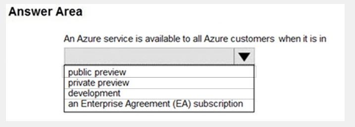

**Correct Answer:**

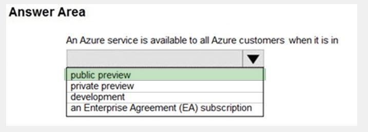

> **Explanation:** Answer: public preview — An Azure service is available to all Azure customers when it is in public preview. Private preview is limited to selected customers; general availability (GA) is the fully released state.

---

### 214. To complete the sentence, select the appropriate option in the answer area.

**Hot Area:**

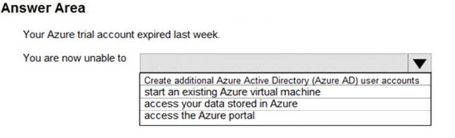

**Correct Answer:**

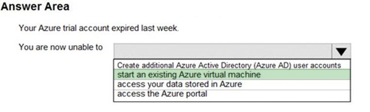

> **Explanation:** Answer: start an existing Azure virtual machine — When your Azure trial account expires, you are unable to start existing virtual machines. However, you can still access the Azure portal and your stored data.

---

### 215. For each of the following statements, select Yes if the statement is true. Otherwise, select No.  
<u>NOTE: Each correct selection is worth one point.</u>

**Hot Area:**

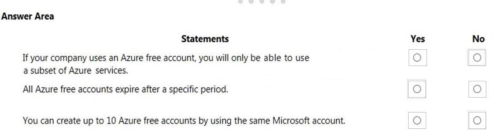

**Correct Answer:**

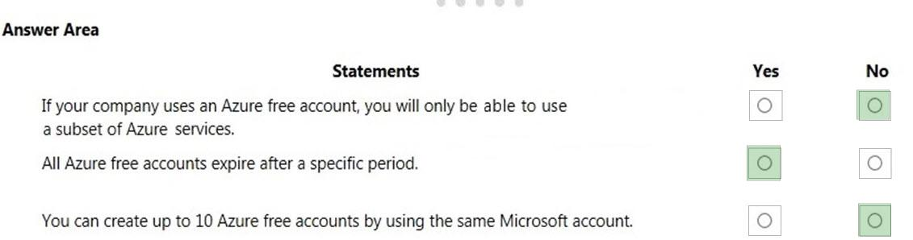

> **Explanation:**
>
> **Box 1: No** — Azure Free Account gives you 12 months access to the most popular free services. It also gives you a credit (150 GBP or 200 USD) to use on any Azure service for up to 30 days.
>
> **Box 2: Yes** — All free accounts expire after 12 months.
>
> **Box 3: No** — You can only create one free Azure account per Microsoft account.

---

### 216. To complete the sentence, select the appropriate option in the answer area.

**Hot Area:**

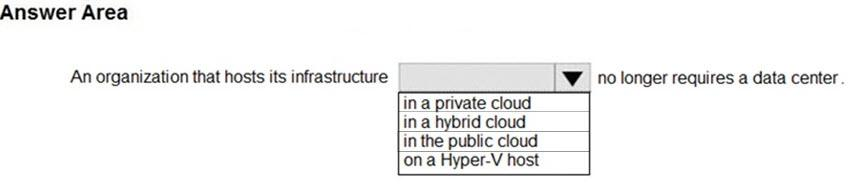

**Correct Answer:**

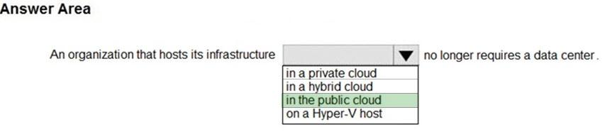

> **Explanation:** Answer: in the public cloud — An organization that hosts its infrastructure in the public cloud no longer requires a data center, as all infrastructure is managed by the cloud provider.

---

### 217. To complete the sentence, select the appropriate option in the answer area.

**Hot Area:**

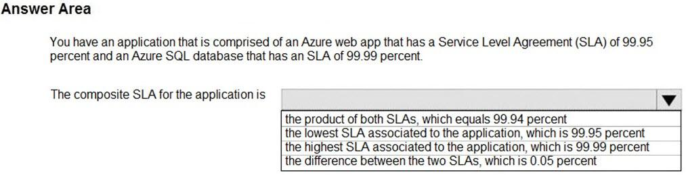

**Correct Answer:**

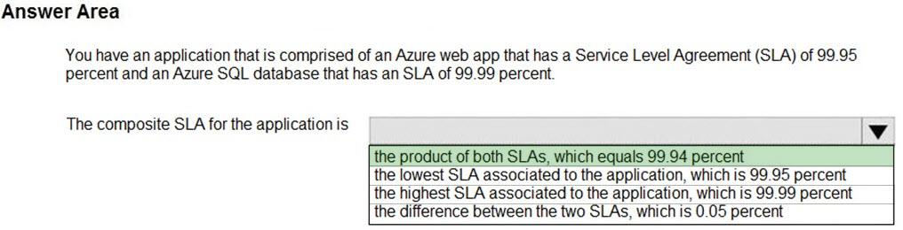

> **Explanation:** Answer: the product of both SLAs, which equals 99.94 percent — The composite SLA is calculated by multiplying the individual SLAs: 99.95% × 99.99% = 99.94%. This is because both services must be available simultaneously.

---

### 218. To complete the sentence, select the appropriate option in the answer area.

**Hot Area:**

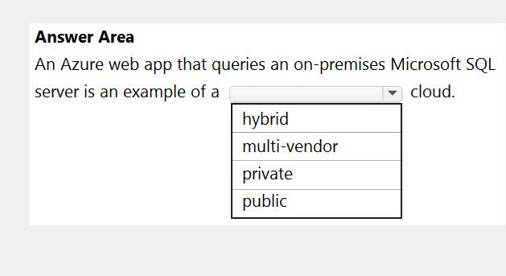

**Correct Answer:**

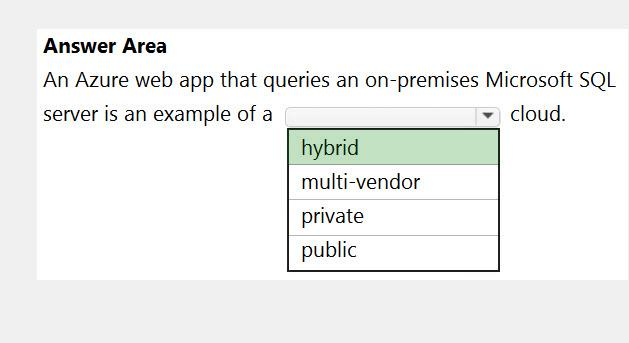

> **Explanation:** Answer: hybrid — An Azure web app that queries an on-premises Microsoft SQL Server uses both cloud and on-premises resources, making it an example of a hybrid cloud.

---

### 219. For each of the following statements, select Yes if the statement is true. Otherwise, select No.  
<u>NOTE: Each correct selection is worth one point.</u>

**Hot Area:**

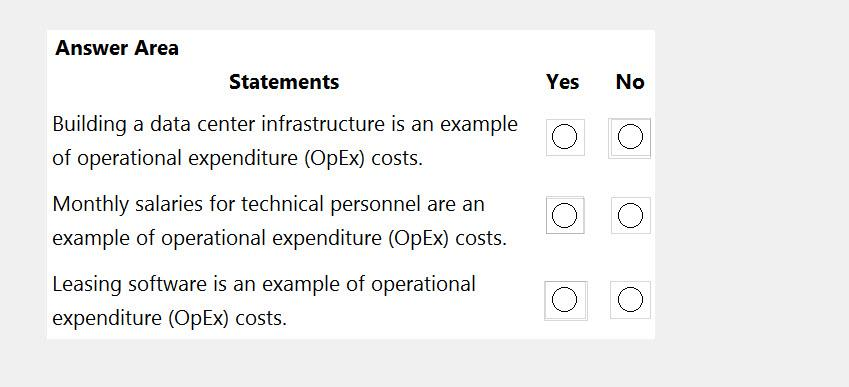

**Correct Answer:**

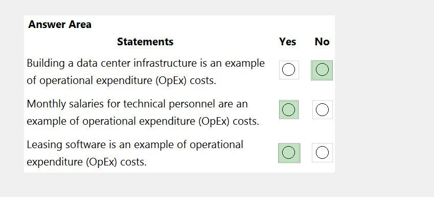

> **Explanation:**
>
> **Box 1: No** — Building a data center infrastructure is capital expenditure, not operation expenditure.
>
> **Box 2: Yes** — OpEx is ongoing costs (costs of operations) such as staff salaries.
>
> **Box 2: Yes** — OpEx is ongoing costs (costs of operations) such as leasing software. If you purchased software as a one-off purchase, that would be CapEx, but leasing software is ongoing so it’s OpEx.

---

### 220. For each of the following statements, select Yes if the statement is true. Otherwise, select No.  
<u>NOTE: Each correct selection is worth one point.</u>

**Hot Area:**

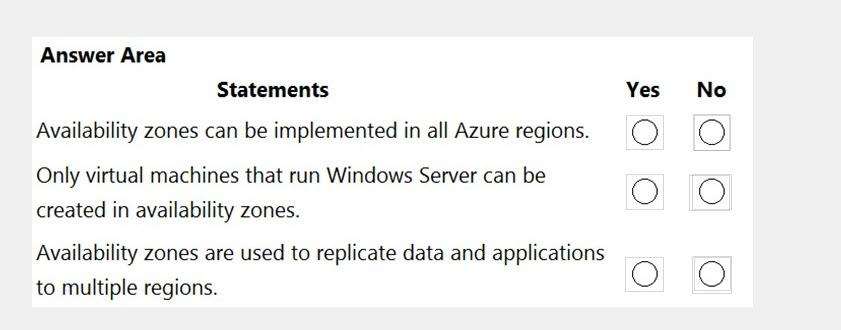

**Correct Answer:**

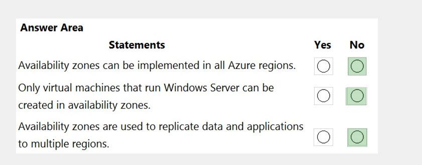

> **Explanation:**
>
> **Box 1: No** — Not all Azure regions support availability zones.
>
> **Box 2: No** — Availability zones can be used with many Azure services, not just VMs.
>
> **Box 3: No** — Availability Zones are unique physical locations within a single Azure region.

---

### 221. To complete the sentence, select the appropriate option in the answer area.

**Hot Area:**

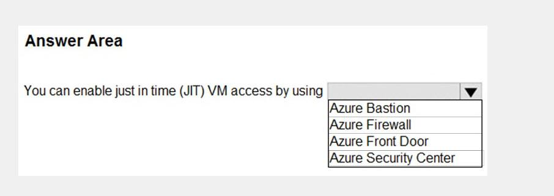

**Correct Answer:**

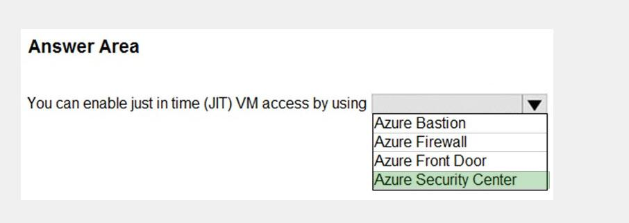

> **Explanation:** Answer: Azure Security Center — You can enable just-in-time (JIT) VM access by using Azure Security Center. JIT locks down inbound traffic to Azure VMs by creating NSG rules that allow access only when needed.

---

### 222. For each of the following statements, select Yes if the statement is true. Otherwise, select No.  
<u>NOTE: Each correct selection is worth one point.</u>

**Hot Area:**

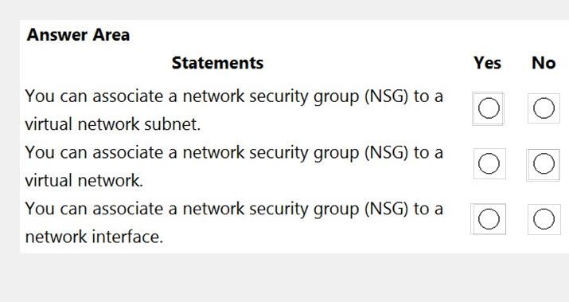

**Correct Answer:**

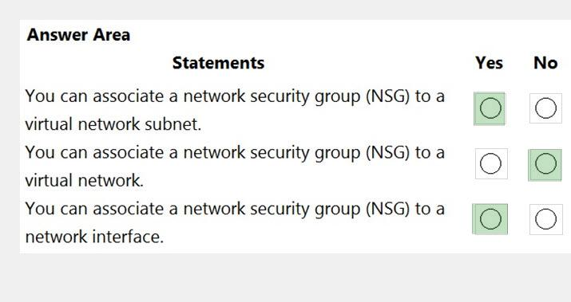

> **Explanation:**
>
> **Box 1: Yes** — You can associate an NSG to a virtual network subnet.
>
> **Box 2: No** — You cannot associate an NSG directly to a virtual network; only to subnets or network interfaces.
>
> **Box 3: Yes** — You can associate an NSG to a network interface.

---

### 223. For each of the following statements, select Yes if the statement is true. Otherwise, select No.  
<u>NOTE: Each correct selection is worth one point.</u>

**Hot Area:**

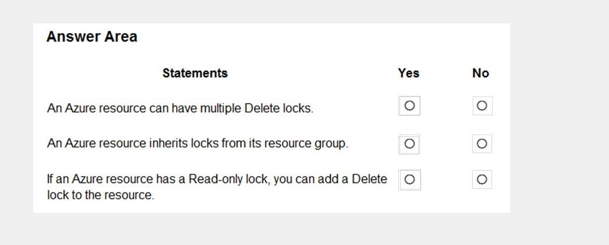

**Correct Answer:**

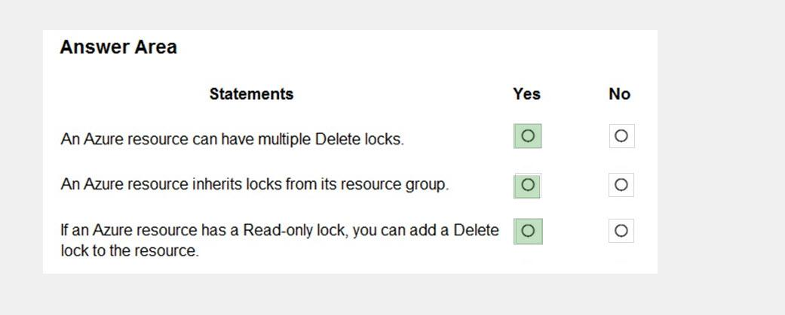

> **Explanation:**
>
> **Box 1: Yes** — An Azure resource can have multiple Delete locks.
>
> **Box 2: Yes** — An Azure resource inherits locks from its resource group.
>
> **Box 3: Yes** — If a resource has a Read-only lock, you can still add a Delete lock.

---

### 224. For each of the following statements, select Yes if the statement is true. Otherwise, select No.  
<u>NOTE: Each correct selection is worth one point.</u>

**Hot Area:**

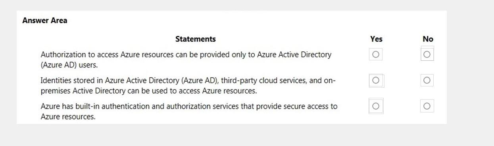

**Correct Answer:**

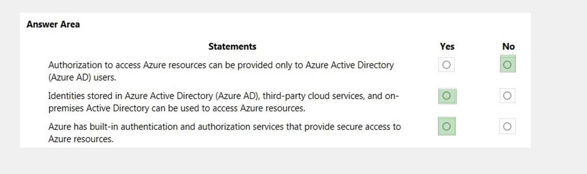

> **Explanation:**
>
> **Box 1: No** — Authorization to access Azure resources can be provided by other identity providers by using federation. A commonly used example of this is to federate your on-premises Active Directory environment with Azure AD and use this federation for authentication and authorization.
>
> **Box 2: Yes** — As described above, third-party cloud services and on-premises Active Directory can be used to access Azure resources. This is known as ‘federation’. Federation is a collection of domains that have established trust. The level of trust may vary, but typically includes authentication and almost always includes authorization. A typical federation might include a number of organizations that have established trust for shared access to a set of resources.
>
> **Box 3: Yes** — Azure Active Directory (Azure AD) is a centralized identity provider in the cloud. This is the primary built-in authentication and authorization service to provide secure access to Azure resources.

---

### 225. To complete the sentence, select the appropriate option in the answer area.

**Hot Area:**

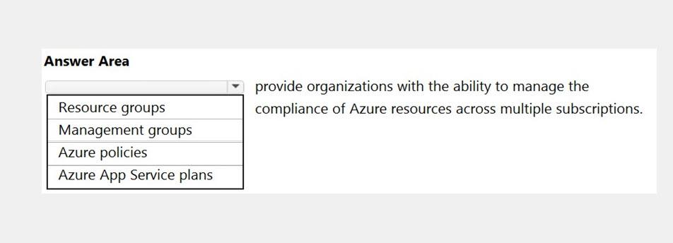

**Correct Answer:**

> **Explanation:** Answer: Azure policies — Azure policies provide organizations with the ability to manage the compliance of Azure resources across multiple subscriptions by enforcing rules and effects.

---

### 226. For each of the following statements, select Yes if the statement is true. Otherwise, select No.  
<u>NOTE: Each correct selection is worth one point.</u>

**Hot Area:**

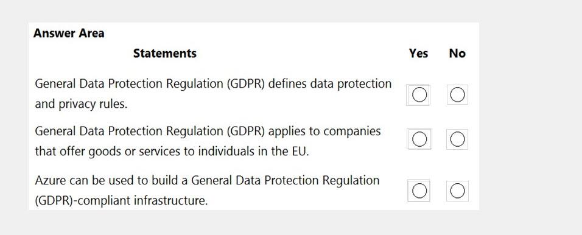

**Correct Answer:**

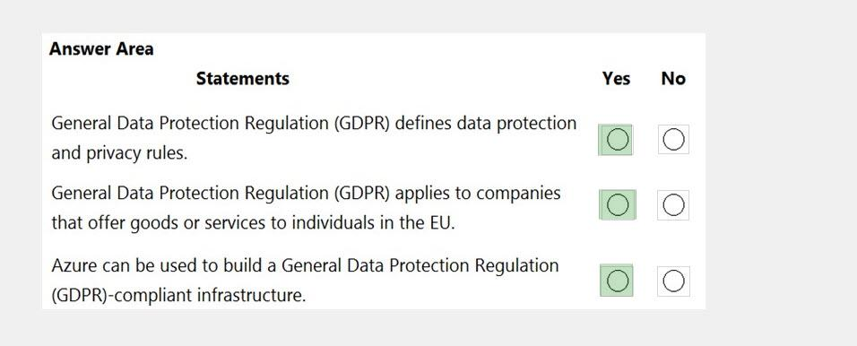

> **Explanation:**
>
> **Box 1: Yes** — GDPR defines data protection and privacy rules.
>
> **Box 2: Yes** — GDPR applies to companies that offer goods or services to individuals in the EU.
>
> **Box 3: Yes** — Azure can be used to build a GDPR-compliant infrastructure.

---

### 227. For each of the following statements, select Yes if the statement is true. Otherwise, select No.  
<u>NOTE: Each correct selection is worth one point.</u>

**Hot Area:**

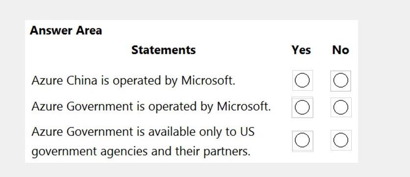

**Correct Answer:**

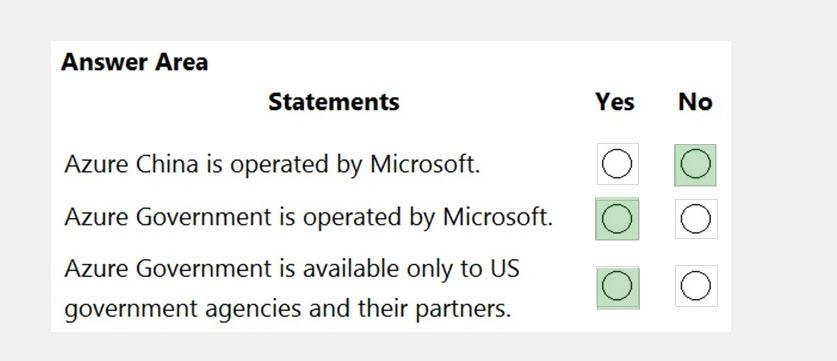

> **Explanation:**
>
> **Box 1: No** — Azure China is not operated by Microsoft; it is operated by 21Vianet.
>
> **Box 2: Yes** — Azure Government is operated by Microsoft.
>
> **Box 3: Yes** — Azure Government is available only to US government agencies and their partners.

---

### 228. For each of the following statements, select Yes if the statement is true. Otherwise, select No.  
<u>NOTE: Each correct selection is worth one point.</u>

**Hot Area:**

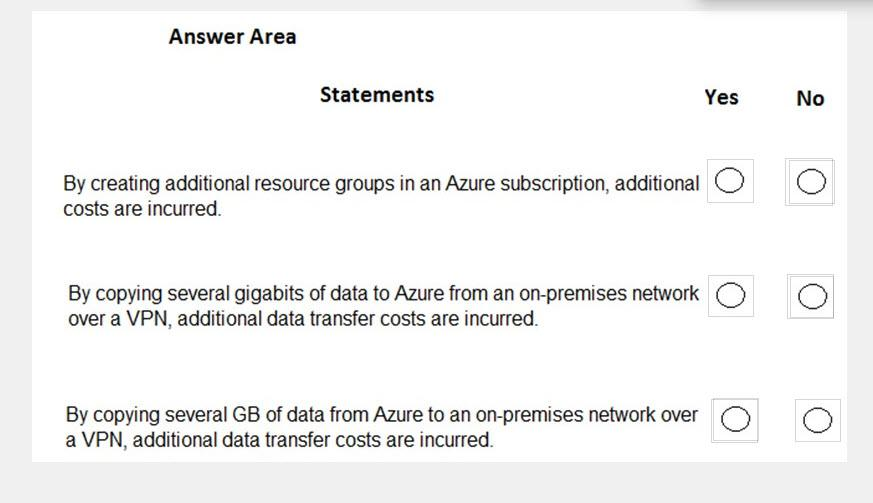

**Correct Answer:**

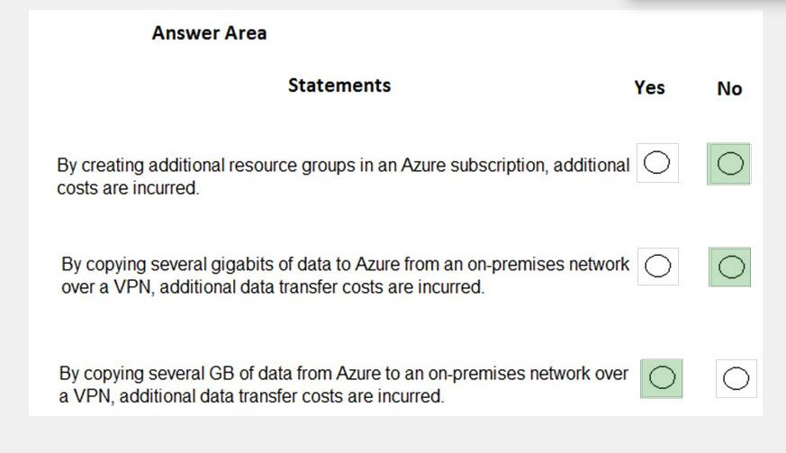

> **Explanation:**
>
> **Box 1: No** — Creating additional resource groups does not incur additional costs; resource groups are free.
>
> **Box 2: No** — Copying data to Azure from on-premises over a VPN is free (inbound data transfer is free).
>
> **Box 3: Yes** — Copying data from Azure to on-premises over a VPN incurs outbound data transfer costs.

---

## Section 3: Drag & Drop (8 Questions)

---

### 229. Match the Azure service to the correct definition.  
Instructions: To answer, drag the appropriate Azure service from the column on the left to its description on the right. Each service may be used once, more than once, or not at all.  
<u>NOTE: Each correct match is worth one point.</u>

**Select and Place:**

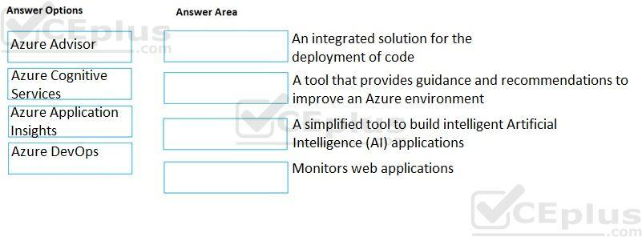

**Correct Answer:**

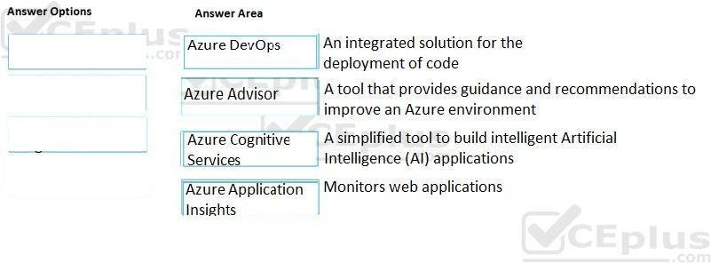

> **Explanation:**
>
> **Box 1: Azure DevOps** — Microsoft's primary software development and deployment platform.
>
> **Box 2: Azure Advisor** — A personalized cloud consultant that helps optimize Azure deployments by analyzing configuration and usage.
>
> **Box 3: Azure Cognitive Services** — APIs and SDKs enabling apps to see, hear, speak, understand, and reason without AI expertise.
>
> **Box 4: Azure Application Insights** — Detects and diagnoses anomalies in web apps; an extensible APM service in Azure Monitor.

---

### 230. Match the Azure service to the correct description.  
Instructions: To answer, drag the appropriate Azure service from the column on the left to its description on the right. Each service may be used once, more than once, or not at all.  
<u>NOTE: Each correct selection is worth one point.</u>

**Select and Place:**

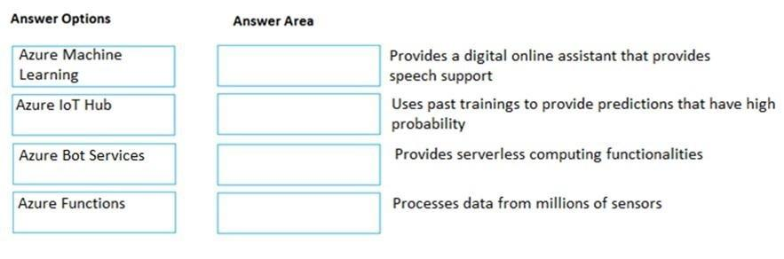

**Correct Answer:**

> **Explanation:**
>
> **Box 1: Azure Bot Services** — Provides a digital online assistant with speech support.
>
> **Box 2: Azure Machine Learning** — Uses past training data to provide high-probability predictions.
>
> **Box 3: Azure Functions** — Serverless compute that runs event-triggered code without managing infrastructure.
>
> **Box 4: IoT Hub** — Central message hub for bi-directional communication between IoT apps and millions of devices.

---

### 231. Match the Azure service to the correct definition.  
Instructions: To answer, drag the appropriate Azure service from the column on the left to its description on the right. Each service may be used once, more than once, or not at all.  
<u>NOTE: Each correct selection is worth one point.</u>

**Select and Place:**

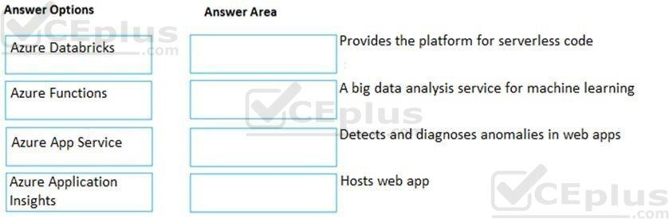

**Correct Answer:**

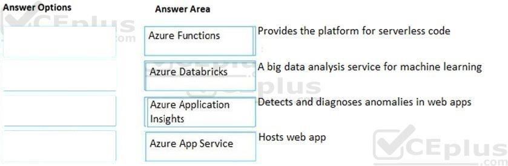

> **Explanation:**
>
> **Box 1: Azure Functions** — Platform for serverless code; runs event-triggered code without provisioning infrastructure.
>
> **Box 2: Azure Databricks** — Big data analysis and machine learning service based on Apache Spark.
>
> **Box 3: Azure Application Insights** — Detects and diagnoses anomalies in web apps automatically.
>
> **Box 4: Azure App Service** — HTTP-based PaaS service for hosting web apps, REST APIs, and mobile back ends.

---

### 232. Match the term to the correct definition.  
Instructions: To answer, drag the appropriate term from the column on the left to its description on the right. Each term may be used once, more than once, or not at all.  
<u>NOTE: Each correct match is worth one point.</u>

**Select and Place:**

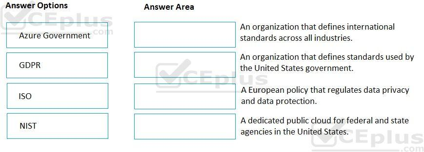

**Correct Answer:**

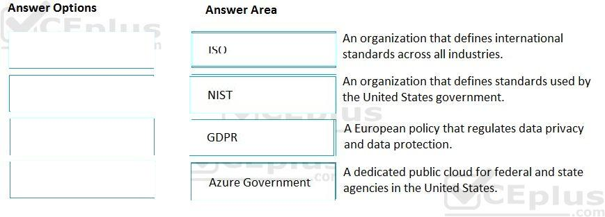

> **Explanation:**
>
> **Box 1: ISO** — International Organization for Standardization; companies can be certified to standards like ISO 9001 or 27001.
>
> **Box 2: NIST** — National Institute of Standards and Technology; a non-regulatory US Department of Commerce agency.
>
> **Box 3: GDPR** — General Data Protection Regulation; adopted in the EU in May 2018 to protect personal data.
>
> **Box 4: Azure Government** — Dedicated cloud for US government agencies using physically isolated US datacenters meeting FedRAMP, ITAR, and CJIS requirements.

---

### 233. Match the Azure Cloud Services benefit to the correct description.  
Instructions: To answer, drag the appropriate benefit from the column on the left to its description on the right. Each benefit may be used once, more than once, or not at all.  
<u>NOTE: Each correct match is worth one point.</u>

**Select and Place:**

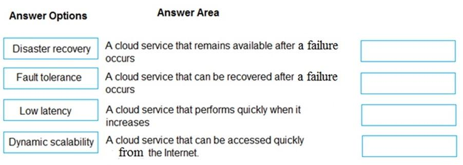

**Correct Answer:**

> **Explanation:**
>
> **Box 1: Fault Tolerance** — Ability of a service to remain available after a component failure.
>
> **Box 2: Disaster Recovery** — Recovery of a service after a failure, e.g. restoring a VM from backup.
>
> **Box 3: Dynamic Scalability** — Ability to add compute resources automatically under heavy load.
>
> **Box 4: Latency** — Time for a service to respond to requests; low latency means faster response.

---

### 234. Match the Azure service to the correct description.  
Instructions: To answer, drag the appropriate Azure service from the column on the left to its description on the right. Each service may be used once, more than once, or not at all.  
<u>NOTE: Each correct match is worth one point.</u>

**Select and Place:**

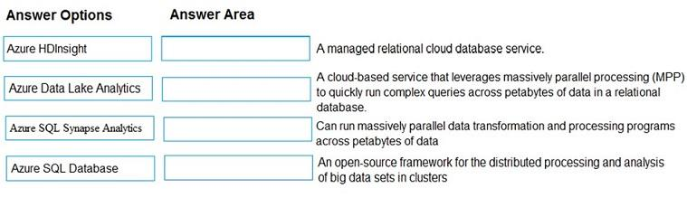

**Correct Answer:**

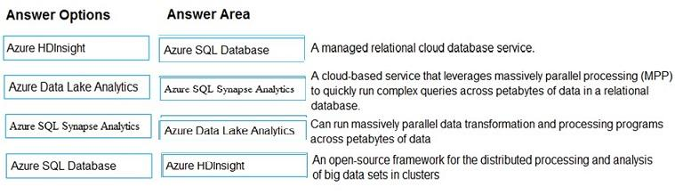

> **Explanation:**
>
> **Box 1: Azure SQL Database** — Managed SQL Server database in Azure; Microsoft manages the server.
>
> **Box 2: Azure SQL Data Warehouse** — Cloud-based PaaS for large-scale analytical workloads using MPP.
>
> **Box 3: Azure Data Lake Analytics** — Processes big data jobs in seconds across petabytes of data.
>
> **Box 4: Azure HDInsight** — Fully managed open-source analytics service based on Hadoop, Spark, and Kafka.

---

### 235. Match the Azure service to the correct description.  
Instructions: To answer, drag the appropriate Azure service from the column on the left to its description on the right. Each service may be used once, more than once, or not at all.  
<u>NOTE: Each correct selection is worth one point.</u>

**Select and Place:**

**Correct Answer:**

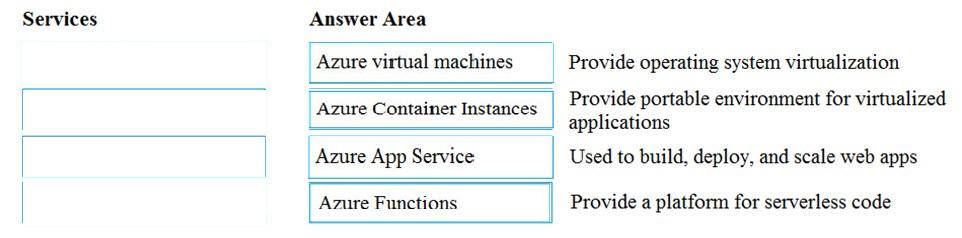

> **Explanation:**
>
> **Box 1: Azure Virtual Machines** — OS virtualization with full control over the computing environment.
>
> **Box 2: Azure Container Instances** — Fastest way to run containers in Azure without managing VMs.
>
> **Box 3: Azure App Service** — PaaS for building, deploying, and scaling web apps and APIs.
>
> **Box 4: Azure Functions** — Serverless platform for running event-triggered code.

---

### 236. Match the cloud model to the correct advantage.  
Instructions: To answer, drag the appropriate cloud model from the column on the left to its advantage on the right. Each cloud model may be used once, more than once, or not at all.  
<u>NOTE: Each correct match is worth one point.</u>

**Select and Place:**

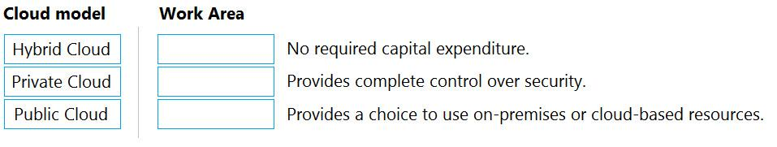

**Correct Answer:**

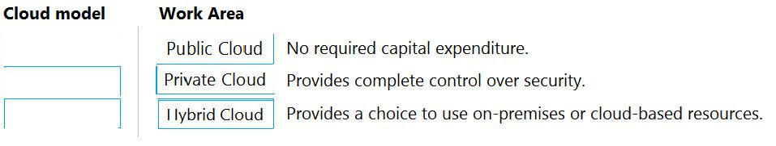

> **Explanation:**
>
> **Box 1: Public Cloud** — No capital expenditure on hardware; pay only for resources used.
>
> **Box 2: Private Cloud** — Hosted on-premises giving complete control over security.
>
> **Box 3: Hybrid Cloud** — Mix of public cloud and on-premises resources; use either as needed.
